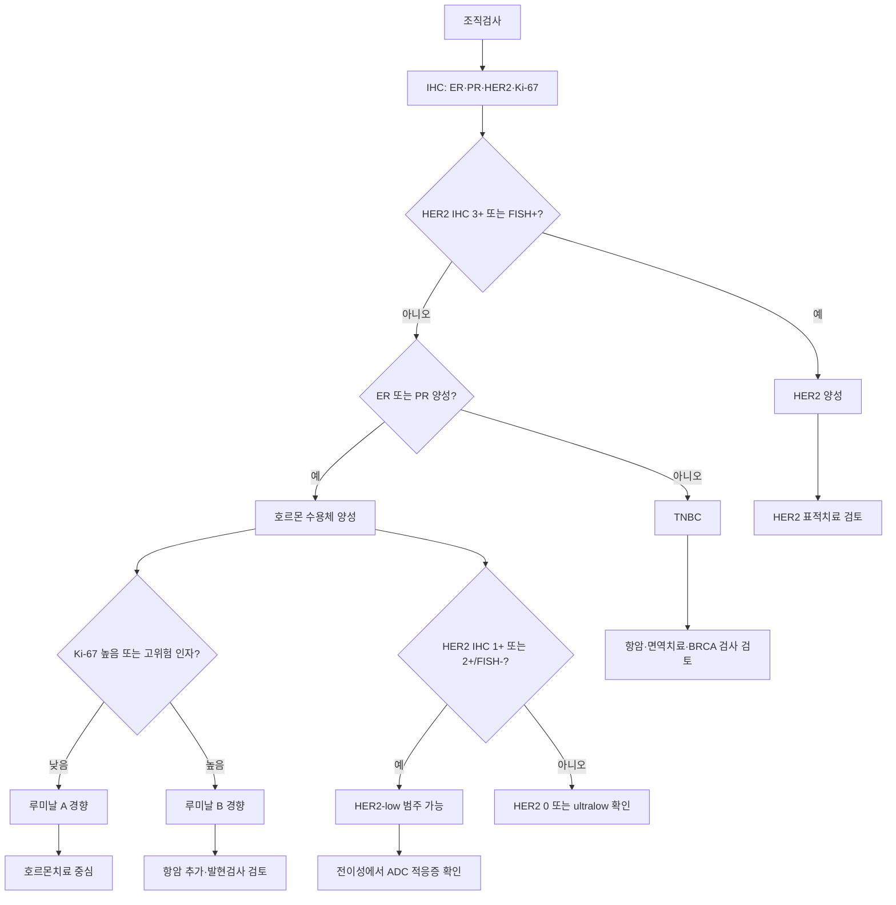

# 유방암 분자 서브타입

## 개요
유방암은 단일 질환이 아닌, 분자생물학적 특성에 따라 구분되는 이질적 질환군이다. 호르몬 수용체(ER, PR)와 HER2 발현, Ki-67 증식지수를 기반으로 4가지 주요 서브타입으로 분류하며, 각 서브타입은 예후와 치료 반응이 판이하게 다르다. 분류 체계는 (1) **임상병리 4분류** (ER/PR/HER2/Ki-67 IHC 기반), (2) **PAM50 내인성 분류** (50유전자 발현 기반 — Luminal A/B·HER2-enriched·Basal-like), (3) **HER2-low/ultralow 등장 후 확장 분류**, (4) **AI 기반 분자 subtype** (LINUXtrial SNF1~4 등) 4층으로 발전했다. 각 층의 의미와 임상 활용을 모두 알아야 적절한 치료 결정이 가능하다.

## 핵심 내용

### 루미날 A (Luminal A)
- **특성**: ER+/PR+, HER2-, Ki-67 낮음
- **예후**: 가장 좋음 (5년 생존율 ~95%)
- **치료**: 호르몬요법 중심, 화학요법 필요성 낮음
- **비율**: 전체 유방암의 약 40%

### 루미날 B (Luminal B)
- **특성**: ER+/PR+, HER2- 또는 HER2+, Ki-67 높음
- **예후**: 루미날 A보다 나쁨
- **치료**: 호르몬요법 + 화학요법 병용 가능
- **비율**: 전체 유방암의 약 20%

### HER2 과발현형 (HER2-enriched)
- **특성**: ER-/PR-, HER2+
- **예후**: 과거 불량했으나, [[HER2표적치료]] 도입 후 크게 개선
- **치료**: 트라스투주맙([[HER2표적치료|허셉틴]]) 기반 표적치료 필수
- **비율**: 전체 유방암의 약 15%

### 트리플 네거티브 (TNBC, Triple Negative Breast Cancer)
- **특성**: ER-, PR-, HER2- 모두 음성
- **예후**: 가장 불량. 재발 위험 높고 내장 전이 잦음
- **치료**: 화학요법 + [[TNBC치료|면역항암제]](PD-L1 양성 시)
- **비율**: 전체 유방암의 약 15-20%
- **관련**: [[BRCA유전자|BRCA1]] 돌연변이와 연관성 높음

### ER+/HER2+ 동시 양성 (복합형)
- **특성**: 호르몬 양성 + HER2 양성의 특성을 동시에 공유
- **예후·행동**: 두 유형의 중간 어딘가에 위치
- **치료**: **HER2+ 치료에 준해 약재 구성** + 호르몬 억제도 병용

## 유방암 서브타입 분포 (임상 참고치)
| 서브타입 | 비율 |
|---------|------|
| 호르몬 수용체 양성 (ER+/HER2-) | 약 60% |
| HER2 양성 (HER2+) | 약 15-20% |
| 트리플 네거티브 (TNBC) | 약 15-20% |

> ⚠️ 비율 참고: 한원식(서울대병원) 강의에서는 "HER2+가 TNBC보다 약간 더 많다"고 언급, 심성훈(국립암센터) 강의에서는 "비슷하거나 HER2+가 약간 더 많다"고 언급 — 코호트마다 소폭 차이 있음

## HER2 IHC 판정 기준

**IHC 점수 체계 (0 / 1+ / 2+ / 3+)**:
- **0, 1+**: HER2 음성
- **2+**: 애매한 중간값 → **FISH(형광 제자리 부화법)** 추가 필수 (유전자 증폭 여부 확인)
- **3+**: HER2 양성

> ⚠️ IHC 2+ 단독으로는 양성/음성 판정 불가. 반드시 FISH로 확인 필요

## ER/PR 수용체 발현 강도

- 결과는 **% 수치**로 보고 (0~100%)
- 높은 %: 호르몬 치료 반응 좋고 예후 양호
- 낮은 % (약한 양성): 호르몬 치료 반응 제한적, 더 공격적일 수 있음
- ER 또는 PR 중 하나라도 양성이면 호르몬 수용체 양성으로 분류

## Ki-67 증식 지수

- **의미**: 세포 분열 속도 지표. 높을수록 암세포가 빠르게 증식 → 더 공격적
- **임상적 중요성**: ER+/HER2- 유방암(루미날 타입)에서 항암 치료 필요 여부 판단에 핵심적 역할
- **컷오프**: 20% 기준 일반적 (루미날A vs B 구분), 기관마다 약간 차이

## PAM50 내인성 분자 분류 (Intrinsic Subtypes)

Perou Nature 2000 / Parker JCO 2009 — **50유전자 발현 프로파일 (PAM50)** 로 결정되는 분자 서브타입. 임상병리 IHC 분류와 거의 일치하지만 **분자 수준에서 더 정확**한 분류를 제공한다. [[유전자발현프로파일링|Prosigna]] 검사로 임상에서 직접 측정 가능.

| 내인성 서브타입 | 분자 특징 | IHC 대응 | 비율 | 임상 행동 |
|------------------|-----------|-----------|------|-----------|
| **Luminal A** | 높은 ER·낮은 증식·CDH1·FOXA1·GATA3 발현 | ER+/PR+/HER2-/Ki67<14% | 35~40% | 가장 좋은 예후, 호르몬 치료에 반응 |
| **Luminal B** | 높은 증식 유전자 (MKI67·AURKA), ER 발현 일부 약화 | ER+/HER2-/Ki67↑ 또는 ER+/HER2+ | 15~20% | Luminal A보다 공격적, 항암 추가 검토 |
| **HER2-enriched** | ERBB2 증폭 + GRB7·STARD3 등 동반 증폭 | ER-/HER2+ 또는 일부 ER+/HER2+ | 10~15% | 표적치료 도입 후 예후 크게 개선 |
| **Basal-like** | 기저세포 표지자 (CK5/6·EGFR·CK17), TP53 변이 다수 | 대부분 TNBC (ER-/PR-/HER2-) | 15~20% | 가장 공격적, BRCA1 연관 |
| **Normal-like** | 정상 유방조직 발현과 유사 (검체 오류 가능성) | — | <5% | 임상적 의의 미확립 |
| **Claudin-low** (확장 분류) | TJ 단백질 감소, EMT 표현형 | 대부분 TNBC | <10% | 줄기세포 표지자, 면역 침윤 |

> 💡 **IHC 분류와 PAM50 분류 약 80% 일치, 20%는 다름**. 특히 ER+ HER2- Ki-67 경계군에서 PAM50이 더 정확한 결정 도구가 됨.

### Basal-like vs TNBC — 같은가?

- **약 80%의 TNBC가 Basal-like**, 약 20%는 다른 분자형
- 모든 Basal-like가 TNBC는 아님 — 일부 Basal-like는 ER 약양성
- 임상에서는 IHC 기반 TNBC가 표준이지만 분자 수준 분류는 다름

## HER2-low / ultralow 등장 (2022~)

[[HER2-low치료|DESTINY-Breast04 (NEJM 2022)]] 이후 HER2 발현 정도에 따른 새 분류:

| 분류 | IHC | FISH | 비율 | 치료 |
|------|-----|------|------|------|
| **HER2 양성** | 3+ 또는 2+/FISH 증폭 | + | 15~20% | [[HER2표적치료|허셉틴·퍼투주맙·엔허투]] 표준 |
| **HER2-low** | 1+ 또는 2+/FISH- | - | **약 50%** (호르몬 양성 다수) | [[HER2-low치료|엔허투]] 적응증 (전이성) |
| **HER2-ultralow** | 0이지만 일부 염색 | - | 일부 (정확한 비율 미확립) | 임상시험 단계 |
| **HER2 0** | 완전 음성 | - | 30~40% | 기존 치료 흐름 |

> 💡 HER2-low 등장으로 **기존 ER+/HER2-, TNBC 환자의 절반 이상이 ADC 적응증 후보**가 되었음. 이는 [[유전자발현프로파일링|기존 5종 검사]]에 더해 진단 시 HER2 정밀 판독의 중요성을 크게 높임.

## AI 기반 분자 subtype — LINUXtrial (Cancer Cell 2026)

CDK4/6 억제제 저항성 후 HR+/HER2- 전이성에서 AI similarity network fusion으로 4개 subtype:

| Subtype | 특징 | ORR (LINUXtrial) |
|---------|------|-------------------|
| **SNF1** | — | 중간 |
| **SNF2** | 면역 풍부 | **우수** |
| **SNF3** | — | 낮음 |
| **SNF4** | 표적 약제 반응 | **우수** |

- 아직 2상 단계, 표준 적용 전
- 미래 정밀의학 방향 — IHC → PAM50 → AI subtype 다층 분류

→ 자세한 임상 데이터는 [[2026임상연구업데이트]]

## 다층 서브타입 분류 — 임상 활용 매트릭스

| 분류 층 | 측정 방법 | 임상 활용 |
|---------|-----------|-----------|
| **임상병리 IHC** | [[면역조직화학검사(IHC)]] + [[FISH검사]] | 진단 시 1차 분류, 기본 치료 결정 |
| **PAM50** | [[유전자발현프로파일링|Prosigna]] (50유전자) | 내인성 분자 분류, ROR 점수 |
| **HER2-low/ultralow** | IHC 정밀 판독 + 재검사 | [[HER2-low치료|엔허투]] 적응증 결정 |
| **유전자 발현 위험도** | [[온코타입DX_RS점수\|Oncotype]]·MammaPrint·EndoPredict·BCI | 항암 추가·연장 결정 |
| **AI subtype** | LINUXtrial SNF | 미래 — 표준 적용 전 |
| **변이 (germline/somatic)** | [[유전자검사]] BRCA·NGS·ctDNA | 표적 약제 적응증 |

## 서브타입 결정 의사결정 흐름

## 임상적 의의
- 서브타입 결정은 치료 방향의 근간 — 진단 시 반드시 [[면역조직화학검사(IHC)]]와 [[FISH검사]] 시행
- [[온코타입DX_RS점수|Oncotype DX]], [[유전자발현프로파일링|MammaPrint]] 같은 [[유전자발현프로파일링]] 검사로 재발 위험도 세분화 가능
- 전체 유방암의 70~80%가 ER+ — 호르몬 치료가 가장 광범위하게 적용됨
- HER2 양성 비율: 약 20% — 과거 불량한 예후였으나 표적치료 도입 후 개선

## 관련 개념
- [[BRCA유전자]] — BRCA1↔TNBC/Basal-like, BRCA2↔루미날 연관
- [[HER2표적치료]] — HER2 양성 치료의 핵심
- [[HER2-low치료]] — IHC 1+/2+/FISH- 환자의 엔허투 적응증
- [[호르몬치료]] — 루미날 타입(ER+) 치료의 핵심
- [[TNBC치료]] — 트리플 네거티브 치료 전략
- [[면역조직화학검사(IHC)]] — IHC 4-항목 1차 분류
- [[FISH검사]] — HER2 IHC 2+ 보조 검사
- [[유전자발현프로파일링]] — PAM50/Prosigna·Oncotype·MammaPrint 등 5종
- [[온코타입DX_RS점수]] — 21유전자 RS 점수
- [[유전자검사]] — 변이 검사 (PAM50과 다른 종류)
- [[조직검사결과해석]] — 검체와 결과지 해석
- [[신보조화학요법]] — 서브타입에 따라 수술 전 항암 여부 결정
- [[2026임상연구업데이트]] — LINUXtrial AI SNF subtype, HER2-low 임상 데이터
- [[CDK46억제제]] — Luminal B 또는 ER+/HER2- 진행성 치료
- [[유전자발현프로파일링]] — PAM50의 임상 적용 검사 (Prosigna)
- [[한국유방암통계]] — 한국 환자의 서브타입 분포 (HER2+ 20% 우세)
- [[유방암면역_미생물군]] — TIL·PD-L1·TMB·MSI 등 면역 바이오마커와 서브타입

## 미해결 질문 / 연구 방향
> 💡 PAM50 분류의 한국 임상 표준화 — Prosigna 보험 적용 확대 시점
>    → **답변 (2026-05)**: 한국은 [[온코타입DX_RS점수|Oncotype DX]]가 2022년 보험 적용된 반면 **Prosigna는 비급여 (약 100~150만원)** 유지. KBCS 권고안은 두 검사를 동등한 옵션으로 인정. 보험 적용 확대 시점 미정 — 심평원 비용효과성 평가 진행 중. 당분간 Oncotype DX·MammaPrint가 표준.
> 💡 HER2-ultralow 표준 치료 확립 — 임상시험 진행 중
>    → **답변 (2026-05)**: **DESTINY-Breast06 (NEJM 2024)** 에서 HER2-ultralow까지 엔허투 효능 확인 (PFS 13.2 vs 8.1개월). FDA 2024년 적응증 확대, 한국은 2026년 보험 적용 검토 중. **표준 진입은 ASCO 2026 가이드라인 반영 시점 예상**.
> 💡 AI subtype (SNF·기타) 임상 적용 — 3상 검증 후 표준화 가능성
>    → **답변 (2026-05)**: LINUXtrial은 2상 단계. 3상 검증 (PROBES·VICTORIAN) 진행 중 — **2027~2028 결과 예상**. 표준 진입은 임상 활용성 vs 비용 균형 평가 후 가능. 현재는 표준 치료 결정에 사용 금지.
> 💡 재발·전이 시 서브타입 전환 (20~30%) 예측 바이오마커
>    → **답변 (2026-05)**: 전이 병소 재조직검사 시 서브타입 전환율 ER 13%·PR 32%·HER2 11~28% (JNCI 2024 메타분석). 예측 바이오마커 없음 — **전이 의심 시 재조직검사가 표준**. ctDNA로 ESR1·HER2 변이 동반 검출 가능.
> 💡 Claudin-low TNBC의 면역치료 반응 — 임상적 가치 평가
>    → **답변 (2026-05)**: Claudin-low TNBC는 TIL·PD-L1 발현 높아 **면역치료 반응 우수 가능성**. 별도 적응증 없음 — KEYNOTE-355 사후 분석에서 시사. 임상 진료에서는 PD-L1 CPS로 결정.

## 출처
- 한원식. 유방암 진단을 받았다면 꼭 알아야 할 것들. 서울대병원 외과. 의학채널 비온뒤. 2024-01-30. https://youtu.be/e6xr1NpsXXU
- 심성훈. 유방암이라고 다 똑같은 유방암이 아니다?! 국립암센터 유방암센터. 국립암센터. 2025-07-04. https://youtu.be/hXWvtk0HTr8

## 업데이트 히스토리
- 2026-04-24: 초기 시드 페이지 생성
- 2026-04-26: HER2 IHC 판정 기준, ER/PR 발현 강도, Ki-67 세부 내용 추가 (비온뒤 한원식 강의)
- 2026-04-26: ER+/HER2+ 동시 양성 케이스, 서브타입 분포 수치, 아형별 행동 특성 추가 (국립암센터 심성훈 강의)
- 2026-05-20: 깨진 wikilink를 별칭 문법으로 정리 — 허셉틴→HER2표적치료 alias, Oncotype DX→온코타입DX_RS점수 alias, BRCA1→BRCA유전자 alias (library-check)
- 2026-05-22: 대폭 보강 — **PAM50 내인성 분자 분류** (Luminal A/B·HER2-enriched·Basal-like·Normal-like·Claudin-low) 6종 표, IHC vs PAM50 80% 일치·20% 불일치, Basal-like vs TNBC 구분, **HER2-low/ultralow 분류 표** (DESTINY-Breast04 후), **AI subtype LINUXtrial SNF1~4**, 다층 서브타입 매트릭스 (IHC·PAM50·HER2-low·발현·AI·변이 6층), 서브타입 결정 의사결정 흐름도, 관련 개념 9개 추가 (library-check 보강)
