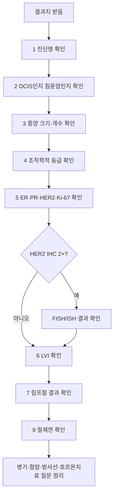

# 검사 결과지 읽기 도우미 — 병리·수용체·병기 핵심 항목

## 개요

유방암 검사 결과지는 병원마다 양식이 다르지만, 치료 결정에 쓰이는 핵심 항목은 대체로 비슷하다. 이 페이지는 결과지를 받았을 때 **어느 항목부터 읽어야 하는지**, **각 항목이 치료 결정에 어떤 의미가 있는지**, **진료실에서 무엇을 확인해야 하는지**를 일반인이 따라갈 수 있게 정리한 도우미다.

> ⚠️ 주의: 결과지 해석은 조직검사·수술 병리·영상검사·진찰 소견을 함께 봐야 한다. 이 문서는 이해를 돕기 위한 안내이며, 치료 결정은 반드시 담당 유방외과·종양내과와 확인한다.

## 핵심 내용

### 먼저 결과지 종류를 확인

| 결과지 종류 | 언제 받나 | 주로 확인할 것 | 연결 문서 |
|---|---|---|---|
| **영상 결과지** | 맘모그래피·초음파·MRI 후 | BI-RADS, 병변 위치, 크기, 추가 검사 필요 여부 | [[유방암진단체계]], [[유방암검진2026]] |
| **조직검사 결과지** | 총조직검사·맘모톰 후 | 양성/악성, 침윤 여부, 암 종류, ER·PR·HER2·Ki-67 | [[조직검사결과해석]], [[면역조직화학검사(IHC)]] |
| **수술 병리 결과지** | 수술 후 | 최종 종양 크기, 림프절, 절제연, LVI, 병기 | [[유방암수술]], [[유방암진단체계]] |
| **FISH/ISH 결과지** | HER2 IHC 2+일 때 | HER2 유전자 증폭 여부 | [[FISH검사]], [[HER2표적치료]] |
| **유전자/발현 검사 결과지** | 필요 시 | BRCA·NGS·Oncotype DX·MammaPrint 등 | [[유전자검사]], [[유전자발현프로파일링]] |

---

## 결과지 읽는 순서 — 8단계

### 1. 진단명: 양성인지, 암인지, 암이면 어떤 종류인지

결과지에서 먼저 찾을 단어:

| 결과지 표현 | 쉬운 의미 | 다음 확인 |
|---|---|---|
| **Benign** | 양성 | 증식성/비정형 여부 |
| **Atypical hyperplasia** | 비정형 증식 | 추가 절제·추적 필요 여부 |
| **DCIS / ductal carcinoma in situ** | 상피내암, 유관 안에 머문 암 | 범위·절제연·방사선 여부 |
| **Invasive carcinoma** | 침윤암, 주변 조직으로 나온 암 | 수용체·림프절·병기 |
| **Invasive ductal carcinoma / IDC** | 침윤성 유관암 | 가장 흔한 유형 |
| **Invasive lobular carcinoma / ILC** | 침윤성 소엽암 | 다발성·양측성 평가 |

> 💡 `carcinoma`는 암을 뜻한다. `in situ`는 아직 제자리, `invasive`는 주변 조직으로 침윤했다는 뜻이다.

### 2. 침윤 여부: DCIS인지 침윤암인지

| 구분 | 의미 | 치료 결정에 미치는 영향 |
|---|---|---|
| **DCIS / Tis** | 유관 안에 머문 비침윤성 병변 | 수술 범위·방사선·호르몬 치료 여부 중심 |
| **Invasive** | 기저막을 넘어 주변 조직으로 침윤 | 수용체·림프절·병기·항암 여부 결정 |

DCIS와 침윤암은 치료 강도와 병기 계산이 달라진다. 결과지에 둘 다 적혀 있으면 **침윤암 크기와 DCIS 범위가 각각 얼마인지** 확인한다.

### 3. 종양 크기와 개수: T 병기의 바탕

결과지 표현:
- **Tumor size**: 종양 크기
- **Greatest dimension**: 가장 긴 지름
- **Multifocal / multicentric**: 여러 군데 병변
- **Extensive intraductal component (EIC)**: DCIS 성분이 넓게 동반

| 크기 | 대략적 T 분류 |
|---|---|
| 2cm 이하 | T1 |
| 2cm 초과 ~ 5cm 이하 | T2 |
| 5cm 초과 | T3 |
| 피부·흉벽 침범 | T4 |

> ⚠️ 조직검사 때 보인 크기와 수술 후 최종 크기는 다를 수 있다. 수술 병리 결과가 최종 판단에 더 중요하다.

### 4. 조직학적 등급: 암세포가 얼마나 거칠게 보이는지

결과지 표현:
- **Histologic grade**
- **Nottingham grade**
- **Elston grade**

| Grade | 쉬운 해석 | 일반적 의미 |
|---|---|---|
| **Grade 1** | 비교적 얌전한 모양 | 천천히 자라는 경향 |
| **Grade 2** | 중간 | 중간 위험 |
| **Grade 3** | 세포 모양이 거칠고 분열이 많음 | 더 공격적인 경향 |

Grade는 치료 결정 요소 중 하나지만, 단독으로 항암 여부를 결정하지 않는다. 수용체, 림프절, 크기, 유전자발현 검사와 함께 본다.

### 5. 수용체 결과: ER·PR·HER2·Ki-67

가장 중요한 치료 방향 결정 항목이다.

| 항목 | 결과지 표현 | 쉬운 의미 | 연결 치료 |
|---|---|---|---|
| **ER** | Estrogen receptor | 에스트로겐 신호를 쓰는 암인지 | [[호르몬치료]] |
| **PR** | Progesterone receptor | 호르몬 반응성 보조 지표 | [[호르몬치료약제비교]] |
| **HER2** | IHC 0/1+/2+/3+ | HER2 표적치료 대상인지 | [[HER2표적치료]], [[HER2-low치료]] |
| **Ki-67** | % | 증식 속도 참고 지표 | [[유방암분자서브타입]], [[온코타입DX_RS점수]] |

#### HER2 결과 빠르게 보기

| HER2 IHC | 일반적 해석 | 다음 단계 |
|---|---|---|
| 0 | HER2 음성 | 다른 지표와 함께 치료 결정 |
| 1+ | HER2 음성, HER2-low 범주 가능 | 전이성에서는 ADC 옵션과 연결 가능 |
| 2+ | 애매함 | [[FISH검사]] 또는 ISH 필요 |
| 3+ | HER2 양성 | HER2 표적치료 검토 |

> ⚠️ HER2 IHC 2+는 양성도 음성도 아니다. FISH/ISH 결과까지 확인해야 한다.

### 6. 림프혈관침범: LVI가 있는지

결과지 표현:
- **Lymphovascular invasion**
- **LVI**
- **Angiolymphatic invasion**
- **Vascular invasion**

| 결과 | 의미 |
|---|---|
| **Not identified / absent** | 림프혈관침범이 보이지 않음 |
| **Present / identified** | 암세포가 림프관·혈관 안에서 관찰됨 |

LVI가 있으면 재발 위험 평가에서 불리한 요소로 고려될 수 있다. 다만 LVI 하나만으로 치료가 결정되지는 않는다.

### 7. 림프절 결과: N 병기의 핵심

결과지 표현:
- **Sentinel lymph node**: 감시림프절
- **Axillary lymph node**: 겨드랑이 림프절
- **Positive / negative**: 전이 있음/없음
- **Macrometastasis / micrometastasis / isolated tumor cells**

| 표현 | 쉬운 의미 |
|---|---|
| **0/3 positive** | 검사한 림프절 3개 중 전이 0개 |
| **1/5 positive** | 검사한 림프절 5개 중 1개 전이 |
| **Micrometastasis** | 아주 작은 림프절 전이 |
| **Extranodal extension / ENE** | 림프절 밖으로 암이 퍼진 소견 |

림프절 전이는 병기와 항암·방사선 범위 결정에 중요하다. 수술 후 결과지에서 반드시 확인한다.

### 8. 절제연: 암이 잘려나간 가장자리까지 닿았는지

결과지 표현:
- **Margin**
- **Negative margin / clear margin**
- **Positive margin**
- **Close margin**

| 결과 | 쉬운 의미 | 가능한 다음 단계 |
|---|---|---|
| **Negative / clear** | 절제 가장자리에 암이 없음 | 보통 추가 절제 불필요 |
| **Close** | 가장자리와 암이 가까움 | 병원 기준에 따라 추가 절제 검토 |
| **Positive / involved** | 가장자리에 암이 닿음 | 추가 수술·방사선 계획 확인 |

> 💡 절제연은 주로 수술 병리 결과지에서 중요하다. 조직검사 결과지에는 없을 수 있다.

---

## 결과 조합으로 치료 방향 이해하기

| 결과 조합 | 보통 의미 | 주로 연결되는 결정 |
|---|---|---|
| **ER+ / HER2-** | 호르몬 양성 유방암 | 호르몬 치료, 항암 필요성 평가, Oncotype DX 등 |
| **HER2+** | HER2 표적치료 대상 | 허셉틴·퍼투주맙·엔허투 등 검토 |
| **ER- / PR- / HER2-** | 트리플 네거티브 | 항암·면역치료·BRCA 검사 검토 |
| **ER+ + 림프절 음성 + 중간 위험** | 항암 여부가 애매할 수 있음 | [[온코타입DX_RS점수]] 등 발현 검사 |
| **BRCA 변이 양성** | 유전성 위험·표적치료 가능성 | [[BRCA유전자]], [[PARP억제제]], 가족 검사 |

---

## 진료실에서 꼭 확인할 질문

### 조직검사 후
1. 정확한 진단명이 무엇인가요? DCIS인가요, 침윤암인가요?
2. ER·PR·HER2·Ki-67 결과가 모두 나왔나요?
3. HER2가 2+라면 FISH/ISH 결과는 언제 나오나요?
4. 수술 전 추가 MRI나 전이 검사가 필요한가요?
5. 유전자 검사(BRCA·NGS) 대상인가요?

### 수술 후 병리 결과 확인 시
1. 최종 종양 크기와 병기는 무엇인가요?
2. 림프절은 몇 개 검사했고 몇 개 양성인가요?
3. 절제연은 깨끗한가요?
4. LVI가 있나요?
5. 항암 여부 판단에 Oncotype DX 등 추가 검사가 필요한가요?
6. 방사선 치료 범위는 어떤 근거로 정하나요?

---

## 결과지에 자주 나오는 영어 표현

| 표현 | 뜻 |
|---|---|
| **Specimen** | 검사한 조직 |
| **Diagnosis** | 병리 진단명 |
| **Histologic type** | 암의 조직형 |
| **Grade** | 조직학적 등급 |
| **Tumor size** | 종양 크기 |
| **Margin** | 절제연 |
| **Lymph node** | 림프절 |
| **LVI** | 림프혈관침범 |
| **ER/PR/HER2** | 호르몬·HER2 수용체 |
| **Ki-67** | 증식 지표 |
| **pT / pN / pM** | 수술 병리 기준 TNM |
| **cT / cN / cM** | 임상 검사 기준 TNM |

---

## 관련 개념

- [[처음온사람안내]] — 진단 직후 환자가 결과지를 가장 먼저 마주하는 시점의 길잡이
- [[유방암진단체계]] — 영상·조직검사·병기 전체 흐름
- [[조직검사결과해석]] — 양성·비정형·DCIS·침윤암 해석
- [[면역조직화학검사(IHC)]] — ER·PR·HER2·Ki-67 상세, Allred score·재판독 동선
- [[FISH검사]] — HER2 IHC 2+일 때 확인 검사, 검사 비용·일정·환자 실전 동선
- [[유방암분자서브타입]] — 루미날·HER2·트리플 네거티브 분류
- [[유전자발현프로파일링]] — Oncotype DX 등 항암 여부 결정 검사
- [[유전자검사]] — BRCA·NGS·ctDNA 검사
- [[유방암수술]] — 수술 후 병리 결과와 추가 치료
- [[항암화학요법]] — 항암 여부 판단
- [[방사선치료]] — 절제연·림프절·수술 범위와 연결
- [[diagnosis-imaging/유방영상검사가이드]] — **영상 결과지의 BI-RADS·치밀유방·미세석회화 해석 표준 — 영상 4종 비교**

## 미해결 질문 / 연구 방향

💡 Ki-67 기준값은 병원·검사실·판독 방식에 따라 차이가 있어 단독 결정 지표로 쓰기 어렵다.

💡 HER2-low, ultra-low처럼 HER2 경계 영역이 ADC 치료와 연결되며 결과지 해석의 중요성이 커지고 있다.

💡 ctDNA·NGS·AI 병리 분석이 치료 선택에 점점 더 많이 연결될 가능성이 있다.

## 주의사항

⚠️ 결과지 한 항목만 보고 예후나 치료를 단정하지 않는다. 유방암 치료는 병리 결과, 영상, 수술 소견, 환자 상태, 선호를 함께 고려한다.

⚠️ 인터넷에서 같은 표현을 검색해도 본인의 병기·수용체·치료 단계가 다르면 의미가 달라질 수 있다.

⚠️ 결과지를 받으면 사진으로만 보관하지 말고 PDF나 원본 사본을 정리해두면 전원·2차 의견·보험 청구에 도움이 된다.

## 출처

- American Cancer Society. Understanding Your Pathology Report: Breast Cancer. 2023.
- National Cancer Institute. Breast Cancer Stages. 2026.
- College of American Pathologists. Cancer Reporting Tools and Breast Biomarker Reporting Protocols.
- SEER Training. Breast Biomarkers. 2024.
- Johns Hopkins Pathology. Understanding My Report — Breast Pathology.

## 업데이트 히스토리

- 2026-05-25: 신규 생성 — 결과지 종류, 8단계 읽기 순서, 주요 영어 표현, 진료실 질문 체크리스트 정리
