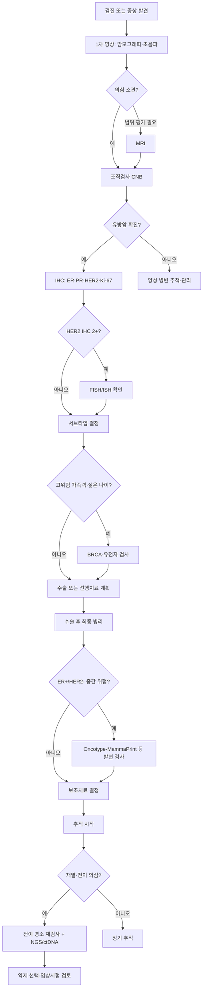

# 유방암 진단 체계

## 개요
유방암 진단은 영상검사(발견)→ 조직검사(확진) → 수용체·유전자 검사(분류) → 병기 결정의 단계로 이루어진다.
각 단계는 치료 전략 수립에 직접 연결되며, 정확한 초기 진단이 예후와 직결된다.

> 💡 **처음 진단받으신 분들께**: 정보가 한꺼번에 쏟아지는 시기 — 우선 읽기 순서·수술 전 체크리스트·진료실 질문 정리는 [[처음온사람안내|처음 온 사람 안내 — 진단 직후 길잡이]]에서 확인하세요.

## 핵심 내용

## 검사 선택 통합 의사결정 흐름도

유방암 진단·치료·재발·전이 각 시점별로 어떤 검사를 받아야 하는지 통합 가이드. 검사 종류·시점·목적이 다르므로 환자가 진료실에서 분명히 알아야 한다.

### 시점별 검사 매트릭스

| 시점 | 1차 검사 | 2차 검사 | 3차 검사 | 결정에 활용 |
|------|----------|----------|----------|--------------|
| **검진 (무증상)** | [[유방암진단체계\|맘모그래피·초음파·MRI(고위험)]] | — | — | 조기 발견 |
| **종양 발견 시** | 조직검사 (CNB) | — | — | 양성·악성 감별 |
| **유방암 확진** | **[[면역조직화학검사(IHC)\|IHC: ER·PR·HER2·Ki-67]]** | HER2 IHC 2+ → [[FISH검사]] | — | 서브타입 결정 |
| **수술 후 보조 결정 (ER+/HER2-)** | [[유전자발현프로파일링\|Oncotype DX·MammaPrint 등]] | — | — | 항암 추가 여부 |
| **고위험 가족력** | [[유전자검사\|BRCA1/2 변이]] (germline) | 다유전자 패널 (PALB2·CHEK2 등) | — | 예방·표적약 선택 |
| **전이성 진단·재발** | 전이 병소 [[조직검사결과해석\|재검사]] | [[유전자검사\|종양 NGS]] (PIK3CA·AKT1·ESR1) | [[유전자검사\|ctDNA: Guardant360]] | 약제 선택 |
| **항호르몬 저항성 (ER+)** | [[유전자검사\|ESR1 변이 ctDNA]] | — | — | [[호르몬치료\|vepdegestrant]] 적응증 |
| **호르몬 치료 5년 후** | [[유전자발현프로파일링\|Breast Cancer Index (BCI)]] | — | — | 10년 연장 결정 |
| **CDK4/6 저항성** | [[유전자검사\|NGS]] | [[2026임상연구업데이트\|LINUXtrial AI subtype]] (임상시험) | — | 후속 약제 |

### 변이 vs 발현 — 가장 흔한 혼동

| 검사 종류 | 본질 | 측정 | 대표 검사 |
|-----------|------|------|------------|
| **[[유전자검사]]** | **변이 (Mutation)** | DNA 염기 서열 영구 변화 | BRCA1/2·NGS·ctDNA |
| **[[유전자발현프로파일링]]** | **발현 (Expression)** | 유전자 활성화 수준 | Oncotype DX·MammaPrint·Prosigna·BCI |
| **[[면역조직화학검사(IHC)]]** | **단백질 발현** | 항체 염색 | ER·PR·HER2·Ki-67 |
| **[[FISH검사]]** | **유전자 복제 수** | 형광 표지 | HER2 증폭 |

### 환자 결정 동선 — 진단부터 추적까지

### 검사 진료실 체크리스트

신규 환자가 진단 시 의료진에게 확인할 질문:

1. 내 IHC 결과는? (ER·PR·HER2·Ki-67)
2. HER2 IHC 2+면 FISH 결과는?
3. 가족력 평가 — BRCA 검사 대상인가?
4. 수술 후 Oncotype/MammaPrint 등 발현 검사 대상인가?
5. 전이 시점에 재검사 가능한가?
6. ctDNA 검사가 내 약제 선택에 영향 줄까?
7. 유전자 검사 결과 가족 검사 권유 시점은?
8. 임상시험 등록과 검사 연계 가능?

→ 각 검사 상세는 위 매트릭스 링크 참조

### 통증과 유방암 — 0.4% 데이터 (문용화 2026)

> ⚠️ **유방 통증은 유방암의 신뢰할 만한 신호가 아니다.**

- 유방 통증을 호소하며 내원한 환자 중 **실제 암 진단 0.4%** (PMC8869188, 전향적 코호트)
- 무작위 검사로 발견되는 확률과 거의 동일
- 이유: 유방 감각 신경은 **갈비뼈 사이**에서 나옴, 초기 암은 신경 없는 **유관·소엽 안**에 국한
- 통증이 생기려면 신경 침범 또는 신경 압박 단계까지 진행
- → "통증 없다 = 안전" 오류 교정 ([[전이경고신호|가시적 신호 6가지]])

### 영상 검사

#### 유방촬영술 (맘모그래피)
- **역할**: 1차 선별검사. 미세석회화 발견에 탁월
- **권고**: 40세 이상 1-2년마다 (국가건강검진 포함)
- **한계**: 치밀유방에서 민감도 저하
- **판독**: BI-RADS 분류 (0-6) 사용

#### 유방초음파
- **역할**: 치밀유방 보완, 낭성/고형 감별, 조직검사 가이드
- **권고**: 맘모그래피 단독으로 불충분한 경우 병용
- **장점**: 방사선 없음, 실시간 조직검사 가이드 가능

#### 유방 MRI
- **역할**: 고위험군 선별, 병변 범위 평가, 신보조요법 반응 평가
- **적응증**:
  - [[BRCA유전자]] 돌연변이 보인자 (연 1회)
  - 유방 임플란트 환자
  - 신보조요법 중 치료 반응 모니터링
  - 다발성/양측성 의심

### 조직검사

#### 코어 바늘 생검 (Core Needle Biopsy)
- **표준 방법**: 영상 유도 하 14-16G 바늘로 조직 획득
- **장점**: 충분한 조직량, 수용체 검사 가능
- **정확도**: 민감도 >97%

#### 세침흡인세포검사 (FNAC)
- 세포만 얻어 조직 구조 확인 불가 → 점차 코어 생검으로 대체

> 💡 결과 해석 상세 — [[조직검사결과해석]]: 양성 종양도 비증식성/증식성(비정형 포함 여부)로 세분되며 이에 따라 유방암 위험도와 수술 여부가 달라진다

### 면역조직화학 검사 (IHC) — 서브타입 결정
생검 조직에서 필수 검사:
- **ER (에스트로겐 수용체)**: Allred score 또는 % 양성
- **PR (프로게스테론 수용체)**: % 양성
- **HER2**: 0/1+/2+/3+ 판정
  - 2+는 [[FISH검사]] 추가 필요 (유전자 증폭 확인)
- **Ki-67**: 증식지수 (20% 기준점)

→ 결과로 [[유방암분자서브타입]] 결정

### 병기 결정 (TNM 분류)

| 구분 | 의미 |
|------|------|
| T (Tumor) | 원발 종양 크기 (T1: ≤2cm, T2: 2-5cm, T3: >5cm, T4: 흉벽/피부 침범) |
| N (Node) | 림프절 전이 (N0: 없음, N1-3: 정도에 따라) |
| M (Metastasis) | 원격 전이 (M0: 없음, M1: 있음) |

**병기 요약**:
- 0기: DCIS (비침윤성)
- 1-2기: 조기 유방암
- 3기: 국소 진행성
- 4기: 전이성 (원격 전이)

### 추가 검사 (전이 평가)

유방암의 주요 전이 장기: 뼈(가장 흔함) > 폐 > 간

| 검사 | 목적 |
|------|------|
| 흉부 CT | 폐 전이 확인 (간 상부까지 포함 가능) |
| 복부 CT / 복부 초음파 | 간 전이 확인 |
| 뼈 스캔 (Bone Scan) | 골전이 확인 |
| 뇌 MRI | 증상 있거나 HER2+/TNBC 고위험군에서 고려 |
| PET-CT | **한국: 초기 검사로 사용 불가** — 다른 검사에서 불명확한 소견이 있을 때만 허용 |

> ⚠️ 한국에서는 PET-CT를 초기 유방암 전이 검사로 무조건 시행 불가 (급여 기준 제한)

#### 뼈 스캔 (Bone Scintigraphy) 시행 대상 — 서울대병원 (강은혜·정지정 2024)

| 환자군 | 뼈 스캔 시행 여부 |
|--------|--------------------|
| **침윤성 유방암** | ✅ 시행 — 전신 전이 평가 |
| **DCIS (상피내암, 제자리암)** | ❌ 시행 안 함 — 전신 전이 가능성 ❌ |
| **재발·전이 의심** | ✅ 재시행 |

**원리**:
- 방사성 동위원소를 정맥 주사
- 뼈에 이상 부위가 신호 ↑
- 전신 뼈를 한 번에 평가

> 💡 환자 핵심: 본인이 **침윤암인지 DCIS인지** 명확히 알아야 검사 목적 이해 가능. DCIS는 뼈 스캔 안 받는 것이 정상.

### 예후 예측 도구

**Predict (영국 NHS 개발)**
- 일반인도 사용 가능한 웹 기반 예후 계산기
- 입력 항목: 나이, 폐경 여부, ER 상태, HER2 상태, Ki-67, 종양 크기, 조직학적 등급, 발견 경위, 림프절 전이 개수, 치료 방법
- 출력: 5년/10년 전체 생존율 (치료 유형별)
- 활용: 치료 강도 결정 참고 자료로 의사와 환자 공유 가능

**Oncotype DX (온코타입 DX)**
- ER+/HER2- 조기 유방암에서 항암 치료 필요 여부 결정
- 조직 내 21개 유전자 RNA 발현 분석
- 재발 위험도 점수(RS) 0~100 제공

**MammaPrint**
- 70개 유전자 발현 기반 예후 예측
- 항암 치료 생략 가능 저위험군 선별

### 조직 검사 결과지 이해

주요 조직학적 진단:
- **Invasive Ductal Carcinoma (IDC)**: 침습성 유관암 — 전체의 80% 이상
- **DCIS (Ductal Carcinoma in Situ)**: 상피내암/제자리암/연기암 — 비침습성
- **Invasive Lobular Carcinoma**: 침습성 소엽암

**DCIS 특징**:
- 유관 안에만 존재, 전이 없음 → 원칙적으로 완치 가능
- 수술 필수 (비침습이지만)
- 부분 절제 후 방사선 ± 호르몬 치료
- 15년 추적 시 재발율 5~10% (절반은 다시 DCIS, 절반은 침습성 암으로 진행)

### 양성 종양과 암의 관계

> ⚠️ 유방의 양성 종양(섬유낭종, 섬유선종)은 암으로 변하지 않는다 — 대장 용종과 다름

- 대장 용종: 암으로 변할 수 있어 제거가 예방 효과 있음
- 유방 양성 종양: 암으로의 변환 없음 → 제거해도 유방암 예방 효과 없음
- 암은 별도로 발생 (양성 종양이 암이 되는 것이 아님)
- **명백한 양성이면 제거 불필요** — 애매한 경우에만 추적 검사 또는 생검

### 유선염 vs 염증성 유방암 구분

| | 유선염 | 염증성 유방암 |
|--|--------|------------|
| 성격 | 세균 감염 | 암인데 염증처럼 보임 |
| 암으로 변환 | 변하지 않음 | 처음부터 암 |
| 예후 | 항생제로 치료 | 진행성, 예후 나쁨 |
| 구분 포인트 | 몇 개월 이내 호전 | 몇 개월 이상 지속 |

- 유선염 → 항생제, 심하면 절개 배농. 암으로 변하지 않음
- **몇 개월 이상 지속되는 유방 염증 → 유방 전문의 방문 필수** (염증성 암 배제)

### 유두 변화 경고 신호 (파제트병)

- **원래부터 있던 짝가슴(위치 차이)**: 유방암과 무관
- **아래 신호들은 즉시 검사 필요**:
  - 유두가 갑자기 함몰 (원래 아니었는데 새로 생긴 경우)
  - 유두 피부가 습진처럼 껍질 벗겨지는 경우
  → **파제트병(Paget's disease)**: 암이 밑에서 올라와 유두를 침범하는 양상

### 백신 후 림프절 부종 — 영상검사 일정 조정 (김성원 2021)

코로나19 백신(또는 일반 백신) 후 발생하는 **겨드랑이 림프절 부종**은 유방암 환자가 재발로 오인할 수 있는 가장 흔한 영상 위양성 원인:

- **백신 접종 후 2~3주 이내** 동측 겨드랑이 림프절이 일시적으로 부을 수 있음
- 면역 반응에 따른 정상 반응 — **유방암 재발이 아님**
- 백신 측 팔과 같은 쪽 유방암 환자에서 헷갈리기 쉬움

**영상검사 일정 조정 권장**:

| 상황 | 권장 일정 |
|------|------------|
| 정기 맘모그래피·초음파 예정 | **백신 후 2~3주 후로 미루기** |
| 신규 림프절 발견 (백신 직후) | 2~3주 추적 후 재평가 우선 |
| 명백한 다른 위치·증상 동반 | 즉시 평가 (기존 프로토콜) |

> 💡 김성원 (2021): "백신 종류 가리지 마시고요. 백신 코로나 백신 빨리 맞기를 권해드립니다. 가장 좋은 백신은 가장 빨리 맞을 수 있는 백신입니다." — 단, 영상검사 일정만 조정.

→ 림프절 부종의 다른 원인은 [[림프부종]], [[전이경고신호]] 참조

### WISDOM 연구 — 유전자 기반 맞춤 검진 (2025, 연구 단계)

기존 검진: 40세 이상 → 매년 유방촬영 (일률적)

WISDOM 연구 제안:
- 수백 개 유방 관련 유전자 분석 → 위험도 분층 → 맞춤 검진 간격

| 위험 분층 | 검진 시작 나이 | 검진 간격 |
|---------|------------|---------|
| 저위험 | 50세 | 2-3년에 한 번 |
| 중간 위험 | 40세 | 2년에 한 번 |
| 고위험 | 40세 | 매년 |
| 초고위험 (BRCA 등) | 더 이른 나이 | 예방적 조치 포함 |

**결과**: 진행성 암 발생률 감소 + 불필요한 검사 횟수 감소
**상태**: 연구 단계. 미국 가이드라인부터 먼저 변경 예상 → 이후 한국 도입 전망

## 임상적 의의
- 맘모그래피 + 초음파 병용이 치밀 유방 한국 여성에게 특히 유효
- 조기 발견 시 (1기) 5년 생존율 ~99%, 전체 유방암 5년 생존율 90% 이상
- 타병원에서 진단 받고 치료 병원 이동 시: 조직 검사 결과지 + 보관 조직 반드시 지참
- ER+/HER2- 유방암은 20년까지 재발 가능 → 장기 추적 관찰 필수

## 관련 개념
- [[조직검사결과해석]] — 양성 종양 분류 체계, 비증식성/증식성/비정형 의미
- [[유방암분자서브타입]] — 진단 결과가 분류로 연결
- [[BRCA유전자]] — 고위험군 진단 프로토콜, WISDOM 초고위험 분층
- [[HER2표적치료]] — HER2 양성 확인 후 치료로 연결
- [[HER2-low치료]] — HER2 IHC 판독 정밀도, 재생검 필요성
- [[신보조화학요법]] — 수술 전 치료 후 MRI로 반응 평가
- [[항암화학요법]] — 진단 후 항암 필요성 결정 및 시작 시기
- [[유방암수술]] — 진단 후 수술 유형 결정, **수술 진행 5단계·동결 절편 검사·뼈 스캔 기준 (DCIS ❌ vs 침윤암 ✅) 양방향**
- [[방사선치료]] — 유방보존수술 후 방사선 치료 연계
- [[치료후삶]] — 치료 완료 후 추적 관찰 일정 및 재발 감시
- [[유방암치료트렌드2026]] — WISDOM 맞춤 검진 연구
- [[유방암검진2026]] — 국가검진·NCCN v1.2026·치밀유방·자가검진 통합
- [[유방암AI영상]] — AI 판독·DBT·디지털 병리·위험 예측
- [[유방암위험인자]] — 5층 위험인자 통합·위험 평가 도구
- [[유방암유전상담]] — 유전 검사 적응증·가족 동선·심리
- [[검사결과지읽기도우미]] — 영상·병리·수용체 결과지 항목 빠른 해석
- [[처음온사람안내]] — 진단 직후 환자·보호자 길잡이 (읽기 순서·수술 전 체크리스트)
- [[glossary/용어사전]] — TNM·BI-RADS·IHC 등 진단 용어 풀이

## 출처
- 한원식. 유방암 진단을 받았다면 꼭 알아야 할 것들. 서울대병원 외과. 의학채널 비온뒤. 2024-01-30. https://youtu.be/e6xr1NpsXXU
- 한원식. 유방암 치료 트렌드 2026. 의학채널 비온뒤 신년특집. 2026-01-01. https://youtu.be/qjA2HmEGDkM

## 업데이트 히스토리
- 2026-04-24: 초기 시드 페이지 생성
- 2026-04-26: 전이 검사 장기별 상세 정보, Predict/Oncotype DX/MammaPrint 도구, DCIS 설명, PET-CT 한국 급여 제한 추가 (비온뒤 한원식 강의)
- 2026-04-27: 양성 종양 vs 암 관계, 유선염 vs 염증성 암 구분, 파제트병(유두 변화), WISDOM 맞춤 검진 연구 추가 (비온뒤 2026 신년특집)
- 2026-04-27: 조직검사 결과 해석 링크 추가 (비온뒤 염차경 원장 강의)
- 2026-05-21: NCCN Breast Cancer Screening v1.2026 — AI 기반 위험평가 도구로 **침습성 유방암 5년 위험 ≥1.7% 고위험군은 35세부터 선별 고려** 권고 추가. 단순 나이 기준 → 개인 위험 기반 선별 흐름. [[2026임상연구업데이트]] 연결
- 2026-05-24: 검사 선택 통합 의사결정 흐름도 추가 — IHC·FISH·유전자 변이·유전자 발현·ctDNA 5종 검사 시점별 선택 가이드 (library-check 보강)
- 2026-05-25: library-check cross-link 보강 — [[검사결과지읽기도우미]]·[[glossary/용어사전]] 연결
- 2026-05-26: 비온뒤 김성원 강의(2021) — 백신 후 동측 겨드랑이 림프절 부종 (영상검사 2~3주 연기 권장) 추가
- 2026-05-26: 건나물TV 문용화 강의(2026-04) — 통증과 유방암 0.4% 데이터 (PMC8869188), 갈비뼈 사이 신경 분포로 인한 초기 무증상 해부학적 근거
- 2026-05-31: 서울대병원tv 강은혜·정지정 교수 강의(2024) — 뼈 스캔 시행 대상 표 (침윤암 vs DCIS) 명확화 + 환자가 알아야 할 진단명 차이
