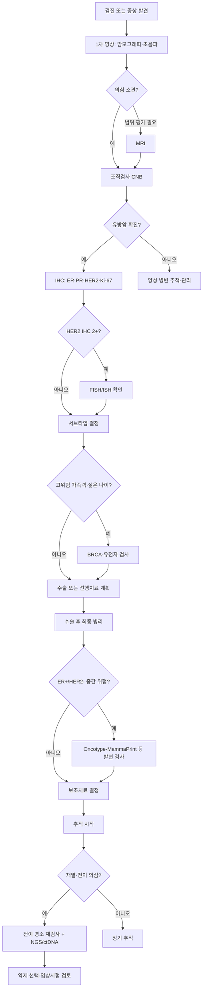

# 유방암 진단 체계 — 진단 흐름

> 이 페이지는 [[diagnosis-workflow/유방암진단체계|유방암 진단체계 허브]]에서 분리된 세부 문서입니다.

## 검사 선택 통합 의사결정 흐름도

유방암 진단·치료·재발·전이 각 시점별로 어떤 검사를 받아야 하는지 통합 가이드. 검사 종류·시점·목적이 다르므로 환자가 진료실에서 분명히 알아야 한다.

### 시점별 검사 매트릭스

| 시점 | 1차 검사 | 2차 검사 | 3차 검사 | 결정에 활용 |
|------|----------|----------|----------|--------------|
| **검진 (무증상)** | [[diagnosis-workflow/유방암진단체계\|맘모그래피·초음파·MRI(고위험)]] | — | — | 조기 발견 |
| **종양 발견 시** | 조직검사 (CNB) | — | — | 양성·악성 감별 |
| **유방암 확진** | **[[diagnosis-tests/면역조직화학검사(IHC)\|IHC: ER·PR·HER2·Ki-67]]** | HER2 IHC 2+ → [[diagnosis-tests/FISH검사]] | — | 서브타입 결정 |
| **수술 후 보조 결정 (ER+/HER2-)** | [[diagnosis-tests/유전자발현프로파일링\|Oncotype DX·MammaPrint 등]] | — | — | 항암 추가 여부 |
| **고위험 가족력** | [[diagnosis-tests/유전자검사\|BRCA1/2 변이]] (germline) | 다유전자 패널 (PALB2·CHEK2 등) | — | 예방·표적약 선택 |
| **전이성 진단·재발** | 전이 병소 [[diagnosis-tests/조직검사결과해석\|재검사]] | [[diagnosis-tests/유전자검사\|종양 NGS]] (PIK3CA·AKT1·ESR1) | [[diagnosis-tests/유전자검사\|ctDNA: Guardant360]] | 약제 선택 |
| **항호르몬 저항성 (ER+)** | [[diagnosis-tests/유전자검사\|ESR1 변이 ctDNA]] | — | — | [[treatment-systemic/호르몬치료\|vepdegestrant]] 적응증 |
| **호르몬 치료 5년 후** | [[diagnosis-tests/유전자발현프로파일링\|Breast Cancer Index (BCI)]] | — | — | 10년 연장 결정 |
| **CDK4/6 저항성** | [[diagnosis-tests/유전자검사\|NGS]] | [[research/2026임상연구업데이트\|LINUXtrial AI subtype]] (임상시험) | — | 후속 약제 |

### 변이 vs 발현 — 가장 흔한 혼동

| 검사 종류 | 본질 | 측정 | 대표 검사 |
|-----------|------|------|------------|
| **[[diagnosis-tests/유전자검사]]** | **변이 (Mutation)** | DNA 염기 서열 영구 변화 | BRCA1/2·NGS·ctDNA |
| **[[diagnosis-tests/유전자발현프로파일링]]** | **발현 (Expression)** | 유전자 활성화 수준 | Oncotype DX·MammaPrint·Prosigna·BCI |
| **[[diagnosis-tests/면역조직화학검사(IHC)]]** | **단백질 발현** | 항체 염색 | ER·PR·HER2·Ki-67 |
| **[[diagnosis-tests/FISH검사]]** | **유전자 복제 수** | 형광 표지 | HER2 증폭 |

### 환자 결정 동선 — 진단부터 추적까지

### 검사 진료실 체크리스트

신규 환자가 진단 시 의료진에게 확인할 질문:

1. 내 IHC 결과는? (ER·PR·HER2·Ki-67)
2. HER2 IHC 2+면 FISH 결과는?
3. 가족력 평가 — BRCA 검사 대상인가?
4. 수술 후 Oncotype/MammaPrint 등 발현 검사 대상인가?
5. 전이 시점에 재검사 가능한가?
6. ctDNA 검사가 내 약제 선택에 영향 줄까?
7. 유전자 검사 결과 가족 검사 권유 시점은?
8. 임상시험 등록과 검사 연계 가능?

→ 각 검사 상세는 위 매트릭스 링크 참조

## 통증과 유방암 — 0.4% 데이터 (문용화 2026)

> ⚠️ **유방 통증은 유방암의 신뢰할 만한 신호가 아니다.**

- 유방 통증을 호소하며 내원한 환자 중 **실제 암 진단 0.4%** (PMC8869188, 전향적 코호트)
- 무작위 검사로 발견되는 확률과 거의 동일
- 이유: 유방 감각 신경은 **갈비뼈 사이**에서 나옴, 초기 암은 신경 없는 **유관·소엽 안**에 국한
- 통증이 생기려면 신경 침범 또는 신경 압박 단계까지 진행
- → "통증 없다 = 안전" 오류 교정 ([[전이경고신호|가시적 신호 6가지]])

## 영상 검사 — 진단 체계 관점 요약

- **맘모그래피**: 1차 선별 — 미세석회화 탁월, 치밀유방에서 민감도 ↓
- **초음파**: 치밀유방 보완·낭성/고형 감별·조직검사 가이드
- **MRI**: 고위험군(BRCA·임플란트)·신보조 반응 평가·다발성 의심

→ **4가지 영상검사 비교·BI-RADS 분류·치밀유방·DBT·MRI 적응증 NCCN/KBCS·가돌리늄 주의**: [[diagnosis-imaging/유방영상검사가이드]] (canonical)
→ **AI 영상 판독 (Lunit·딥러닝 CAD)·디지털 병리 AI**: [[diagnosis-imaging/유방암AI영상]] (canonical)

## 조직검사

### 코어 바늘 생검 (Core Needle Biopsy)
- **표준 방법**: 영상 유도 하 14-16G 바늘로 조직 획득
- **장점**: 충분한 조직량, 수용체 검사 가능
- **정확도**: 민감도 >97%

### 세침흡인세포검사 (FNAC)
- 세포만 얻어 조직 구조 확인 불가 → 점차 코어 생검으로 대체

> 💡 결과 해석 상세 — [[조직검사결과해석]]: 양성 종양도 비증식성/증식성(비정형 포함 여부)로 세분되며 이에 따라 유방암 위험도와 수술 여부가 달라진다

## 면역조직화학 검사 (IHC) — 서브타입 결정

생검 조직에서 필수 검사:
- **ER (에스트로겐 수용체)**: Allred score 또는 % 양성
- **PR (프로게스테론 수용체)**: % 양성
- **HER2**: 0/1+/2+/3+ 판정
  - 2+는 [[FISH검사]] 추가 필요 (유전자 증폭 확인)
- **Ki-67**: 증식지수 (20% 기준점)

→ 결과로 [[유방암분자서브타입]] 결정

## 백신 후 림프절 부종 — 영상검사 일정 조정 (김성원 2021)

코로나19 백신(또는 일반 백신) 후 발생하는 **겨드랑이 림프절 부종**은 유방암 환자가 재발로 오인할 수 있는 가장 흔한 영상 위양성 원인:

- **백신 접종 후 2~3주 이내** 동측 겨드랑이 림프절이 일시적으로 부을 수 있음
- 면역 반응에 따른 정상 반응 — **유방암 재발이 아님**
- 백신 측 팔과 같은 쪽 유방암 환자에서 헷갈리기 쉬움

**영상검사 일정 조정 권장**:

| 상황 | 권장 일정 |
|------|------------|
| 정기 맘모그래피·초음파 예정 | **백신 후 2~3주 후로 미루기** |
| 신규 림프절 발견 (백신 직후) | 2~3주 추적 후 재평가 우선 |
| 명백한 다른 위치·증상 동반 | 즉시 평가 (기존 프로토콜) |

> 💡 김성원 (2021): "백신 종류 가리지 마시고요. 백신 코로나 백신 빨리 맞기를 권해드립니다. 가장 좋은 백신은 가장 빨리 맞을 수 있는 백신입니다." — 단, 영상검사 일정만 조정.

→ 림프절 부종의 다른 원인은 [[림프부종]], [[전이경고신호]] 참조

## WISDOM 연구 — 유전자 기반 맞춤 검진 (2025, 연구 단계)

기존 검진: 40세 이상 → 매년 유방촬영 (일률적)

WISDOM 연구 제안:
- 수백 개 유방 관련 유전자 분석 → 위험도 분층 → 맞춤 검진 간격

| 위험 분층 | 검진 시작 나이 | 검진 간격 |
|---------|------------|---------|
| 저위험 | 50세 | 2-3년에 한 번 |
| 중간 위험 | 40세 | 2년에 한 번 |
| 고위험 | 40세 | 매년 |
| 초고위험 (BRCA 등) | 더 이른 나이 | 예방적 조치 포함 |

**결과**: 진행성 암 발생률 감소 + 불필요한 검사 횟수 감소
**상태**: 연구 단계. 미국 가이드라인부터 먼저 변경 예상 → 이후 한국 도입 전망

## 관련 문서

- [[유방암진단체계]] — 허브 페이지 (전체 개요·빠른 참조)
- [[유방암진단체계_병기NCCN]] — TNM 병기 상세·전이 평가 검사·예후 도구·DCIS
- [[진단흐름의 영상 판독 표준|diagnosis-imaging/유방영상검사가이드]] — 맘모·DBT·초음파·MRI 4종 비교
- [[diagnosis-imaging/유방암AI영상]] — AI 판독·디지털 병리
- [[diagnosis-tests/면역조직화학검사(IHC)]] — IHC 결과 해석 상세
- [[diagnosis-tests/FISH검사]] — HER2 증폭 확인
- [[diagnosis-tests/유전자발현프로파일링]] — Oncotype·MammaPrint·BCI 통합
- [[diagnosis-tests/유전자검사]] — BRCA·NGS·ctDNA
- [[처음온사람안내]] — 진단 직후 환자·보호자 길잡이
- [[검사결과지읽기도우미]] — 영상·병리·수용체 결과지 항목 빠른 해석

## 업데이트 히스토리

- 2026-06-28: [[유방암진단체계]] 허브에서 분리 — 진단 흐름·검사 선택·조직검사·IHC·백신 림프절·WISDOM 내용 통합
