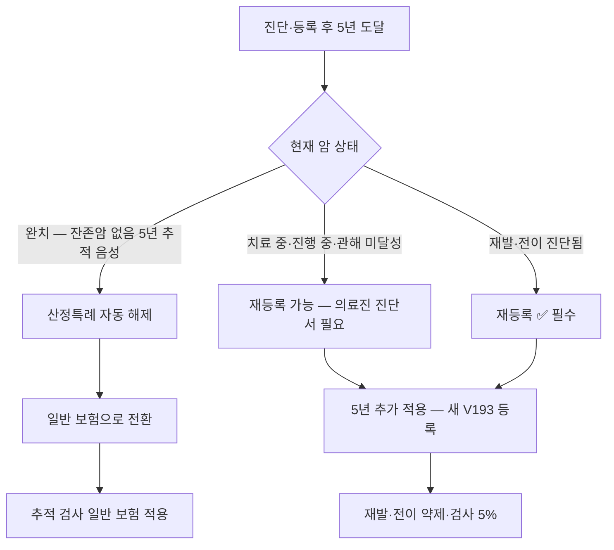

# 산정특례 갱신 가이드 — 5년 시점·재발·전이 재등록

## 개요
한국 **산정특례 (중증질환 본인일부부담금 산정특례)** 는 유방암 환자의 본인부담을 약 **5%로 경감**하는 핵심 행정 제도다. **암 진단일로부터 5년간 적용**되며, 5년 시점에서 **잔존암·재발·전이 여부에 따라 재등록·해제**가 결정된다. 카페에서 가장 자주 분쟁·문의되는 시점이 **5년 갱신·재발 시 재등록**이며, 의료진·국민건강보험공단·심평원 간 행정 절차를 환자가 직접 챙겨야 한다. 본 페이지는 갱신 동선·필요 서류·재등록 시나리오를 정리한다. 청구 전반은 [[insurance-admin/보험행정]], 실손은 [[insurance-admin/실비보험가이드]] 참조.

## 핵심 내용

### 산정특례 기본 — 빠른 복습

| 항목 | 내용 |
|------|------|
| **적용 기간** | 암 진단·등록일로부터 **5년** |
| **본인부담률** | 입원·외래·약제 **5%** (일반 보험 환자 20~50% 대비 ↓) |
| **코드** | **V193** (악성신생물 — 유방암 포함) |
| **신청 시점** | 진단 직후 (조직검사 양성 확정 후) |
| **신청 장소** | 진료병원 원무과 → 건보공단 자동 등록 |
| **적용 범위** | 등록 질환에 대한 입원·외래 진료비, 약제비 |
| **비적용** | 비급여 항목 (선택 진료비·상급병실료·일부 검사·미용 등) |

### 5년 시점 — 갱신 vs 해제 결정 흐름

### 시나리오 A — 완치 후 5년 시점 자연 해제

**조건**:
- 5년 추적 검사 모두 음성
- 호르몬치료 등 유지 약물 복용 중이라도 **재발 증거 없음**
- 잔존암 없음

**결과**:
- 산정특례 자동 해제 (별도 신청 ❌)
- 호르몬치료 약제비·정기 추적 검사도 **일반 보험** 적용
  - 본인부담 5% → 약 30% (대부분 외래)
- 카페 사례: "5년 후 갱신 안 되어 약값 6배 증가" — 흔한 충격 포인트

**대비 전략**:
- 5년 도달 전 [[insurance-admin/실비보험가이드|실손보험]] 약관 재검토
- 호르몬치료 비용 부담 증가 예상 (월 단위로 누적)
- 일부 환자: 본인부담 증가 후 호르몬치료 임의 중단 위험 — **의료진과 사전 상의 권장**

> ⚠️ 호르몬치료 5~10년 권고 환자에서 5년 산정특례 해제 후에도 **약물 지속 권고는 유지** — 비용 부담 전략 필요.

### 시나리오 B — 재발·전이 진단 시 즉시 재등록

**조건**:
- 5년 이내 또는 이후 **재발·전이 진단** (영상·조직·종양표지자 등)

**재등록 절차**:
1. 진단 즉시 담당의에게 **재등록 진단서** 요청
2. 진료 병원 원무과 → 건보공단 산정특례 재등록 신청
3. 약 **1~2주 내 처리** — 등록 즉시 새 5년 시작
4. 등록 직전 진료비 환급 — **소급 적용 가능** (의료진·병원과 협의)

**중요**:
- 4기 (M1) 진단 → 산정특례 적용 **무제한 갱신 가능** (보건복지부 지침)
- 단, 매 5년마다 재등록 신청 필요 — 자동 ❌
- 재발·전이 약제 (엔허투·CDK4/6·올라파립·vepdegestrant 등) 모두 5% 적용

### 시나리오 C — 5년 시점 잔존암·치료 중

**조건**:
- 항암·방사선·표적치료 진행 중이지만 5년 도달
- 완전 관해 (CR) 미달성 — 부분 관해·진행 안정 상태

**재등록 절차**:
- 의료진 판단으로 재등록 가능 (재발 증거 없어도 활발 치료 중인 경우)
- 진단서에 "**치료 진행 중**" 명시
- 카페 회원: 일부는 거절·일부는 인정 — **병원별·지역 보험공단별 편차** 보고

> 💡 **거절 사례 대응**: 의료진 진단서 + 추적 검사 결과지 + 약제 처방 기록 동봉. 거절 시 국민건강보험 이의신청 (90일 이내).

### 시나리오 D — DCIS (상피내암) 등록·갱신

- DCIS (in situ)는 **V193**이 아닌 다른 산정특례 코드 적용 (병원별 차이)
- 5년 후 침윤암 진단 시 V193으로 새 등록
- 호르몬치료 5년 권고 환자 — 약제비 부담 변화 사전 확인

→ [[insurance-admin/유방암보험청구쟁점|C코드/D코드 동시 진단금 청구]] 참조

### 갱신 시 환자가 챙길 서류

| 서류 | 발급처 | 용도 |
|------|--------|------|
| **진단서** (재발·전이·치료 중 명시) | 담당 종양내과·외과 | 산정특례 재등록 |
| **조직검사 결과지** | 병리과 | 진단 근거 |
| **영상검사 결과지** | 영상의학과 | 재발·전이 증거 |
| **약제 처방 기록** | 약국·의무기록 | 치료 진행 증명 |
| **이전 산정특례 등록증** | 본인 보관 | 재등록 연속성 |
| **신분증·등본** | 본인 | 신청 행정 |

### 산정특례 ↔ 사보험·실손 보험 — 동시 활용

- **건강보험 산정특례 (5%)** + **사보험 (실손·진단금·수술비)** = **이중 보장**
- 진단금·수술비는 산정특례와 무관 — 사보험 약관에 따라 청구
- **실손**: 산정특례 본인부담 5%에 대해서도 다시 청구 가능 (대부분 환급 효과 큼)
- → [[insurance-admin/실비보험가이드]] 세대별 청구 단계

### 자주 분쟁되는 항목

| 분쟁 | 사례·대응 |
|------|-------------|
| **5년 자동 해제 통보 누락** | 환자가 미리 인지 — 만료 3개월 전부터 갱신 검토 |
| **재발 진단 직후 등록 지연** | 진료 당일 진단서 발급 요청, 원무과 즉시 신청 |
| **호르몬치료 진행 중 갱신 거절** | 의료진 진단서 + 약제 기록 보강해 이의신청 |
| **소급 적용 거절** | 등록 신청 시점부터 적용 — 미리 신청이 핵심 |
| **잔존암 평가 차이** | 의료진 의견 차이 — 다학제·2차 의견 활용 |

### 4기·전이성 환자 — 무제한 갱신 가능

**한국 보건복지부 지침**:
- 4기 (M1·원격 전이) 진단 환자는 **산정특례 무제한 적용 가능**
- 단, **5년마다 갱신 신청 필요** — 자동 ❌
- 누락 시 임시 일반 보험 전환 가능성 — 갱신 시점 일정 관리 핵심

**환자 활용**:
- [[research/임상시험|임상시험 등록]] 환자도 산정특례 유지 가능
- 비급여 약제 (예: NATALEE 리보시클립 조기) — 산정특례 비적용, 별도 비용

### 일정 관리 — 5년 갱신 캘린더

| 시점 | 행동 |
|------|------|
| **진단·등록 직후** | 등록증 보관, 5년 만료일 캘린더 등록 |
| **만료 1년 전** | 추적 검사 결과·치료 상태 점검 시작 |
| **만료 6개월 전** | 의료진과 갱신 가능성 사전 상의 |
| **만료 3개월 전** | 진단서·필요 서류 준비 |
| **만료 1개월 전** | 원무과·건보공단 신청 |
| **만료 시점** | 갱신 또는 해제 처리 — 결과 확인 |
| **만료 후 1년** | 일반 보험 전환 후 비용 변화 추적 |

> 💡 카페 권고: "**캘린더 알림·가족 공유**가 갱신 누락 회피의 핵심" — 가족이 일정을 같이 챙기는 모델 권장.

## 신약·임상시험·호스피스 — 산정특례 동선 확장 (2026-06)

### ASCO 2026 후 신약 도입과 산정특례

| 신약 (한국 도입 진행 중) | 산정특례 영향 |
|----------------------------|----------------|
| **vepdegestrant** (ER+ ESR1 변이) | 식약처 허가 후 산정특례 5% 적용 예상 — 2026 하반기 |
| **T-DXd (DESTINY-Breast05/09/11)** | 적응증 확대 시 모두 산정특례 — 보험 적용 평가 진행 |
| **PARP — PALB2 적응증 확대** | **현재 BRCA1/2 한정** — 2027 PALB2 확대 시 신규 환자 산정특례 가능 |
| **다트로웨이 (Dato-DXd)** | 한국 신청 단계 — 산정특례 적용 시점 미정 |

> 💡 신약은 **식약처 허가 + 심평원 평가 + 보험 적용** 3단계 후 산정특례 적용. **임상시험 단계 약제는 보통 무상 제공**으로 산정특례와 별개.

### 임상시험 등록 환자 산정특례 (2026-06)

- **임상시험 참여 ≠ 산정특례 해제** — 시험 외 표준 치료 비용은 산정특례 유지
- **시험 약제**: 보통 후원사 무상 제공 (산정특례 무관)
- **시험 외 추가 검사**: 시험 후원사 부담
- **표준 치료·정기 추적**: 산정특례 5% 적용 유지
- **부작용 처치**: 산정특례 적용 (응급실·입원 포함)

→ [[research/임상시험|임상시험 상세]]

### 페니트리움 등 한국 신약 임상 등록 시 산정특션 (2026-06)

- 페니트리움 (현대ADM) 1상 → 2상 IND 신청 임박
- 페니트리움 + 키트루다 병합 임상 환자 등록 시작
- **임상시험 등록 환자는 산정특례 유지 + 무상 시험 약제** — 비용 부담 ↓
- 시험 종료 후 약제 접근성 변화 가능 — 의료진과 사전 상의

### 4기 → 호스피스 전환 시 산정특례 동선 (2026-06)

[[preparation-facilities/호스피스완화의료|호스피스 통합]] 시 산정특례 적용 변화:

| 단계 | 산정특례 적용 |
|------|------------------|
| **자문형 완화의료** | 적극치료 병행 — 산정특례 유지 |
| **가정형 호스피스** | 산정특례 적용 + 가정 방문료 일부 보험 |
| **입원형 호스피스** | **산정특례 + 호스피스 별도 정액 수가** (본인부담 ↓↓) |
| **사망 후** | 산정특례 자동 종료 (가족 별도 행정 ❌) |

> 💡 입원형 호스피스는 **본인부담률 5% 미만** 가능 — 정액 수가 적용으로 가장 부담 적음. 단, 입원 대기 사전 등록 필요.

### PALB2 환자 가족 cascade testing 시 산정특례

- PALB2 변이 가족 검사 적응증 충족 시 산정특례 일부 적용
- → [[diagnosis-workflow/유방암유전상담|cascade testing 동선]]
- PARP 보험 확대 시 PALB2 환자 산정특례 신규 등록 가능

## 임상적 의의

- 산정특례는 한국 환자 의료비의 **가장 큰 보호 장치** — 5% vs 일반 30%+
- 5년 시점·재발·전이 시 **환자가 직접 챙겨야** 자동화 부재
- 4기·전이성 환자는 **무제한 갱신** — 일정 관리만 잘 하면 평생 적용
- 산정특례 + 사보험 이중 활용으로 [[insurance-admin/실비보험가이드|실손 환급]] 효과 극대화
- 카페 분쟁의 큰 비중이 5년 시점 — 사전 교육·일정 관리로 회피 가능
- **신약 도입·임상시험 등록·호스피스 전환** 시 산정특례 동선 통합 평가 필요

## 관련 개념
- [[insurance-admin/보험행정]] — 산정특례 등록 초기·전체 행정 체계
- [[insurance-admin/실비보험가이드]] — 산정특례 5% + 실손 환급 이중 활용
- [[insurance-admin/유방암보험청구쟁점]] — 청구 분쟁 쟁점 (C코드·재발·재건)
- [[insurance-admin/손해사정사대응]] — 갱신 거절·이의신청 시 손해사정 대응
- [[insurance-admin/환자지원프로그램]] — 산정특례 외 추가 자원 (PSP·복지)
- [[mental-experience/치료후삶]] — **5년 추적·장기 생존자 케어 동선과 갱신 시점 통합 — 환자 일정 관리 핵심**
- [[cases/장기생존_4기경험담]] — **4기 무제한 갱신 시나리오의 실제 사례 — 산정특례 ↔ 약제 순차 사용 동선 양방향 cross-link**
- [[treatment-systemic/호르몬치료]] — 5~10년 호르몬치료 5년 갱신 영향
- [[research/임상시험]] — 임상시험 등록 환자 산정특례 유지

## 미해결 질문 / 연구 방향
> 💡 5년 갱신 자동 알림 시스템 — 국민건강보험공단 디지털 도입
>    → **답변 (2026-06)**: 일부 지역 보건소 시범 — 카카오톡·SMS 알림 진행. 전국 단위 표준화 미정. 환자 본인 일정 관리가 여전히 핵심.
>
> 💡 호르몬치료 5~10년 환자 산정특례 5년 후 비용 부담 영향 — 실제 중단율
>    → **답변 (2026-06)**: 일부 단일 기관 연구 — 5년 산정특례 해제 후 호르몬치료 중단율 약 5~10% ↑ 추정. 정밀 데이터 부족. **카페 사례 다수** — 비용 부담을 사유로 의료진과 임의 중단 상의.
>
> 💡 4기 환자 갱신 누락 시 임시 보장 — 행정 보완책
>    → **답변 (2026-06)**: 현재 누락 시 일반 보험 자동 전환 → 환자 충격. 보건복지부 자동 갱신 시스템 검토 단계 — 도입 미정.

## 주의사항
> ⚠️ 본 페이지는 일반 가이드이며, 개별 환자의 갱신 가능 여부는 의료진·국민건강보험공단 판단에 따른다.
> ⚠️ 5년 만료 시점은 환자가 직접 챙겨야 — 자동 알림 부재. 캘린더 관리 필수.
> ⚠️ 갱신 거절 시 90일 이내 국민건강보험 이의신청 가능 — 시한 놓치지 않도록 주의.

## 출처
- 보건복지부. 중증질환 산정특례 운영 지침. 2024.
- 국민건강보험공단. 본인일부부담금 산정특례. https://www.nhis.or.kr
- 건강보험심사평가원. 산정특례 등록·갱신 안내. https://www.hira.or.kr
- 한국유방암환우총연합회. 환자권리 가이드. 2024.
- 네이버 카페 '유방암이야기' — 보험처리 게시판 회원 경험담 다수.

## 업데이트 히스토리
- 2026-06-02: 신규 생성 (library-check 보강 추천 Top 3 — insurance-admin 산정특례 갱신). 5년 시점 결정 흐름도, 4가지 시나리오 (완치 해제·재발 재등록·잔존암·DCIS), 필요 서류 6종, 사보험·실손 동시 활용, 자주 분쟁되는 5개 항목, 4기 무제한 갱신, 5년 갱신 캘린더 7시점
- 2026-06-08: **신약·임상시험·호스피스 — 산정특례 동선 확장** 섹션 신규 (library-check Top 3) — ASCO 2026 후 신약 도입 (vepdegestrant·T-DXd·PALB2 PARP·Dato-DXd)과 산정특례 시점, 임상시험 등록 환자 산정특례 유지, 페니트리움 등 한국 신약 임상 환자, 4기→호스피스 전환 시 산정특례 동선 4단계, PALB2 cascade testing
