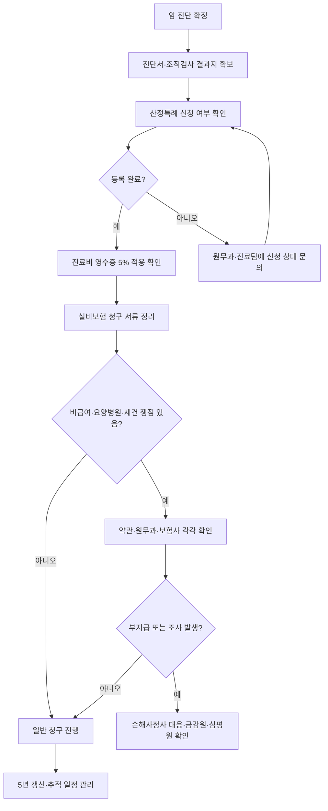

# 유방암 환자 보험·행정·제도 가이드

## 개요
암 진단 직후 의료비 부담을 줄이는 행정 절차는 중증환자(산정특례) 등록부터 시작한다. 이후 실비 보험 청구, 4기 환자의 장애 등록, 요양병원 선택, 직장 내 병가·재택근무 협의까지 단계별로 행정 작업이 이어진다. 카페 회원들의 실전 경험에서 반복되는 체크포인트를 정리한다.

> 💡 **진단 직후 처음 오셨다면** [[처음온사람안내|처음 온 사람 안내]]부터 — 결과지 정리, 수술 전 대기 동선, 보호자가 도울 일까지 입구 가이드.

> 💡 보험금 청구·분쟁이 메인 주제라면 다음 3개 전용 페이지를 참조:
> - [[실비보험가이드]] — 실비 세대별 구조·면책기간·청구 단계·본인부담상한제
> - [[손해사정사대응]] — 동의서 분류·면담·부지급·금감원·민사소송
> - [[유방암보험청구쟁점]] — BRCA·상피내암+침윤암·유전자검사·방사선총조사량·재건 쟁점별 청구법

## 핵심 내용

### 진단 직후 행정 처리 흐름

### 중증환자 등록 (산정특례)

- 암 진단 확정 후 등록 여부를 **바로 확인**
- CT, MRI, PET-CT, 본스캔 등 검사비 부담이 크게 줄었다는 경험담 다수
- 병원 원무과 또는 진료팀에 등록 절차 문의 → 5년 단위 갱신

### 산정특례 절차 — 진단 → 등록 → 청구 → 갱신

| 단계 | 시점 | 행동 |
|------|------|------|
| **1. 진단 확정** | 조직검사 결과 (C50.x 코드) | 외과·종양내과 진단서 발급 |
| **2. 산정특례 신청** | 진단 후 1주 이내 | 병원 원무과·진료협력실 — 의사 작성 신청서 |
| **3. 등록 확인** | 신청 후 1~2주 | 건강보험공단에서 등록 완료 통보 |
| **4. 본인부담 5%** | 등록일부터 | 본인부담률 일반 20% → **5%** |
| **5. 진료비 영수증 확인** | 매 진료 | 산정특례 적용 여부 영수증에서 확인 |
| **6. 보험 청구** | 매 진료/입원 후 | [[실비보험가이드|실비보험]] 제출 |
| **7. 5년 갱신** | 5년 후 (재발·전이 없어도) | 외과·종양내과 갱신 신청 — 진료 지속 시 갱신 가능 |
| **8. 산정특례 제외** | 완치 5년 + 추적 종료 | 환자에 따라 일부 환자는 제외 (단, 호르몬치료 중 환자는 지속 가능) |

> 💡 카페 사례 #683093 (삼중음성 4기 10년 생존): 영상상 암 소실 + 무치료 상태 4년 → **2023년 산정특례 제외** — 산정특례 종료는 완치 의미 (행정상)일 수 있음.

### 4기 환자 행정 체크리스트

전이성·재발성 4기 진단 시 동시에 진행할 행정:

| 항목 | 일정 |
|------|------|
| ✅ 산정특례 5년 갱신 확인 | 진단 후 즉시 |
| ✅ 실비 보험 청구 — 입원·통원·검사 ([[실비보험가이드]]) | 매 진료 후 |
| ✅ 비급여 약제 PSP 신청 ([[환자지원프로그램]]) | 약제 처방 시 |
| ✅ 국민연금 장애연금 평가 | 4기 진단 후 |
| ✅ 장애인 등록 (보건복지부) | 4기 진단 후, 의료진 진단서 필요 |
| ✅ 직장 — 병가·재택·휴직 협의 | 진단 후 즉시 |
| ✅ 가족 — 보호자 분담·돌봄 SOS 신청 | 진단 후 |
| ✅ 사전연명의료의향서 등록 ([[호스피스완화의료]]) | 본인 상태 좋을 때 미리 |
| ✅ 보험 분쟁 시 [[손해사정사대응]] 검토 | 분쟁 발생 시 |

### 실비·보험 청구

- **법정 비급여**와 **임의 비급여**는 보장 여부가 다를 수 있음
- 보험사가 거절하면:
  - 건강보험심사평가원 **비급여진료비 확인신청**
  - 금감원 민원
- 약관·콜센터 확인이 필요한 항목:
  - 요양병원 입원
  - 암 입원일당
  - 여성질환 특약

→ 세대별 구조·면책기간·청구 단계는 [[실비보험가이드]] 참조  
→ 손해사정사 면담 시 동의서·부지급 대응은 [[손해사정사대응]] 참조  
→ BRCA·상피내암+침윤암·유전자검사·방사선·재건 쟁점별 청구는 [[유방암보험청구쟁점]] 참조

### 재건술 보험 처리

- 유방암으로 인한 [[유방재건수술]]은 **미용 목적이 아니라 치료 목적**임을 진단서에 명확히 적는 것이 중요
- 실비 보장 범위는 가입 시기·약관에 따라 차이
- 선별급여, 상급병실료, 비급여 항목은 병원 원무과와 보험사에 **각각 확인**

### 장애 등록 (전이성 4기)

- 4기 전이암은 장애 등록 가능성이 언급됨
- 신청처: 국민연금공단 또는 주민센터 확인

### 국민연금 장애연금 — 실제 신청 경험 (#624937)

카페 회원이 정리한 실제 승인 사례 (재발·전이 게시판 TOP50):

- 신청 근거: 유방암 수술·재발·난소/난관 절제·항암·방사선 이력
- 제출 서류: 수술·치료 이력 다수
- 핵심 확인 항목:
  - 국민연금 **납입 요건** 충족 여부
  - 치료 기간·후유 기간 기준
  - **지사에 사전 문의**로 필요 서류 확정 후 진행

> 💡 1기 환자도 후유 평가에 따라 가능성이 있다는 카페 댓글이 있음 — 단정 말고 지사·공단 문의 권장.

### 비급여 약제 지원 (전이성 환자)

전이성 약제는 보험 미적용·비급여 부담이 크므로 다음 지원 채널을 미리 확인:

- **제약사 환자 지원 프로그램** (입랜스·키스칼리·엔허투·트로델비 등)
- 한국유방암학회·관련 협회 지원
- 병원 사회복지팀 통한 연결
- 산정특례 + 비급여 조합 검토

→ 약제별 상세는 [[항암화학요법]]·[[호르몬치료]]·[[HER2표적치료]]·[[TNBC치료]] 참조

### 요양병원 선택 기준

선택 시 사전 방문해서 확인:
- 항암 부작용 대응 수준
- 회복 환경
- 식사 품질
- 통원 거리
- **암 전문 코디네이터 유무**
- 수액·영양 지원, 도수치료 제공 여부
- 본병원과의 연계 가능성, 주치의 상담 빈도

→ 4가지 유형(휴양형·액티비티형·관광형·치료집중형)과 상담 체크리스트는 [[요양병원선택]] 참조

→ 실제 활용 사례: [[TCHP항암_요양병원케이스]] — TCHP 6회 중 3차부터 항암 직후 10일씩 요양병원 입원해 회복한 카페 회원 경험담

> ⚠️ 요양병원은 표준치료를 **대체하지 않으며**, 항암을 버티기 위한 보조적 회복 수단으로 본다.

### 직장생활·복직

- 병가, 연차, 재택, 반차를 조합해 치료를 병행한 사례 다수
- [[항암화학요법]] 당일과 며칠 후 컨디션 패턴을 기록하면 출근 가능일 예측에 유리
- 회사에 공유 범위: 필요한 만큼만, **업무 조정·재택·회의 방식** 등 구체 요청 준비

## 임상적 의의

- 중증환자 등록 지연은 가족의 의료비 부담을 즉시 크게 증가시키므로 **진단 당일 절차 시작**이 효과적
- 보험사 거절 시 비급여진료비 확인신청 제도는 일반에 덜 알려져 있어 카페 경험담이 큰 도움이 됨
- 4기 환자 장애 등록은 경제적 보호와 함께 의료 외 사회보장 접근성을 확장

## 관련 개념
- [[유방재건수술]] — 재건 보험 처리에 필요한 진단서 문구
- [[항암화학요법]] — 항암 일정 기반 직장 복귀 계획
- [[환자지원프로그램]] — 병원 사회복지팀, 돌봄 SOS 등 추가 자원
- [[치료후삶]] — 복직 후 장기 생활 관리
- [[TCHP항암_요양병원케이스]] — 실비 활용 요양병원 병행 항암 케이스
- [[요양병원선택]] — 4가지 유형, 상담 체크리스트, 면역·도수치료 분류
- [[장기생존_4기경험담]] — 4기·전이 환자의 보험·행정·약제 지원 사례
- [[전이경고신호]] — 전이 진단 직후 행정 체크리스트
- [[실비보험가이드]] — 실비 세대·면책기간·청구 단계
- [[손해사정사대응]] — 동의서·면담·부지급 대응
- [[유방암보험청구쟁점]] — 쟁점별(BRCA/상피내암/유전자검사/방사선/재건) 청구법
- [[한국유방암통계]] — 산정특례·검진 보급률·발생률·5년 생존율 통계
- [[직장복귀_법적권리]] — 산재·근로기준법·직장 복귀 행정 가이드
- [[처음온사람안내]] — 진단 직후 보험·행정 동선의 시작점
- [[glossary/용어사전]] — 산정특례·장애등급·요양급여 등 행정·제도 용어 풀이

## 미해결 질문 / 연구 방향
> 💡 2026년 산정특례 갱신 기준 변경 여부 — 정책 추적 필요
> 💡 디지털 가상화폐·NFT 등 신종 자산이 장애 등록 소득 평가에 미치는 영향

## 주의사항
> ⚠️ 보험·행정 정보는 시점·지역·개별 약관에 따라 달라진다. 정확한 보장 범위는 가입 보험사·관할 행정기관에 직접 확인한다.

## 출처
- 네이버 카페 '유방암이야기' 회원 경험 공유 — Notion 큐레이션. 2026. https://fehoon.notion.site/35fbae8c4f5981de98afdd57422915d8

## 업데이트 히스토리
- 2026-05-18: Notion 카페 가이드 기반 신규 생성 — 산정특례, 실비, 장애 등록, 요양병원, 직장 가이드
- 2026-05-18: Notion v2 갱신분 반영 — 요양병원 선택 기준에 수액·도수치료·본병원 연계 추가; [[TCHP항암_요양병원케이스]] 링크
- 2026-05-19: Notion TOP50 후기 큐레이션 반영 — [[요양병원선택]] 링크 추가
- 2026-05-20: Notion 재발·전이 TOP50 반영 — 국민연금 장애연금 신청 경험(#624937), 비급여 약제 지원 채널 추가
- 2026-05-21: Notion 보험처리 TOP50 — 보험금 청구 메인 주제 3개 전용 페이지로 분리 ([[실비보험가이드]]·[[손해사정사대응]]·[[유방암보험청구쟁점]]), 본 페이지는 행정 전반 허브로 정리
- 2026-05-25: library-check cross-link 보강 — [[glossary/용어사전]] 연결
