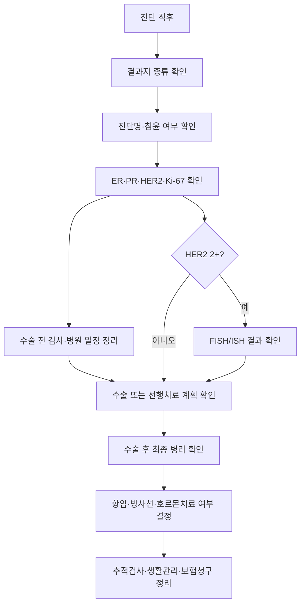

# 처음 온 사람 안내 — 진단 직후 길잡이

## 개요

유방암 진단 직후에는 정보가 너무 많아서 오히려 무엇부터 봐야 할지 막막해진다. 이 페이지는 처음 방문한 환자와 보호자가 **지금 당장 확인할 것**, **나중에 봐도 되는 것**, **의사에게 꼭 물어볼 것**을 순서대로 정리한 입구 페이지다.

> ⚠️ 주의: 이 위키는 진료를 대신하지 않는다. 검사 결과와 치료 순서는 병원·병기·서브타입·동반질환에 따라 달라지므로, 중요한 결정은 반드시 담당 유방외과·종양내과·방사선종양학과와 확인한다.

## 핵심 내용

### 처음 방문자 전체 동선

### 1. 오늘 할 일 — 정보 수집보다 정리

처음에는 치료법을 전부 외우려고 하기보다, 내 상황을 설명하는 기본 정보를 모으는 것이 먼저다.

| 확인할 것 | 왜 중요한가 | 연결 문서 |
|---|---|---|
| 진단명 | 양성, 상피내암, 침윤암 여부가 치료 방향을 가른다 | [[diagnosis-tests/조직검사결과해석]] |
| 검사 결과지 종류 | 영상·조직·수술 병리 결과지는 읽는 항목이 다르다 | [[diagnosis-workflow/검사결과지읽기도우미]] |
| ER·PR·HER2·Ki-67 | 유방암 서브타입과 약물치료 방향을 정한다 | [[diagnosis-tests/면역조직화학검사(IHC)]] |
| 병원 예약 일정 | 수술 전 검사, 마취 평가, 추가 영상검사 순서가 잡힌다 | [[diagnosis-workflow/유방암진단체계]] |
| 보험·행정 서류 | 진단서, 산정특례, 실비 청구 준비에 필요하다 | [[insurance-admin/보험행정]] |

### 2. 처음 읽으면 좋은 순서

처음부터 모든 문서를 읽을 필요는 없다. 아래 순서대로 보면 전체 그림이 잡힌다.

1. [[diagnosis-workflow/유방암진단체계|유방암 진단 체계]]
2. [[diagnosis-workflow/검사결과지읽기도우미|검사 결과지 읽기 도우미]]
3. [[biology/유방암분자서브타입|유방암 분자 서브타입]]
4. [[treatment-surgery/유방암수술|유방암 수술]]
5. [[preparation-facilities/치료준비물|입원·항암·방사선 준비물 종합]]
6. [[insurance-admin/보험행정|유방암 환자 보험·행정·제도 가이드]]
7. [[glossary/용어사전|유방암 용어사전]]

### 3. 수술 전 대기 중이라면

수술 전에는 "지금 뭘 해야 하나"라는 불안이 커진다. 이 시기에는 치료를 앞당기려고 무리하게 정보를 늘리기보다, 수술과 최종 병리 결과를 기다리면서 준비할 일을 나누는 것이 좋다.

| 할 일 | 구체적으로 |
|---|---|
| 병원 일정 정리 | 수술일, 입원일, 수술 전 검사일, 외래일을 가족과 공유 |
| 질문 메모 | 진료실에서 물어볼 질문을 휴대폰 메모에 미리 작성 |
| 결과지 보관 | 조직검사, 영상검사, 진단서, CD, 보험 서류를 한 폴더에 정리 |
| 생활 준비 | 입원 준비물, 수술 후 팔 움직임 제한, 보호자 동선 확인 |
| 마음 관리 | 검색 시간을 정해두고, 잠들기 전 과도한 검색은 피하기 |

수술 전 단계에서 특히 자주 보는 문서:
- [[treatment-surgery/유방암수술]] — 수술 방식과 림프절 확인
- [[treatment-supportive/림프부종]] — 수술 후 팔·어깨 관리
- [[preparation-facilities/치료준비물]] — 입원 준비물
- [[mental-experience/보호자심리지지]] — 환자와 보호자의 소통

### 4. 의사에게 처음 물어볼 질문

진료 시간은 짧기 때문에 질문은 짧고 구체적으로 준비하는 것이 좋다.

> 🩺 **의사에게 꼭 확인하세요**
> - 현재 결과 기준으로 암의 종류는 무엇인가요?
> - ER, PR, HER2, Ki-67 결과는 어떻게 나왔나요?
> - 수술 전 추가 검사가 필요한 이유는 무엇인가요?
> - 수술 범위와 림프절 검사는 어떻게 계획되어 있나요?
> - 최종 병기와 항암 여부는 언제 확정되나요?
> - 수술 전까지 피해야 할 약, 건강식품, 운동이 있나요?
> - 응급실에 가야 하는 증상은 무엇인가요?

### 5. 보호자가 도울 수 있는 방식

보호자는 모든 답을 대신 찾아야 하는 사람이 아니라, 환자가 치료를 버틸 수 있도록 현실적인 부담을 나눠주는 사람이다.

| 보호자가 맡기 좋은 일 | 설명 |
|---|---|
| 일정 관리 | 외래·검사·입원 날짜와 준비물 체크 |
| 기록 담당 | 진료실 설명을 메모하고 모르는 용어 표시 |
| 서류 정리 | 진단서, 영수증, 세부내역서, 보험 청구 서류 보관 |
| 검색 필터 | 검증되지 않은 치료법·건강식품 정보 걸러내기 |
| 정서 지원 | 섣부른 낙관보다 "같이 확인하자"는 태도 유지 |

보호자에게 필요한 문서:
- [[mental-experience/보호자심리지지]] — 말과 태도
- [[insurance-admin/보험행정]] — 행정 절차
- [[insurance-admin/실비보험가이드]] — 실비 청구 흐름
- [[insurance-admin/손해사정사대응]] — 보험 조사 대응

### 6. 단계별 통합 진입 동선 (2026-06)

진단 직후부터 1년 이상의 치료 여정을 한눈에 — 각 단계별 핵심 페이지 통합:

#### 단계 1: 진단 직후 1~2주 (수술 전 대기)

| 영역 | 핵심 페이지 |
|------|--------------|
| 결과지·서브타입 이해 | [[diagnosis-workflow/검사결과지읽기도우미]] · [[diagnosis-tests/조직검사결과해석]] · [[biology/유방암분자서브타입]] |
| 영상 검사 흐름 | [[diagnosis-imaging/유방영상검사가이드]] · [[diagnosis-workflow/유방암진단체계]] |
| 유전상담·BRCA | [[diagnosis-workflow/유방암유전상담]] · [[biology/BRCA유전자]] |
| 의사결정 도구 | [[mental-experience/환자의사결정도구]] (DA·PREDICT·RSClin) |

#### 단계 2: 수술 준비·수술 (1~2주~수일)

| 영역 | 핵심 페이지 |
|------|--------------|
| 수술 종류·동선 | [[treatment-surgery/유방암수술]] (수술 당일 9시점·4축 의료 준비) |
| 재건 결정 | [[treatment-surgery/유방재건수술]] (자가조직·보형물·ADM·BresDex DA 도구) |
| 입원 가방·써지브라 | [[preparation-facilities/치료준비물]] (수술 준비 매트릭스·써지브라 4시점) |
| 요양병원 vs 집 | [[preparation-facilities/요양병원선택]] (수술 직후 결정 가이드) |
| 가임 계획자 | [[treatment-supportive/가임력보존]] (POSITIVE 5년 안전성) |

#### 단계 3: 항암 (TCHP·AC·TC, 약 4~6개월)

| 영역 | 핵심 페이지 |
|------|--------------|
| 회차별 부작용 패턴 | [[cases/TCHP항암_요양병원케이스]] (TCHP 워크플로우 hub) |
| 항암 식이 | [[nutrition-exercise/항암중식이주의]] · [[nutrition-exercise/식이영양관리]] · [[nutrition-exercise/한국유방암영양가이드]] |
| 부작용 관리 | [[treatment-systemic/항암화학요법]] · [[treatment-supportive/통증관리]] · [[treatment-supportive/혈관접근장치]] |
| 약물 상호작용 | [[treatment-supportive/약사협진_약물상호작용]] (지르텍·OTC·영양제) |
| 정신건강 | [[mental-experience/유방암환자정신건강]] · [[mental-experience/보조요법주의]] |

#### 단계 4: 방사선·후항암·표적치료 (수개월)

| 영역 | 핵심 페이지 |
|------|--------------|
| 방사선 단기·장기 | [[treatment-radiation/방사선치료]] · [[treatment-radiation/방사선장기부작용]] |
| HER2 표적치료 | [[treatment-systemic/HER2표적치료]] (pCR/non-pCR·T-DM1·T-DXd·APT) |
| HER2-low ADC | [[treatment-systemic/HER2-low치료]] |
| PARP (BRCA) | [[treatment-systemic/PARP억제제]] (OlympiA 10년) |
| 면역치료 (TNBC) | [[treatment-systemic/TNBC치료]] (KEYNOTE-522·TROPION-Breast04) |

#### 단계 5: 호르몬치료 (5~10년)

| 영역 | 핵심 페이지 |
|------|--------------|
| 호르몬 약제 선택 | [[treatment-systemic/호르몬치료]] · [[treatment-systemic/호르몬치료약제비교]] (12약제 비교) |
| CDK4/6 보조·전이 | [[treatment-systemic/CDK46억제제]] (monarchE·NATALEE 5년) |
| 식이·골밀도 | [[nutrition-exercise/호르몬양성식이]] · [[treatment-radiation/방사선장기부작용]] |

#### 단계 6: 추적·생존자 케어 (5~20년)

| 영역 | 핵심 페이지 |
|------|--------------|
| 장기 추적 | [[mental-experience/치료후삶]] (5~20년 추적 일정) |
| 회복기 영양 | [[nutrition-exercise/회복기영양가이드]] |
| 산정특례 갱신 | [[insurance-admin/산정특례갱신가이드]] (5년 시점·재발·전이) |
| 후기 재발 평가 | [[research/온코타입DX_RS점수]] (TAILORx 12년·BCI·EPclin) |
| 이차암 추적 | [[treatment-supportive/이차암]] |
| 직장 복귀 | [[insurance-admin/직장복귀_법적권리]] |

#### 단계 7: 4기·재발·전이 시 (해당 시)

| 영역 | 핵심 페이지 |
|------|--------------|
| 약제 순차 사용 | [[cases/장기생존_4기경험담]] (4기 워크플로우 hub) |
| 전이 분자 기전·MRD | [[research/전이메커니즘_Prrx1]] (CLEVER·c-TRAK TN) |
| 임상시험 등록 | [[research/임상시험]] (한국 신약 페니트리움·TROPION-Breast04) |
| 적극치료 vs 완화 | [[preparation-facilities/호스피스완화의료]] (4기 의사결정) |

> 💡 **단계별 진입 동선의 가치**: 처음 진단 충격에서 안정되는 데 1~2주 걸리는데, 전체 그림을 미리 파악하면 다음 단계 두려움 ↓·의사결정 자신감 ↑. 한 번에 모두 읽기보다 **현재 단계 + 다음 단계**까지만 읽기 권장.

### 7. 검색할 때 조심할 것

진단 직후에는 검색 알고리즘이 가장 자극적인 사례를 먼저 보여줄 수 있다. 아래 정보는 특히 조심해서 본다.

| 정보 유형 | 조심할 이유 |
|---|---|
| "완치 보장" 치료법 | 암 치료에서 보장 표현은 신뢰하기 어렵다 |
| 건강식품·즙·농축액 | 항암·호르몬치료·간수치와 충돌할 수 있다 |
| 병기만 같은 사례 | 서브타입, 나이, 림프절, 유전자 검사 결과가 다르면 치료가 달라진다 |
| 해외 신약 후기 | 국내 허가·급여·적응증이 다를 수 있다 |

식이·보조요법은 [[nutrition-exercise/식이영양관리]], [[mental-experience/보조요법주의]], [[nutrition-exercise/항암중식이주의]]를 먼저 확인한다.

## 임상적 의의

처음 며칠의 목표는 치료를 직접 결정하는 것이 아니라, 담당 의료진과 대화할 수 있을 만큼 기본 구조를 이해하는 것이다. 진단명, 수용체, 병기, 수술 계획, 최종 병리 확인 시점을 알고 있으면 이후 항암·방사선·호르몬치료 설명을 훨씬 안정적으로 따라갈 수 있다.

## 관련 개념

- [[diagnosis-workflow/검사결과지읽기도우미]] — 결과지를 항목별로 읽는 방법
- [[diagnosis-workflow/유방암진단체계]] — 진단부터 병기 결정까지 전체 흐름
- [[biology/유방암분자서브타입]] — ER·PR·HER2에 따른 분류
- [[treatment-surgery/유방암수술]] — 수술 방식과 림프절 확인
- [[insurance-admin/보험행정]] — 산정특례·보험·행정 절차
- [[glossary/용어사전]] — 어려운 용어 쉬운 설명
- [[research/최신업데이트요약]] — 최근 위키에 새로 추가된 내용 한눈에 보기

## 미해결 질문 / 연구 방향

> 💡 처음 방문자의 상황은 진단 직후, 수술 전, 항암 전, 재발·전이 의심 등으로 나뉜다. 향후 단계별 체크리스트를 더 세분화하면 안내 정확도가 높아질 수 있다.
>    → **답변 (2026-05)**: 본 페이지는 진단 직후 입구로 기능. 단계별 세분화는 [[유방암수술|수술 전]]·[[항암화학요법|항암 전]]·[[전이경고신호|재발·전이]]·[[치료후삶|치료 후 장기]] 별도 페이지로 발전. 향후 인터랙티브 가이드·디지털 도구 도입 검토.

## 주의사항

> ⚠️ 같은 유방암이라도 치료 순서는 크게 다를 수 있다. 특히 HER2 양성, 트리플 네거티브, 젊은 나이, 임신 관련 유방암, 유전성 의심, 림프절 전이 여부가 있으면 치료 계획이 달라질 수 있다.

## 출처

- 국가암정보센터. 유방암 정보 및 암환자 생활 안내. https://www.cancer.go.kr
- American Cancer Society. Understanding Your Pathology Report: Breast Cancer. 2023.
- National Cancer Institute. Breast Cancer Treatment and Patient Support Information. https://www.cancer.gov

## 업데이트 히스토리

- 2026-05-25: 신규 생성 — 처음 방문자용 읽기 순서, 수술 전 대기 체크리스트, 보호자 역할, 진료실 질문 정리
- 2026-06-08: **단계별 통합 진입 동선** 섹션 신규 (library-check Top 1) — 7단계 환자 여정 (진단 직후→수술 준비→항암→방사선·표적·면역·후항암→호르몬→추적·생존자→4기 시) 각 영역별 핵심 페이지 매트릭스. 진단 직후 환자가 1~2주 안정기에 전체 그림 파악 가능
