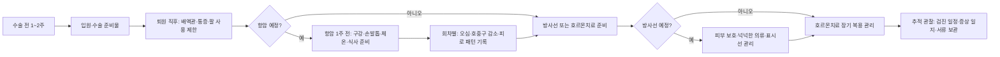

# 입원·항암·방사선 준비물 종합

## 개요
유방암 치료는 입원, 항암, 방사선 등 각 단계마다 필요한 준비물이 다르다. 환자 커뮤니티에서 반복적으로 추천되는 제품과 카테고리를 단계별로 정리한다. 제품명은 경험담에서 자주 언급되는 예시이며 동일 기능 대체품이 있다.

> 💡 **처음 진단받으신 분들께**: 준비물보다 먼저 진단·결과지 정리와 진료실 질문 준비가 우선입니다 → [[처음온사람안내|처음 온 사람 안내 — 진단 직후 길잡이]]

## 핵심 내용

### 치료 단계별 준비 흐름

### 입원 준비물 (수술 입원)

| 구분 | 준비물 |
|------|--------|
| 옷 | 넉넉한 티셔츠, 주머니 있는 옷, 가디건, 수면양말, 앞이 둥근 슬리퍼 |
| 위생 | 수건 여러 장, 각티슈, 물티슈, 마스크, 일회용 팬티, 항암용 칫솔 |
| 식사·수분 | 꺾이는 빨대, 종이컵, 생수, 이온음료, 입맛용 과일 |
| 전자기기 | 충전기, 멀티탭, 이어폰, 태블릿 또는 노트북 |
| 서류 | 필기도구, 클리어파일, 보험·진단 관련 서류 보관 폴더 |
| 통증·자세 | 목베개, 미니쿠션, 팔 받침용 수건, 필요 시 물주머니 |

**복부 재건 수술 추가**: 에어매트, 에어방석, 빨대 컵, 포크 — 움직임을 줄이는 도구

### 입원 전 집 정리

- 혼자 사는 경우 퇴원 후 체력이 떨어지므로 집 청소·생필품을 미리 준비
- **팔을 덜 쓰는 청소용품**: 정전기 청소포, 롤클리너, 물걸레 도구
- 수술 전 피부 자극을 줄이기 위해 무리한 때밀기·새 화장품 사용 회피

### 항암 준비물

| 구분 | 준비물 |
|------|--------|
| 구강 | 미세모 칫솔, 식염수·크린조 가글, 프로폴리스 스프레이, 아프타치·페리덱스 등 처방 제품 |
| 손발톱 | 에보네일, 손발 보습제, 면장갑·면양말 |
| 피부 | 피지오겔, 세타필, 바셀린, 카밀 핸드크림 등 순한 보습제 |
| 체온 | 체온계, 수면비니, 담요, 수면양말, 전기담요 |
| 소화·식사 | 뉴케어·엔커버 등 대체식, 누룽지, 현미차, 작은 용량 음료 |
| 위생 | 물티슈, 일회용 팬티, 키친타월, 소독제 |

→ 항암 부작용별 대처는 [[항암화학요법]] 참조

### 방사선 준비물

- 방사선 크림: 이지듀, 엑스클레어 등
- 알로에젤, 보습크림, 미스트, 냉찜질팩은 **병원 허용 여부 확인 후** 사용
- 부드럽고 넉넉한 옷, 브래지어 대체 의류

→ 주차별 피부 변화·관리 팁은 [[방사선치료]] 참조

### 탈모·가발

- 항암 시작 후 **2~3주 내 탈모** 시작 경험담 다수 → 미리 준비하면 심리적 안정
- 선택지: 기성품, 맞춤 제작, 모자가발 — 외출 빈도와 예산에 맞춰
- **눈썹 문신**은 항암 전 일정과 감염 위험을 병원에 확인한 뒤 결정

### 수술 준비 — 카페 검색 TOP50 통합 (2026-06)

50개 카페 게시글·559개 댓글 기준 **수술 준비 핵심 매트릭스**:

#### 입원 가방 — 부분절제 (2~3일 입원)

| 카테고리 | 항목 (✓ 필수 · △ 선택) |
|----------|----------------------|
| **위생** | ✓ 세면도구·수건·물티슈·비데티슈·휴지·일회용 수건 / △ 마이비데·바디티슈 |
| **음용** | ✓ 텀블러·구부러지는 빨대컵·종이컵·생수 |
| **의류** | ✓ **앞 열리는 옷** (단추 셔츠·지퍼 원피스)·수면양말·슬리퍼·얇은 가디건 |
| **전자기기** | ✓ **긴 충전기(2m+)·멀티탭**·이어폰·휴대폰 거치대 / △ 노트북·태블릿 |
| **수면·휴식** | ✓ 안대·귀마개·목베개·작은 쿠션 |
| **건조 대비** | ✓ 립밤·핸드크림·인공눈물 |
| **기타** | △ 효자손·포크·간식·가글·면봉·메모지 |
| **서류** | ✓ 진단서·산정특례 등록증·실손 청구 양식 |

> 💡 **카페 #29·#36 권고**: 부분절제는 짧은 입원 — **세면·슬리퍼·수건·텀블러·퇴원 시 가디건** 정도만 실제 사용. 너무 많이 챙기지 않기.

#### 입원 가방 — 전절제·재건·확장기 (5~10일 입원, 배액관 1~2개)

부분절제 준비물에 **추가**:

| 카테고리 | 항목 |
|----------|------|
| **배액관 대비** | ✓ **주머니 있는 조끼·남방·앞단추 잠옷** (배액관 주머니용) |
| **씻기 어려움** | ✓ **바디티슈·일회용 수건·일회용 팬티 (5~10개)** |
| **머리 감기** | ✓ **방수 파마보** (보호자가 감겨줄 때 옷 안 젖음) / △ 마른 샴푸 |
| **수술 후 압박** | ⚠️ **써지브라** — 미리 사지 말고 **병원 제공 여부 먼저 확인** |
| **건조 대비 강화** | ✓ MD크림 (압박브라 가려움)·얇은 면티 (브라 안쪽) |
| **장기 입원** | ✓ 보온병·블루투스 이어폰·손선풍기·블루투스 스피커 |

#### 써지브라 — 환자가 가장 자주 묻는 항목 (카페 #1·#4·#44)

| 시점 | 권고 |
|------|------|
| **수술 전** | **미리 사지 말 것** — 병원 제공 여부·맞춤 제공 여부 확인 |
| **수술 직후** | 다수 병원이 **사이즈 맞는 브라 입혀줌** (성형외과·유방외과 제공) |
| **퇴원 후** | 여분 필요 시 — 앞지퍼·심리스·어깨끈·둘레 조절·스포츠브라형 |
| **진피·확장기** | ⚠️ **병원 제공 브라만 사용 지시** 多 — 임의 변경 금지 |
| **가려움·붉어짐** | MD크림 + 얇은 면티 안에 받쳐 입기 (의료진 상담) |

> ⚠️ **카페 공통 결론**: 써지브라는 **"예쁜 브라"보다 병원 지시·착용감 우선**. 보형물 초반 고정·상처 관리가 핵심.

#### 수술 전 집안일·생활 정리 (카페 #9·#12·#16·#31·#35)

"입원 가방"보다 **"퇴원 후 팔을 못 써도 생활이 굴러가게 하는 준비"** 가 핵심:

- **머리 짧게 다듬기** (수술 후 감기 어려움)
- **반찬·국·죽 냉동** 준비 (배우자·자녀 식사용)
- **대청소·이불빨래·식재료 채우기·무거운 물건 치우기**
- **통목욕·세신·사우나·여행** — 미리 (당분간 어려움)
- 가족·보호자 역할 분담·집안 동선 정리

#### 수술 전 의료 준비 — 4축 체크

| 영역 | 확인 항목 |
|------|-----------|
| **약물·영양제** | 1주 전부터 아스피린·올리브오일·들기름·홍삼·석류 중단 (병원 안내문 확인) |
| **예방접종** | 대상포진·폐렴·독감·파상풍 — 항암 예정이면 미리 / 수술 임박이면 후로 (의료진 상의) |
| **치과** | 골다공증 주사 전 스케일링·발치·임플란트 미리 |
| **눈썹문신** | 항암 가능성 시 미리 (그러나 감염·회복 기간 여유 필요) |

#### 수술 당일 — 알아두면 좋은 동선 (카페 #14·#37·#49)

- **유륜주사** — 통증 강할 수 있음, 마취 가능 여부 사전 문의
- **localization 와이어** — 비주얼 부담, 통증 참을 만함 (국소마취)
- **발등·발목 링거** — 혈관 확보 어려우면 숙련자 요청
- **금식** — 자정부터, 머리 묶기, 악세사리 제거, 생리 시작 시 간호사 알림
- **수술실 공기·팔 고정·보호자 헤어짐** — 큰 감정 부담, "**자고 일어나면 회복실**" 마음가짐

#### 보호자 준비물 (카페 #50)

- ✓ 본인 침구·세면도구·전자기기·충전기·간식
- ✓ 환자용 가디건·담요·핫팩 (여름에도 — 환자 추위)·수면양말
- ✓ 씻은 과일 (방울토마토 등)·면손수건·물티슈
- △ 보호자 본인 시간 보낼 도구 (책·노트북·이어폰)

### 단계별 카탈로그 — 수술 → 항암 → 방사선 → 추적 관찰

#### 1단계: 수술 전 1~2주

| 카테고리 | 항목 |
|----------|------|
| 의류 | 앞트임 단추 옷·잠옷, 수면 양말, 슬리퍼 |
| 위생 | 무향 바디워시, 마른 샴푸 (3~5일 머리 못 감을 때), 면 손수건 |
| 통증 보조 | 모유 패드 (배액 흡수), V자 베개, 어깨 받침 쿠션 |
| 식사 | 빨대, 가벼운 컵, 죽·미음용 작은 그릇 |
| 서류 | 진단서 사본·산정특례 등록증·보험 청구 양식 |

#### 2단계: 수술 직후~퇴원 (배액관 있음)

| 카테고리 | 항목 |
|----------|------|
| 배액관 관리 | 배액관 가방·고정 스트랩, 무균 거즈·소독제 |
| 통증 | 처방 진통제·의사 처방 변비약 (오피오이드 동반) |
| 자세 보조 | 어깨 무리 없는 베개, 등받이 의자 |
| 위생 | 한쪽 손으로 사용 가능한 도구·머리띠 |

#### 3단계: 항암 시작 직전 (1주 전)

| 카테고리 | 항목 |
|----------|------|
| 구강 | 미세모 칫솔 (3M·오랄비 등), 죽염가글, 식염수, 프로폴리스 가글, 오라메디·페리덱스 처방 |
| 손발톱 | 에보네일, 손발 보습제, 면장갑·면양말, 손톱영양제 |
| 피부 | 피지오겔·세타필·바셀린·카밀 핸드크림, SPF 50+ 자외선 차단제 |
| 체온 | 체온계 (적외선·전자), 수면비니, 담요, 수면양말, 전기담요 |
| 식사 | 뉴케어·엔커버·메디푸드, 누룽지, 현미차, 작은 용량 음료 |
| 위생 | 물티슈, 일회용 팬티, 키친타월, 손소독제 |
| 가발 | 미리 시술·구매 (반영구눈썹은 항암 전이 안전) |
| 외출 | 모자가발·비니, 마스크 (호중구 감소 시기) |

#### 4단계: 항암 회차별 (회차 사이 1~3주)

| 시기 | 추가 준비 |
|------|------------|
| 1~3일차 | 오심·구토 대비 — 산쿠소 패치·에멘드 처방, 변비약 마그밀 |
| 7~14일차 | 호중구 감소 응급 대비 — 체온 모니터, 외출 마스크, 가족 분리 식기 |
| 식욕부진 시 | 영양 보충제, 단백질 분말 (의료진 확인 후), 작은 용량 자주 |
| 손발증후군 | 보습제 강화, 면장갑·면양말, 통증 시 처방 |

#### 5단계: 방사선 (4~6주)

| 카테고리 | 항목 |
|----------|------|
| 피부 보호 | 방사선 크림 (이지듀·엑스클레어), 알로에젤, 보습크림, 미스트 |
| 의류 | 부드럽고 넉넉한 옷, 브래지어 대체 (스포츠 캠솔), 면 속옷 |
| 표시선 보호 | 마커선 지우지 않기 — 비누칠·문지름 회피 |
| 응급 | 진물·갈라짐 시 식염수 거즈, 처방 연고, 38도 이상 열 시 응급실 (→ [[treatment-systemic/항암화학요법#개요|응급 신호 canonical]]) |

#### 6단계: 호르몬 치료 (5~10년)

| 카테고리 | 항목 |
|----------|------|
| 복용 보조 | 약 케이스 (요일·시간별), 비상용 보관 가방·휴대 케이스 |
| 부작용 관리 | 골밀도 검사 예약 (DEXA, 2년), 칼슘·비타민 D 보충 (의료진 확인) |
| 산부인과 | 정기 검진 (자궁초음파·자궁내막 평가) |
| 안과 | 시야 변화 시 검사 |
| 관절통 | 가벼운 운동·온찜질·물리치료 |

#### 7단계: 추적 관찰 (5~20년)

| 카테고리 | 항목 |
|----------|------|
| 검진 | 정기 맘모그래피 (반대편)·MRI (BRCA)·산부인과 |
| 자가 모니터 | 양팔 둘레 자가 측정 ([[림프부종]] 추적) |
| 자가 인지 | 새 증상 일지 (통증·종양표지자·체중) |
| 정신건강 | 검진 전 불안 관리 — [[유방암환자정신건강|FCR 자원]] |

### 한국 의료비 지원 — 카탈로그별

- 가발: 일부 지자체 의료비 지원 (서울·경기·부산 등)
- 압박 의류·물리치료: 일부 보험 적용
- 영양 보충제·심리 상담: 산정특례 적용 가능 (의료진 처방)
- 자세한 자원은 [[환자지원프로그램]] 참조

## 임상적 의의

- 입원 전 준비는 퇴원 직후 체력 저하 기간의 부담을 줄임
- 항암 준비물은 구내염·손발톱 변화·피부 건조 등 흔한 부작용을 **시작 전 대비**하는 데 효용이 큼
- 방사선 보조 제품은 병원 프로토콜과 충돌 가능하므로 사전 확인이 필수

### 부작용 우선순위 매트릭스 — 본인에게 맞는 준비 (카페 TOP50 2페이지 #14)

전부 사기보다 **본인에게 생길 가능성이 높은 부작용에 맞춰** 우선순위 결정:

| 우선순위 | 부작용 | 핵심 준비물 |
|----------|--------|-------------|
| **1순위 (거의 모든 환자)** | **구내염** | 미세모 칫솔·식염수·처방 가글·프로폴리스 스프레이·구강유산균 |
| **1순위** | **탈모·두피염** | 모자가발 또는 통가발, 두피 순한 비누·소독약·후시딘, 수면비니 |
| **2순위 (회차 따라)** | **손발톱 변화** | 손발톱 보호제 (에보네일), 손톱 영양제, 면장갑·면양말 |
| **2순위** | **피부 건조·착색** | 무향 보습제, SPF 50+ 자외선차단제, 무향 바디클렌저 |
| **2순위** | **오심·변비** | 처방 항구토제, 산쿠소 패치, 마그밀·푸룬주스 |
| **3순위 (TCHP·AC 위주)** | **부종 (3차 이후)** | 부종 완화 스트레칭 영상, 의료진 이뇨제 처방 |
| **3순위** | **눈 분비물·다래끼** | 인공눈물·눈꺼풀 세정제 |
| **3순위** | **수면장애·우울** | 수면비니·정신건강의학과 약 (처방), 가벼운 운동 도구 |

> 💡 **카페 회원 #14 노하우**: "준비물을 전부 살 필요 없다. 약제(TC·AC·TCHP)·서브타입·본인 체질에 따라 다른 부작용이 옵니다. 본인 첫 회차 후 패턴을 보고 2차 전에 보강하세요."

### 모자가발·부분가발 조합 — 비용·편의성 균형 (#20)

통가발 단독보다 **모자가발 + 부분가발 조합**이 카페에서 자주 언급되는 실용 선택:

- **통가발**: 정식 외출·결혼식 등 공식 자리 — 자비 50~150만 원 (지자체 일부 지원)
- **모자가발**: 일상 외출의 80% — 5~20만 원, 더위·답답함 적음
- **부분가발 (정수리 없는 형태)**: 모자 위에 부분 덮음 — 일상 활동 시 편함
- **두피 모낭염**: 순한 비누 → 소독약 → 후시딘 단계로 카페 회원 다수 관리

### 항암 차수별 준비물 변화 (#10 #14 #19 #33)

회차별 새로 필요해지는 항목:

| 차수 | 새로 등장하는 부작용·필요 항목 |
|------|--------------------------------|
| **1차** | 심리적 충격 — 진통제·수면 보조 / 처음 부작용 패턴 기록지 |
| **2차** | TC: 부정출혈·근육통, TCHP: 불면·잇몸 출혈·급격한 탈모 / 두피 케어 강화 |
| **3차** | 부종 시작 (특히 TC) / 부종 스트레칭 영상·이뇨제 처방 / TCHP는 식욕 저하 → 영양제·요양병원 검토 |
| **4차** | 손발톱 변화 본격화 / 손톱 보호제·매니큐어 비교 검토 |
| **5~6차** | 누적 피로·미각상실·기력저하 / 단백질 보충·운동 강도 조정 |
| **막항** | 심리적 이정표·요양병원 입원 검토 / 항암부작용센터 협진 필요 시 |

### 투병일기 TOP 회원 추천 항암 준비물 (보강)

투병일기 TOP50의 항암 준비물 글(#319906, #360374, #271341)에서 반복 언급된 추가 항목:

| 분류 | 추가 항목 |
|------|-----------|
| 구강 | **죽염가글**, **물치실**, 프로폴리스 치약 |
| 손발톱 | **손발톱 보호제** (에보네일 외) |
| 피부 | **무향 바디클렌저**, **치질연고**, **상처연고**, 바셀린 |
| 오심 | **산쿠소 패치** + 변비 대비 (마그밀 등) |
| 환경 | **티포트** (수분 섭취·체온 유지), **전기담요**, **런닝머신** (실내 걷기) |
| 신체 모니터 | **체온계** (적외선·전자), **혈압계** |
| 외모 | **반영구눈썹** (탈모 전 시행 권장 — 항암 후엔 감염 위험으로 미루는 것이 안전) |
| 가발 | 항암 시작 후 **2~3주 내 탈모**, 미리 준비하면 심리적 안정 |

> 💡 카페 회원 다수 권고: 항암 시작 전 **반영구눈썹**은 일정·감염 위험을 병원에 확인한 뒤 결정.

## 관련 개념
- [[처음온사람안내]] — 진단 직후 동선과 입원 전 우선순위
- [[유방암수술]] — 수술 종류별 회복 패턴과 입원 기간, **수술 전날 5단계 체크리스트 (동의서·금식·쉐이빙·검사·마음가짐)**
- [[유방재건수술]] — 재건 입원 준비물·압박브라·배액관·보정속옷
- [[항암화학요법]] — 회차별 부작용 발현 시점 (제품 준비 타이밍)
- [[방사선치료]] — 주차별 피부 변화와 허용 보조제
- [[운동수면위생]] — 체온 유지·위생 준비물과 일상 운영
- [[보호자심리지지]] — 보호자가 챙길 서류·물품 분담

## 미해결 질문 / 연구 방향
> 💡 두피 냉각 장치(cold cap) 한국 보급·효과
>    → **답변 (2026-05)**: **Paxman·DigniCap** 등 FDA 승인 — 탁산·AC 항암 탈모 예방 약 50% 효과 (Nangia JAMA 2017). 한국 일부 대형 병원 도입 (삼성·서울대 등) — 자비 약 50~150만 원. 보험 적용 ❌. 두피 동통·불편감 일부.

## 주의사항
> ⚠️ 제품명은 환자 커뮤니티 추천 예시이며 특정 브랜드 광고가 아니다. 알레르기·민감도가 있는 경우 의료진·약사와 상의 후 선택한다.

## 출처
- 네이버 카페 '유방암이야기' 회원 경험 공유 — Notion 큐레이션. 2026. https://fehoon.notion.site/35fbae8c4f5981de98afdd57422915d8
- 네이버 카페 '유방암이야기' — 투병일기 게시판 좋아요 순 TOP50 (Notion). 2026-05-21.
- 네이버 카페 '유방암이야기' — 치료와 부작용관리 게시판 좋아요 순 2페이지 TOP50 (Notion). 2026-05-31.
- National Cancer Institute. Side Effects of Cancer Treatment. https://www.cancer.gov/about-cancer/treatment/side-effects
- Oncology Nursing Society. Chemotherapy Patient Care Resources. 2024.

## 업데이트 히스토리
- 2026-05-18: Notion 카페 가이드 기반 신규 생성 — 입원·항암·방사선·탈모 단계별 준비물 통합
- 2026-05-21: Notion 투병일기 TOP50 — 죽염가글, 물치실, 손발톱 보호제, 무향 바디클렌저, 치질연고, 산쿠소 패치, 티포트, 전기담요, 런닝머신, 반영구눈썹 항목 추가
- 2026-05-24: 단계별 카탈로그 7단계 확장 (수술전 → 수술직후 → 항암전 → 항암회차별 → 방사선 → 호르몬치료 → 추적관찰), 한국 의료비 지원 분류 추가 (library-check 보강)
- 2026-05-31: 카페 TOP50 2페이지 환자 경험 통합 — **부작용 우선순위 매트릭스** (#14 — 전부 사기보다 본인 부작용 패턴별 우선순위), 모자가발+부분가발 조합 비용·편의성 균형(#20), 항암 차수별 준비물 변화 표 (#10·#14·#19·#33 — 1차~막항 6단계). 출처 5개로 보강 (NCI·ONS 추가)
- 2026-06-08: **수술 준비 — 카페 검색 TOP50 통합** 섹션 신규 (Notion 큐레이션 50건·댓글 559개 기준) — 입원 가방 부분절제 vs 전절제·재건·확장기 매트릭스 (배액관 대비·써지브라 4시점 권고), 수술 전 집안일·생활 정리·의료 준비 4축 체크, 수술 당일 동선 (유륜주사·와이어·발등 링거·금식), 보호자 준비물
