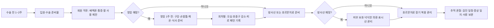

> 📦 **허브 문서** — 이 페이지는 개요와 빠른 참조를 제공합니다. 세부 내용은 하위 문서를 참조하세요.

# 입원·항암·방사선 준비물 종합

## 개요

유방암 치료는 입원, 항암, 방사선 등 각 단계마다 필요한 준비물이 다르다. 환자 커뮤니티에서 반복적으로 추천되는 제품과 카테고리를 단계별로 정리한다. 제품명은 경험담에서 자주 언급되는 예시이며 동일 기능 대체품이 있다.

> 💡 **처음 진단받으신 분들께**: 준비물보다 먼저 진단·결과지 정리와 진료실 질문 준비가 우선입니다 → [[처음온사람안내|처음 온 사람 안내 — 진단 직후 길잡이]]

## 하위 문서 목차

| 문서 | 내용 | 줄 수 |
|------|------|--------|
| [[preparation-facilities/치료준비물_입원수술항암\|치료준비물 — 입원·수술·항암·방사선·탈모]] | 입원 가방, 집 정리, 항암·방사선 준비물, 수술 준비 카페 TOP50, 써지브라, 보호자 준비물 | ~170줄 |
| [[preparation-facilities/치료준비물_카탈로그\|치료준비물 — 단계별 카탈로그]] | 수술→항암→방사선→추적 7단계 카탈로그, 한국 의료비 지원, 부작용 우선순위 매트릭스, 모자가발·부분가발, 차수별 준비물 변화, 투병일기 TOP 추천 | ~170줄 |

## 치료 단계별 준비 흐름

## 빠른 참조: 치료 단계별 준비물 핵심 체크리스트

### 수술 입원

- ✓ 앞 열리는 옷 (단추·지퍼) + 수면양말 + 슬리퍼
- ✓ 긴 충전기(2m+) + 멀티탭 + 이어폰
- ✓ 텀블러·빨대컵 + 립밤·핸드크림·인공눈물
- ✓ 진단서·산정특례 등록증·실손 청구 양식
- ⚠️ 써지브라 — 미리 사지 말고 병원 제공 여부 먼저 확인
- ⚠️ 전절제·재건 시 배액관 주머니 있는 잠옷 필수

### 항암 시작 전 1주

- ✓ 미세모 칫솔 + 식염수·죽염가글 + 프로폴리스 스프레이
- ✓ 에보네일 + 면장갑·면양말 (손발톱 보호)
- ✓ 피지오겔·세타필 등 무향 보습제 + SPF 50+ 자외선차단제
- ✓ 체온계 + 수면비니 + 전기담요
- ✓ 뉴케어·엔커버 등 영양 보충식
- ✓ 모자가발·통가발 미리 준비

### 방사선 시작 전

- ✓ 방사선 크림 (이지듀·엑스클레어) — 병원 허용 제품 확인
- ✓ 부드럽고 넉넉한 면 의류 + 스포츠 캠솔 (브래지어 대체)
- ⚠️ 마커 표시선 — 비누칠·문지름으로 지우지 말 것

### 수술 전 집 정리 (퇴원 후 팔 못 쓸 때 대비)

- ✓ 반찬·국·죽 냉동 준비
- ✓ 대청소·이불빨래·식재료 채우기 미리
- ✓ 머리 짧게 다듬기 (수술 후 감기 어려움)
- ✓ 통목욕·세신·사우나·여행 미리 해두기

## 임상적 의의

- 입원 전 준비는 퇴원 직후 체력 저하 기간의 부담을 줄임
- 항암 준비물은 구내염·손발톱 변화·피부 건조 등 흔한 부작용을 **시작 전 대비**하는 데 효용이 큼
- 방사선 보조 제품은 병원 프로토콜과 충돌 가능하므로 사전 확인이 필수

## 관련 개념

- [[처음온사람안내]] — 진단 직후 동선과 입원 전 우선순위
- [[유방암수술]] — 수술 종류별 회복 패턴과 입원 기간, 수술 전날 5단계 체크리스트
- [[유방재건수술]] — 재건 입원 준비물·압박브라·배액관·보정속옷
- [[항암화학요법]] — 회차별 부작용 발현 시점 (제품 준비 타이밍)
- [[방사선치료]] — 주차별 피부 변화와 허용 보조제
- [[운동수면위생]] — 체온 유지·위생 준비물과 일상 운영
- [[보호자심리지지]] — 보호자가 챙길 서류·물품 분담

## 미해결 질문 / 연구 방향

> 💡 두피 냉각 장치(cold cap) 한국 보급·효과
>    → **답변 (2026-05)**: **Paxman·DigniCap** 등 FDA 승인 — 탁산·AC 항암 탈모 예방 약 50% 효과 (Nangia JAMA 2017). 한국 일부 대형 병원 도입 (삼성·서울대 등) — 자비 약 50~150만 원. 보험 적용 없음. 두피 동통·불편감 일부.

## 주의사항

> ⚠️ 제품명은 환자 커뮤니티 추천 예시이며 특정 브랜드 광고가 아니다. 알레르기·민감도가 있는 경우 의료진·약사와 상의 후 선택한다.

## 출처

- 네이버 카페 '유방암이야기' 회원 경험 공유 — Notion 큐레이션. 2026. https://fehoon.notion.site/35fbae8c4f5981de98afdd57422915d8
- 네이버 카페 '유방암이야기' — 투병일기 게시판 좋아요 순 TOP50 (Notion). 2026-05-21.
- 네이버 카페 '유방암이야기' — 치료와 부작용관리 게시판 좋아요 순 2페이지 TOP50 (Notion). 2026-05-31.
- National Cancer Institute. Side Effects of Cancer Treatment. https://www.cancer.gov/about-cancer/treatment/side-effects
- Oncology Nursing Society. Chemotherapy Patient Care Resources. 2024.

## 업데이트 히스토리

- 2026-05-18: Notion 카페 가이드 기반 신규 생성 — 입원·항암·방사선·탈모 단계별 준비물 통합
- 2026-05-21: Notion 투병일기 TOP50 — 죽염가글, 물치실, 손발톱 보호제, 무향 바디클렌저, 치질연고, 산쿠소 패치, 티포트, 전기담요, 런닝머신, 반영구눈썹 항목 추가
- 2026-05-24: 단계별 카탈로그 7단계 확장 (수술전 → 수술직후 → 항암전 → 항암회차별 → 방사선 → 호르몬치료 → 추적관찰), 한국 의료비 지원 분류 추가 (library-check 보강)
- 2026-05-31: 카페 TOP50 2페이지 환자 경험 통합 — 부작용 우선순위 매트릭스, 모자가발+부분가발 조합, 항암 차수별 준비물 변화 표. 출처 5개로 보강 (NCI·ONS 추가)
- 2026-06-08: 수술 준비 — 카페 검색 TOP50 통합 섹션 신규 (Notion 큐레이션 50건·댓글 559개 기준) — 입원 가방 부분절제 vs 전절제·재건·확장기 매트릭스, 수술 전 집안일·생활 정리, 수술 당일 동선, 보호자 준비물
- 2026-06-28: 허브+자식 구조로 분리 재편 — 치료준비물_입원수술항암.md, 치료준비물_카탈로그.md 신규 생성. 허브는 개요·흐름도·빠른 체크리스트·임상적 의의·관련 개념·히스토리 유지
