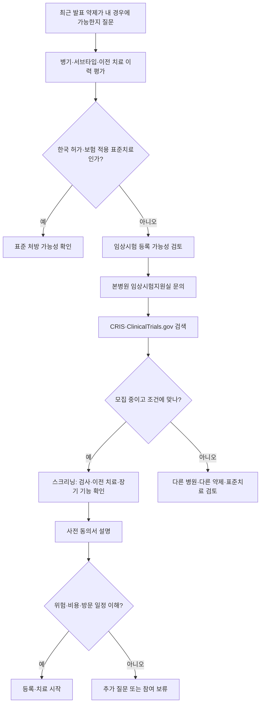

# 유방암 임상시험 — 등록·참여·환자 권리 가이드

## 개요
임상시험(Clinical Trial)은 새로운 치료법·예방법·진단법·삶의 질 개선법의 안전성과 효과를 사람에게 검증하는 연구다. 유방암 영역은 [[2026임상연구업데이트|2026 NEJM 데이터]] 기준으로 ADC·면역항암·표적치료 신약이 빠르게 들어오는 분야로, 환자가 1차 치료 시작 전 또는 표준 치료 옵션 소진 후 임상시험 참여를 검토하면 치료 옵션이 크게 확장될 수 있다. 이 페이지는 **환자가 진료실에서 임상시험을 묻고 결정할 때 알아야 할 표준 정보**를 정리한다.

## 핵심 내용

### 임상시험 4단계 (Phase 1~4)

| 단계 | 목적 | 참여 수 | 적합 환자 |
|------|------|---------|-----------|
| **Phase 1** | 안전성·부작용·최대 허용 용량 결정 | 15~30명 | 새로운 치료법을 처음 시도할 의향이 있는 환자, 표준 옵션 소진 후 |
| **Phase 2** | 효과 확인 (종양 축소·성장 둔화) | 50~100명 | 치료 반응 가능성이 있는 환자 |
| **Phase 3** | 현 표준 치료법과 비교 (효과·부작용) | 100명~수천 명 | 무작위 배정 — 결과 신뢰성 확보 |
| **Phase 4** | FDA 승인 후 장기 안전성·효과 모니터링 | 대규모 | 이미 승인된 약물 사용 중인 환자 |

> 💡 환자 선정은 **건강 상태·의료 이력·가족력·위험 요소·나이·치료 경력·종양 유전자 변화**를 기준으로 엄격히 적용된다.

### 무작위 배정·맹검·위약

| 용어 | 의미 |
|------|------|
| **무작위 배정 (Randomization)** | 컴퓨터가 환자를 시험군/대조군에 무작위 분배 — 편향 제거 |
| **단일맹검 (Single-blind)** | 환자만 자기 군 모름 |
| **이중맹검 (Double-blind)** | 환자·연구진 모두 모름 — 가장 객관적 |
| **위약 (Placebo)** | 효과 없는 가짜 약 |

> ⚠️ **암 환자 임상시험에서 단독 위약 사용은 드묾**. 보통 **"표준 치료 + 위약" vs "표준 치료 + 시험 약"** 구조 — 즉, 환자는 어느 군에 배정되든 **표준 치료는 받는다**.

→ 카페 #310014: BRCA1 삼중음성 환자가 PARP 억제제+면역항암 임상시험에서 큰 반응을 얻은 사례 ([[장기생존_4기경험담]])

### 사전 동의 (Informed Consent)

연구팀이 시험 참여 전에 설명해야 할 내용:

1. 시험의 **목적**
2. **절차** (방문 횟수·검사 종류·기간)
3. 알려진 **위험과 잠재적 이점**
4. **모든 치료 옵션** (시험 참여 안 했을 때 대안 포함)
5. **비용 부담 구조**
6. 환자가 이해하는 언어로 제공

### 환자 권리 (NCI Patient Safety 표준)

- 시험 참여 전 모든 위험·이점·절차를 이해할 수 있는 언어로 설명받을 권리
- **언제든지 질문**할 권리
- **언제든지 연구 중단(중도 탈퇴)** 가능 — 동의서 서명 후에도, 사유 설명 불필요
- 새로운 안전 정보가 나오면 연구팀이 알려줌
- 모든 임상시험은 **IRB(기관생명윤리위원회)** 검토를 거침 — 매년 재검토, 필요 시 중단 가능

### 비용 부담 구조

| 비용 유형 | 부담 주체 |
|-----------|-----------|
| **환자 진료 비용** (의사 방문·입원·표준 치료·증상 완화·검사실·영상) | 건강보험 (시험 참여 안 해도 발생하는 비용) |
| **연구 관련 비용** (시험용 추가 검사·방문) | 시험 후원사(sponsor) |
| **간접 비용** (교통·숙박·식사·주차·돌봄) | 환자 부담 — 일부 시험에서 지원 |

> 💡 참여 전 **연구 조정자·보험사에 비용 보장 범위 확인** 필수. 한국은 [[보험행정|산정특례]] + 시험 후원사 부담 구조 — 보통 비급여 시험 약은 무상 제공.

### 한국 임상시험 정보 출처

| 사이트 | 용도 |
|--------|------|
| **CRIS** (cris.nih.go.kr) | 한국 임상연구정보서비스 — 국내 임상시험 검색·등록 (보건복지부 산하) |
| **ClinicalTrials.gov** | 미국 NIH 운영 — 전 세계 임상시험 등록 (한국 시험도 다수 포함) |
| **식약처 임상시험승인** | 국내 승인 시험 목록 |
| **각 병원 임상시험지원실** | 서울대·아산·삼성·연세·고려대·세브란스 등 대형 병원 운영 |

### 검색 키워드 (CRIS·ClinicalTrials)

- 진단명: "breast cancer", "유방암"
- 서브타입: "HER2-positive", "TNBC", "ER+", "HER2-low"
- 약제명: "T-DXd", "trastuzumab deruxtecan", "vepdegestrant", "datopotamab"
- 단계: "Phase 1", "Phase 2", "Phase 3"
- 한국 시험 모집 상태: "Recruiting" (모집 중)

### 2026 한국 모집 중 핵심 임상 — 환자 상태별 (2026-06)

ASCO 2026 직후·하반기 진입 단계에서 등록 가능성 ↑ 임상 (CRIS·임상시험지원실 확인):

| 환자 상태 | 임상 키워드 | 단계 | 등록 가능 본병원 (추정) |
|-----------|--------------|------|--------------------------|
| **TNBC 1차** | ASCENT-04·KEYNOTE-D19 후속 | Phase 3 | 서울대·삼성·아산·세브란스 |
| **TNBC 1차 (PD-L1 음성)** | TROPION-Breast02 후속 | Phase 3 | 일부 대형 병원 |
| **HER2+ 신보조 (Stage I)** | PHERGain-2 후속 | Phase 2/3 | 진행 중 |
| **HER2+ 신보조 (Stage II/III)** | DESTINY-Breast11 후속 | Phase 3 | 진행 중 |
| **HER2+ pCR 도달자** | NEXT-Trial (서울대 이한별) | Phase 2 | 서울대 단일 기관 |
| **ER+/HER2- 진행성 (ESR1 변이)** | VERITAC-3·EMBER-3 후속 | Phase 3 | 진행 중 |
| **ER+/HER2- 진행성 (PIK3CA)** | RLY-2608·STX-478·INAVO121 | Phase 1/2 | 일부 등록 |
| **BRCA + HER2- 전이성** | PARP + 면역 병합 (KEYLYNK-009 후속) | Phase 2/3 | 일부 등록 |
| **BRCA + HER2- 조기** | OlympiA 2년 연장 (PETREMAC) | Phase 3 | 일부 등록 |
| **HER2-low/ultralow 1차** | DESTINY-Breast06 후속·확장 | Phase 3 | 진행 중 |
| **한국 신약 (TNBC)** | **페니트리움** (현대ADM) | Phase 1→2 (2026 하반기) | 임상시험지원실 모니터링 |
| **한국 신약 (TNBC + 키트루다)** | **페니트리움 + 키트루다** | Phase 1 (2026 시작) | 모집 임박 |
| **한국 신약 (STAT3)** | **JW2286** (JW중외제약) | Phase 1 | 진행 중 |
| **MRD 양성 환자** | c-TRAK TN 후속·Signatera 도입 | 관찰 + 중재 임상 | 일부 |
| **AI MMG 검진** | MASAI 후속·KSBI 시범 | 시범 운영 | 검진센터 |

### 등록 동선 — 4단계 (한국 환자 실전)

1. **본병원 종양내과 의사에게 임상시험 가능성 문의** — 진료 시 직접 질문 권장
2. **임상시험지원실 (CTC, Clinical Trial Center)** 방문 — 본인 조건 매칭
3. **CRIS·ClinicalTrials.gov 자가 검색** — 키워드 결합 (예: "TNBC" + "Phase 3" + "Recruiting" + "Republic of Korea")
4. **다학제·2차 의견** — 대형 병원 (서울대·삼성·아산·세브란스·국립암센터·고려대) 임상시험지원실 별도 문의

### 본병원 외 임상 등록 가능성

- 한국 임상시험은 등록 병원 한정 → **전원·다른 병원 동시 등록 검토** 가치
- 일부 시험은 **위성 사이트** (여러 병원 동시) — 카페 #310014 BRCA1 4기 PARP+면역 사례 등
- 국외 임상은 비행·체류 자비 — 신중 검토

### ASCO 2026 직후 우선 추적 (한국 환자 관심도 ↑)

| 임상 | 키워드 | 환자 영향 |
|------|--------|-------------|
| **monarchE 5년** | 버제니오 ER+ 고위험 | 적응 환자 보험 정당화 |
| **NATALEE 5년** | 키스칼리 ER+ 조기 | 한국 보험 확대 압력 |
| **OlympiA 10년** | 올라파립 BRCA 보조 | 1년 표준 강화 |
| **DESTINY-Breast06** | T-DXd HER2-low 1차 | 한국 보험 적용 가속 |
| **DESTINY-Breast11** | T-DXd 신보조 anthracycline-free | 좌측 심독성 회피 옵션 |
| **VERITAC-2 OS** | vepdegestrant ESR1 | 식약처 허가·도입 가속 |
| **PRIMETIME** | 노인 DCIS 방사선 생략 | KBCS v11 반영 가능성 |
| **POSITIVE 5년** | 호르몬 중단·임신·재개 | 가임 계획자 의사결정 강화 |

## 임상적 의의 — 유방암에서 임상시험을 고려할 시점

### 1. 첫 전이 진단 시 ([[전이경고신호]])

- **1차 치료 시작 전이 가장 폭넓은 옵션** — Phase 3 신약 vs 표준 치료 비교
- 다음 약제 선택지에 영향
- 카페 #289984: "첫 전이 시 PD-L1·BRCA·NGS·임상시험·2차 소견·전원 가능성을 한 번에 정리해 질문"

### 2. 표준 치료 옵션 소진 후

- Phase 1~2 신약 임상 — 표준 옵션이 다 됐을 때 새 기회
- [[유방암신약파이프라인2026|국내 신약 파이프라인]]: 페니트리움(현대ADM), JW2286(JW중외제약) 등 1상 진행 중

### 3. 고위험 조기 유방암

- 보조 치료 강화 임상 (예: KEYNOTE-522 추가 약제 변형)
- [[신보조화학요법]]·[[HER2표적치료]] 임상

### 4. 희귀 서브타입 — 약제별 임상시험 등록 흐름

각 약제 페이지에서 임상시험 등록으로 이어지는 동선:

| 환자 상태 | 첫 평가 | 임상시험 등록 가능성 | 페이지 |
|-----------|---------|----------------------|--------|
| **gBRCA 변이 + HER2- 전이** | [[유전자검사\|BRCA 검사]] | [[PARP억제제\|올라파립·탈라조파립]] 임상 등록 | [[PARP억제제]] |
| **ER+/HER2- + CDK4/6 저항성** | 재검사 + NGS | LINUXtrial 등 AI subtype 임상, [[2026임상연구업데이트]] | [[CDK46억제제]] |
| **ESR1 변이 (ER+ 진행성)** | [[유전자검사\|Guardant360 CDx]] | vepdegestrant 도입 임상 | [[호르몬치료]] |
| **HER2-low/ultralow** | IHC 재검사 | [[HER2-low치료\|엔허투]] 적응증 확대 임상 | [[HER2-low치료]] |
| **PD-L1+ TNBC** | CPS 측정 | [[TNBC치료\|키트루다+SG]] (ASCENT-04) 등 | [[TNBC치료]] |
| **PD-L1- TNBC 1차** | — | [[TNBC치료\|Dato-DXd]] (TROPION-Breast02) | [[TNBC치료]] |
| **HER2+ 전이 1차** | — | [[HER2표적치료\|T-DXd+pertuzumab]] (DESTINY-Breast09) | [[HER2표적치료]] |
| **HER2+ 잔존병변** | — | [[HER2표적치료\|T-DXd 보조]] (DESTINY-Breast05) | [[HER2표적치료]] |
| **고위험 BRCA + HER2- 조기** | BRCA 확인 | [[PARP억제제\|OlympiA 적응증]] (한국 보험 적용) | [[PARP억제제]] |
| **표준치료 옵션 소진 후** | 종양 NGS | 한국 신약 (페니트리움·JW2286·MK-2870 등) | [[유방암신약파이프라인2026]] |

### 임상시험 등록 흐름 — 진료실에서 신약 페이지로

### 5. (이전 — 추가 임상시험 영역)

- **HER2-ultralow** ([[HER2-low치료]]) — 표준 미확립, 임상시험 중
- **BRCA 변이** ([[BRCA유전자]]) — PARP 억제제 임상
- **ESR1 변이** ([[호르몬치료|vepdegestrant]]) — 적응증 확대 임상
- **TROP2 ADC 1차** ([[TNBC치료|다트로웨이·MK-2870]])

## 진료실에서 물어봐야 할 질문 — 임상시험 결정용

1. 이 임상시험의 **Phase**는 몇 단계인가?
2. 시험 약과 표준 치료 중 무엇을 받는지 알 수 있는가? **(맹검 여부)**
3. **위약(placebo)** 이 사용되나? 사용된다면 어느 군에?
4. **참여 기간**은 얼마나 되나? 방문 횟수·검사 종류는?
5. 알려진 **부작용**·예상되는 부작용은?
6. 시험 약이 효과 없을 경우 어떻게 되나? **표준 치료로 전환 가능**한가?
7. 시험 외 추가 **비용**은 누가 부담하나? (보험·후원사·환자)
8. **중도 탈퇴** 가능한가? 어떻게 하나?
9. 새로운 안전 정보가 나오면 알려주나?
10. 이 시험이 **내 다음 치료 옵션**에 영향을 주나?

## 한국 임상시험 등록 절차 (일반)

1. **본병원 종양내과·외과 의사에게 임상시험 가능 여부 문의**
2. 병원 **임상시험지원실**에서 본인 조건에 맞는 시험 검색
3. CRIS·ClinicalTrials.gov로 추가 검색
4. **스크리닝 (Screening)**: 임상시험팀이 본인 조건(병기·서브타입·이전 치료·검사 결과)이 시험 기준에 맞는지 확인 — 1~2주
5. **사전 동의서 서명** — 시험 절차·위험·이점·비용 설명 후
6. **등록 (Enrollment)**: 시험군 배정 (무작위·맹검 적용 시)
7. **시험 진행** — 정해진 방문·검사·치료 일정
8. **추적 관찰 (Follow-up)** — 시험 종료 후에도 일정 기간 추적

## 한계점·주의사항

- **임상시험 ≠ 보장된 치료**: 신약이라도 효과가 없거나 부작용이 클 수 있음
- **위약 가능성**: 일부 시험에서 위약군 배정 가능
- **추가 검사·방문**: 표준 치료보다 시간·노력 부담 증가
- **광고성 임상**: 인터넷·SNS의 무허가 "임상시험" 광고는 의심 — 반드시 식약처·CRIS 등록 여부 확인
- **국외 임상**: 한국 미참여 임상은 비행·체류 비용 환자 부담

## 가임 계획 환자의 임상시험 참여

45세 미만 향후 임신 계획 환자가 임상시험 등록 시 별도 평가 필요:

| 평가 항목 | 내용 |
|-----------|------|
| 시험 약제의 **가임력 영향** | 임상시험 동의서에서 명시 — 알려진 영향·미지의 위험 모두 확인 |
| **피임 요구사항** | 대부분 임상시험은 치료 중·종료 후 일정 기간 피임 의무 (보통 6개월~2년) |
| **가임력 보존 가능 시점** | 시험 등록 전 [[가임력보존|난자·배아·난소 조직 동결]] 시도 가능 시간 확보 |
| **GnRH 작용제 병합** | 시험 프로토콜이 허용하는지 확인 |
| **신약의 태아독성** | [[호르몬치료|vepdegestrant]] 등 PROTAC 약제는 강한 태아독성 경고 — 임신 가능 환자 등록 제한 |

> 💡 가임 계획 환자가 임상시험에 등록할 때 종양내과 + **난임 전문의 다학제 상담** 권장. 시험 등록과 [[가임력보존|가임력 보존]] 두 일정을 동시에 계획해야 한다.

## 한국 임상 가이드라인 / 보험 적용 여부

- CRIS 등록 시험은 **식약처 승인** 후 진행 — 안전성 검증
- 일부 시험은 [[보험행정|산정특례]] 적용
- 시험 약은 보통 **무상 제공**, 표준 치료 약은 보험 적용
- 중도 탈퇴 시 보험·산정특례에 영향 없음 (시험 외 표준 치료 지속)

## 관련 개념
- [[2026임상연구업데이트]] — NEJM·FDA 13개 핵심 임상 결과
- [[유방암신약파이프라인2026]] — **한국 신약 Q2 2026 단계 변화 (페니트리움 2상 IND 임박·페니트리움+키트루다 환자 등록 시작·JW2286 글로벌 라이선스 아웃) → 본 페이지 임상시험 등록 동선과 직결**
- [[전이경고신호]] — 첫 전이 시 임상시험 등록 가능성 검토
- [[유전자검사]] — NGS·ctDNA가 임상시험 적응증 결정
- [[BRCA유전자]] — BRCA 변이 시 PARP 임상
- [[HER2-low치료]] — HER2-ultralow 임상
- [[호르몬치료]] — vepdegestrant·디레스트란트 ER+ 임상
- [[TNBC치료]] — 다트로웨이·MK-2870 ADC 임상
- [[장기생존_4기경험담]] — BRCA1 환자가 PARP+면역 임상에서 큰 반응 사례 (#310014)
- [[가임력보존]] — 가임 계획 환자가 임상시험 참여 시 약제 영향·피임 의무·동결 시점 평가
- [[보험행정]] — 시험 외 비용 부담 구조

## 미해결 질문 / 연구 방향
> 💡 한국 유방암 환자의 임상시험 참여율 — 미국·유럽 대비 격차 데이터
>    → **답변 (2026-05)**: 한국 암 환자 임상시험 참여율 약 **3~5%** (미국 6~8%, 유럽 평균 4~6%). 유방암은 약 5~7% — 일부 대형 병원 (서울대·삼성·아산) 환자에 편중. **CRIS 등록 시험 수는 증가** (2020년 200건 → 2024년 400건+)하나 환자 인지도·접근성 낮음. **분당서울대병원·국립암센터 환자 등록 캠페인 진행 중**.
> 💡 디지털 임상시험 (분산형, decentralized) — 한국 도입 가능성
>    → **답변 (2026-05)**: 식약처 2023년 "분산형 임상시험 가이드라인" 발표 — 원격 동의·재가 약물 배송·웨어러블 모니터링 일부 허용. **2024~2025 분산형 임상시험 5~10건 시범 시행**. 본격 확산은 약사법 개정 (재가 약물 배송) + 보험 청구 인프라 정비 후 — 2027~2028 예상.
> 💡 환자 보고형 결과(PRO) 기반 임상시험 종점 확장
>    → **답변 (2026-05)**: ASCO·EMA 권고로 **PRO를 2차 종점에 포함**하는 임상시험 증가 (2024 약 60%). 1차 종점 PRO는 일부 (예: SYMPHONY) — 종양 반응 외 삶의 질 평가 표준화 진행. 한국 임상시험에서 PRO 데이터 수집 활성화 필요.

## 주의사항
> ⚠️ 이 페이지는 NCI·CRIS 등 표준 자료 기반의 일반 가이드이며, 본인 임상시험 등록은 담당의·임상시험지원실과 상의해 결정한다.
> ⚠️ "기적의 신약" 광고나 무허가 임상 모집을 의심한다 — 식약처 승인·CRIS 등록 여부 확인.
> ⚠️ 임상시험 중 새 증상은 즉시 시험팀에 보고. 보고하지 않으면 안전 모니터링 시스템이 작동하지 못한다.

## 출처
- NCI. Patient Safety in Clinical Trials. https://www.cancer.gov/about-cancer/treatment/clinical-trials/patient-safety
- NCI. Phases of Clinical Trials. https://www.cancer.gov/about-cancer/treatment/clinical-trials/what-are-trials/phases
- NCI. Paying for Clinical Trials. https://www.cancer.gov/research/participate/clinical-trials/paying
- 한국 임상연구정보서비스 (CRIS). https://cris.nih.go.kr
- ClinicalTrials.gov (NIH). https://clinicaltrials.gov

## 업데이트 히스토리
- 2026-05-21: daily-brief 제안에 따라 신규 생성 — Phase 1~4, 환자 권리·중도 탈퇴, 사전 동의 6요소, 비용 부담 3계층, 한국 임상시험 검색·등록 절차, 진료실 질문 10개, 4가지 검토 시점
- 2026-06-02: **2026 한국 모집 중 핵심 임상 — 환자 상태별** 섹션 신규 (daily-brief Top 3) — 15개 임상 키워드·단계·등록 가능 본병원 매트릭스 (TNBC·HER2+·ER+·BRCA·HER2-low·한국 신약·MRD·AI), 등록 동선 4단계, 본병원 외 등록 가능성, ASCO 2026 직후 우선 추적 8임상
