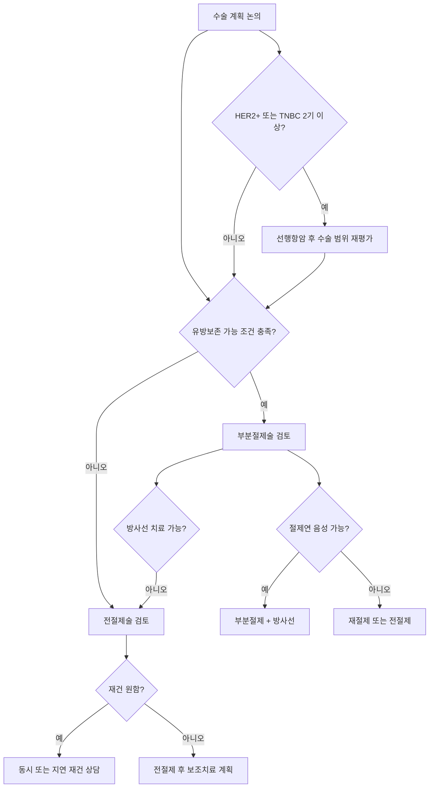

> 이 페이지는 [[treatment-surgery/유방암수술|유방암수술 허브]]에서 분리된 세부 문서입니다.

# 유방암 수술 — 수술 방식 상세

## 수술 방식 결정 흐름



## 유방 보존 수술 (부분 절제술)

**성공 조건 — 3가지 모두 충족해야 함**:
1. **절제연 음성**: 절제 단면에 암세포 없어야 함. 양성 시 재수술 또는 전절제로 전환
2. **미용적 결과 양호**: 전절제보다 흉한 결과라면 보존의 의미 없음
3. **방사선 치료 이행 가능**: 보존 수술 후 방사선 치료 없이는 재발률이 크게 증가

**재수술 위험**: 절제연 양성 비율 5~10% → 재수술 또는 전절제 전환 가능성

> ⚠️ 주의: 전절제 선택이 재발·생존율을 높이지 않는다. 일부 연구에서는 보존 수술군의 예후가 더 좋다는 결과도 있어, "더 많이 잘라야 안심"이라는 생각은 의학적 근거가 없다.

## 부분절제+방사선 vs 전절제 — 핵심 임상 데이터

| 결과 | 비교 |
|------|------|
| 국소재발률 | 전절제가 약간 낮으나 차이 작음 |
| **장기 생존율** | **두 수술 간 의미 있는 차이 없음** |
| 원격전이 비율 | 10년 장기적으로 차이 없음 |
| 부분절제 후 국소재발 | 전절제로 성공적 치료 가능 |

**대표 논문 3가지**:

1. **2002 NEJM** (Veronesi 등, 6,343회 인용): 종양 2cm 이하 701명 20년 추적
   - 국소재발률: 전절제 2.3% vs 부분절제 8.8%
   - **총사망률: 전절제 41.2% vs 부분절제 41.7% → 통계적으로 차이 없음**

2. **2014 JAMA** (21.4만 명, 후향적 코호트): 초기 침윤성 유방암 5년 생존율
   - 부분절제 97% vs 전절제 94%

3. **2016 Lancet** (3.7만 명, 인구 기반): T1-2기 N0-1 여성 10년 추적
   - **T1N0 서브그룹**에서 부분절제+방사선이 10년 생존율을 의미 있게 향상

> 💡 결론: 국소재발률이 부분절제에서 약간 높지만, **부분절제 후 국소재발은 전절제로 성공적 치료가 가능**하므로 결과에 큰 영향을 주지 않는다. 삶의 질과 재발 우려를 종합할 때 **부분절제+방사선이 전절제보다 열등하지 않다**는 것이 현재 표준 트렌드.

## 유방 전절제술

**전절제 결정 요인** (복합적 고려 필요):

| 요인 | 전절제 고려 상황 |
|------|----------------|
| 종양 크기 | 일반적으로 4cm 초과 |
| 병변 개수 | 다발성 병변 |
| 종양 위치 | 유두 근처, 하내측 위치 |
| 유방 크기 | 작은 유방에 상대적으로 큰 종양 |
| 방사선 치료 | 방사선 치료 시행 불가 |
| 유전자 변이 | [[BRCA유전자]] 돌연변이 보인자 |
| 환자 선호 | 환자가 명확히 전절제를 원하는 경우 |
| 재건 수술 | 재건 수술을 원하고 인프라 갖춘 병원 |

**신보조화학요법 후 보존 가능성 증가**: 항암 후 암 크기가 줄어 원래 전절제 대상이었던 환자의 30~50%에서 보존 수술로 전환 가능

## 유방 재건 수술

전절제 후 동시 재건 수술 가능 (특히 젊은 환자). 세 가지 주요 방법:

**1. 자가조직 재건 (자가 피판술)**
- 복부(TRAM·DIEP) 또는 등(LD) 조직 활용
- 자연스러운 질감, 시간에 따라 함께 노화, 방사선 후에도 유리
- 고난도 수술, 혈관 문합 필요, 통증 많음, 공여부 흉터
- 2025 삼성서울병원 연구: 보형물 대비 정신질환 위험 13% 높음

**2. 보형물 재건 (실리콘 임플란트)**
- 최근 더 많이 시행되는 추세
- 수술 간단, 회복 빠름 — 피막구축·파열 합병증 주의
- 방사선 치료 예정 시 합병증 증가 → 방사선 후 자가조직 권장
- 대형 병원에서 재건 수술 활발할수록 전절제 비율이 높아지는 경향

**3. 인공진피 (ADM) 보조**
- 보형물 재건 시 보조 재료로 사용 — 보형물 안정화·피막구축 예방
- 추적 관찰 영상에서 암 재발로 오인될 수 있음 → 판독 시 주의

→ 상세 비교: [[유방재건수술]]

## 예방적 반대쪽 유방 절제
- [[BRCA유전자]] 돌연변이 보인자: 반대쪽 유방암 발생 위험 20~30% → 예방적 절제 고려
- BRCA 변이 없는 일반 유방암: 반대편 발생 위험 약 7% — 예방적 절제 불필요 (과치료)

## 감시 림프절 생검 (Sentinel Lymph Node Biopsy)

유방암은 겨드랑이 림프절로 먼저 전이되므로, 겨드랑이 림프절 상태를 평가해야 한다.

**과거**: 겨드랑이 림프절 전체 곽청술 → 림프 부종 등 합병증 多

**현재 표준**: 감시 림프절 생검 (파란 염색약 또는 방사선 동위원소 사용)
- 1~3번째 림프절(감시 림프절) 2~3개 검사
- 음성 → 추가 절제 불필요
- 양성 → 추가 림프절 곽청술 시행

### 감시 림프절 동위원소 주입 절차 (서울대병원 2024)

수술 당일 아침:
1. 핵의학과에서 **방사성 동위원소를 유두·유륜 주위에 주입**
2. 동위원소가 림프관을 통해 감시 림프절로 이동
3. 수술 중 감마 카메라·프로브로 림프절 위치 추적
4. 표시된 감시 림프절 2~3개를 절제 → 전이 평가
5. 동위원소 잔여는 자연 배출 (며칠 내)

> 💡 동위원소 주입은 일시적 따끔함 외 부작용 거의 없음. 환자에게 사전 안내된 절차.

## 감시 림프절 생검 실패·곽청술 전환 판단 기준

### 감시 림프절 생검이 실패하거나 한계에 부딪히는 경우

| 상황 | 대응 |
|------|------|
| **감시 림프절 동위원소 취득 실패** (추적 불가) | 림프절 곽청술 (ALND) 직접 전환 |
| **동결 절편 중 림프절 전이 확인** | 즉시 ALND 추가 — 수술 중 결정 |
| **수술 전 초음파·MRI에서 림프절 전이 의심** | ALND 계획 수립 후 수술 |
| **신보조항암 후 임상 N0** | ALND 생략 가능 (cN0 달성 시 감시 림프절만으로 충분, 단 수술 전 전이 확인 시 ALND 필수) |
| **1~2개 림프절 양성 (Z0011 기준)** | 보존수술 + 방사선 예정 시 ALND 생략 가능 — ACOSOG Z0011 근거 |

> ⚠️ **ACOSOG Z0011 기준** (림프절 1~2개 양성에서 ALND 생략 허용 조건): ① 부분절제술 ② 전신마취 개방 수술 ③ 방사선 치료 예정. **전절제·신보조 후·3개 이상 양성에는 적용 불가.**

### 감시 림프절 이후 ALND 전환 결정 흐름

```
[수술 중 감시 림프절 절제]
    ↓
[동결 절편 즉시 판독]
    ├── 음성 → ALND 생략 — 표준
    ── 양성 (1~2개)
            ├── 부분절제 + 방사선 예정 → ALND 생략 가능 (Z0011)
            ── 전절제 OR 3개+ 양성 → ALND 추가
```

## 수술 후 최종 병리 결과 읽기 — "절제연 양성" 판단

수술 후 1~2주 병리 결과에서 환자가 가장 불안해하는 항목:

### 절제연 (Surgical Margin) 해석

| 결과 | 의미 | 처치 |
|------|------|------|
| **R0 (음성, margin negative)** | 암세포 없음 | 추가 수술 불필요 — 계획대로 진행 |
| **Close margin** | 암세포와 절제면 거리 1~2mm 이내 | 의료진 판단 — 방사선 추가 또는 재수술 검토 |
| **R1 (양성, margin positive)** | 절제면에 암세포 있음 | **재수술 (re-excision) 또는 전절제 전환 필요** |

**Close margin 기준**: 유방보존수술에서 침윤암 "no tumor on ink" (SSO-ASTRO 2014) = 잉크가 닿은 절제면에 암세포가 없으면 R0로 인정 — 특정 mm 거리 기준 없음. 단, DCIS는 2mm 이상 권장.

**환자가 병리 결과지에서 확인할 항목**:
1. **Margins** — R0/R1/close 명시 여부
2. **Residual Carcinoma Burden (RCB)** — 신보조항암 후 잔존 암 정도 (0 = pCR)
3. **pT·pN** — 병리 최종 병기 (영상 병기와 다를 수 있음)
4. **LVI (림프혈관 침범)** — 재발 위험 변수
5. **EIC (광범위 관내 성분)** — 보존수술 후 재발 위험 ↑, 추가 조치 검토

> 💡 "절제연 양성 나왔어요" → 반드시 종양외과에 **재수술 여부·방사선 강화 옵션**을 물어본다. 재수술 시 전절제 전환이 필요한지, 방사선으로 대체 가능한지는 환자별 다름. → 자세한 결과지 해석은 [[diagnosis-tests/조직검사결과해석|조직검사결과해석]] 참조.

## 림프 부종 합병증

| 수술 유형 | 림프 부종 발생률 |
|----------|----------------|
| 감시 림프절 생검 | 5~10% |
| 림프절 곽청술(ALND) | 약 30% |

- 증상: 팔 부종, 무거움, 통증, 관절 가동 범위 제한
- 만성화 시 심각한 장애 초래
- 운동은 림프 부종 예방 효과 없음 — 발병 후 재활 전문의 치료 필요

## 관련 문서
- [[treatment-surgery/유방암수술|유방암수술 허브]] — 전체 개요 및 하위 문서 목차
- [[treatment-surgery/유방암수술_환자동선|환자 동선 상세]] — 입원 전~퇴원 단계별 안내
- [[treatment-surgery/유방암수술_2026트렌드|2026 수술 트렌드]] — ASCO 2026·수술 최소화 패러다임
- [[유방재건수술]] — 자가조직·보형물·인공진피 상세 비교
- [[림프부종]] — 수술 후 림프부종 재활 상세
- [[diagnosis-tests/조직검사결과해석|조직검사결과해석]] — 병리 결과지 읽기
- [[BRCA유전자]] — 예방적 절제 결정 근거

## 업데이트 히스토리
- 2026-06-28: `유방암수술.md` 핵심 내용(수술방식) 섹션에서 분리 생성
