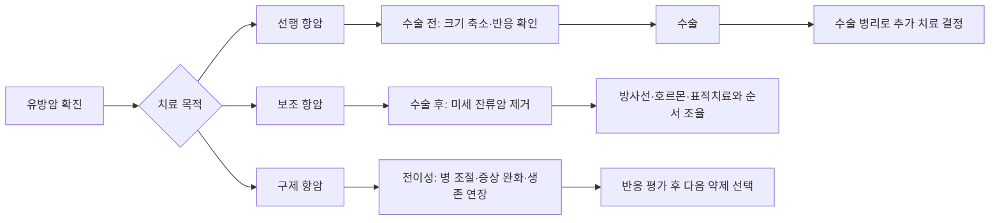

> 📂 **허브 문서 안내**: 이 페이지는 항암화학요법의 개요와 하위 문서 목차를 제공하는 허브입니다. 세부 내용은 아래 자식 페이지를 참조하세요.

# 유방암 항암화학요법

## 하위 문서 목차

| 문서 | 내용 |
|------|------|
| [[treatment-systemic/항암화학요법_약제회차관리\|약제·회차 관리]] | 병합요법(AC/TC/TCHP 등), 회차별 컨디션 패턴, Dose-Dense 요법, G-CSF 급여 기준, 항암 시작 시기 |
| [[treatment-systemic/항암화학요법_부작용관리\|부작용 관리]] | 탈모·오심·점막염·신경병증 등 전체 부작용, 오해 교정, 경험담 대처, 백혈구 수치 관리, 건국대병원 응급 기준 |

## 개요

항암화학요법은 암세포의 성장을 억제하거나 제거하는 전신 치료다. 유방암에서 항암치료는 수술 전(선행), 수술 후(보조), 전이성 유방암(구제) 세 가지 맥락으로 사용되며, 암의 진행 정도·서브타입·환자 상태에 따라 적용 여부와 약제가 결정된다. 무조건 받아야 하는 치료가 아니며, 일부 초기 유방암은 수술과 방사선만으로 충분하다.

> 🚨 **응급 신호 한눈에 — Canonical Reference** (위키 전반에서 이 섹션을 참조)
>
> 다른 페이지(전이경고신호·치료준비물·방사선장기부작용·혈관접근장치·보호자심리지지·약사협진·호스피스완화의료 등)에서 38℃ 발열 응급 신호를 언급할 때 본 페이지의 **"건국대병원 환자 안내문 — 실전 응급 기준" 표**를 표준 기준으로 인용한다.
> → 상세 기준표: [[treatment-systemic/항암화학요법/부작용관리|부작용 관리 — 건국대병원 안내문 섹션]]
>
> **즉시 응급실 직행 — 3대 신호**:
> 1. **38℃ 이상 발열 + 오한** — 호중구감소 가능성 (FN, Febrile Neutropenia). ⚠️ **의료진 확인 전 해열제(타이레놀·게보린·아스피린·사리돈) 임의 복용 ❌**
> 2. **호흡곤란·가슴 조임·의식 변화** — 과민반응·심독성·폐독성 의심
> 3. **출혈 30분 이상 지속**·**대량 멍·혈뇨·흑색 대변** — 혈소판감소·출혈성 부작용

## 핵심 내용

### 항암치료 3가지 목적

| 종류 | 시기 | 목적 |
|-----|------|------|
| **선행 항암 요법** | 수술 전 | 암 크기 축소, 재발 위험 감소, 수술 가능성 확대 |
| **보조 항암 요법** | 수술 후 | 미세 잔류 암세포 제거, 재발 방지 |
| **구제 항암 요법** | 전이성 | 생존율 증가, 증상 완화, 병 조절 |

> 💡 항암치료는 전신 치료다 — 혈류를 타고 몸 전체에 작용해 눈에 보이지 않는 미세 암세포까지 제거하는 것이 목표.

### 항암제 작용 원리

**전통적 항암제 (세포독성 항암제)**:
- 빠르게 분열하는 세포를 사멸
- 암세포뿐 아니라 정상 세포(모낭, 위장관 점막, 골수) 중 분열 속도 빠른 것도 영향 → 부작용 발생 기전

**표적 치료제**:
- 암세포가 가진 특이 표적 (HER2 등)만 공격
- 정상세포 영향 상대적으로 적음

### 항암치료 결정 요소

세 가지를 종합적으로 고려:
1. **암의 진행 정도**: 종양 크기, 림프절 전이 여부
2. **암의 특성**: 호르몬 수용체(ER/PR) 발현 여부, HER2 발현 여부
3. **환자 상태**: 나이, 전신 건강 상태, 동반 질환

> 같은 유방암이라도 서브타입에 따라 치료가 완전히 달라진다.

### 서브타입별 항암 치료 개요

| 서브타입 | 특성 | 항암 치료 원칙 |
|---------|------|--------------|
| **ER+/HER2-** (루미날) | 가장 흔함, 성장 느림 | 항암 반응이 적어도 실망 금물 — 이 서브타입은 원래 반응이 적음 |
| **HER2+** | 표적 치료제 효과 큼 | 선행 항암 6개월(TCHP) → 수술 → 1년 표적 치료 |
| **TNBC (삼중음성)** | 항암 반응은 좋으나 재발 위험 높음 | 선행 항암 + 수술 후 결과에 따라 경구 항암제 추가 |

→ 상세 내용: [[신보조화학요법]], [[HER2표적치료]], [[TNBC치료]]

## 임상적 의의
- 항암치료는 전신 치료로서 눈에 보이지 않는 미세 전이 가능성을 다루는 핵심 전략
- 초기 유방암 환자 모두에게 필요한 것은 아님 — 서브타입, 병기, 건강 상태 종합 평가 후 결정
- 부작용은 관리 가능 — 혼자 참지 말고 의료진과 적극 소통하면 대부분 해결 가능
- 일정 준수 중요하지만, 합병증 위험이 있을 때는 의료진 판단 따라 개별화

## 관련 개념
- [[신보조화학요법]] — 수술 전 선행 항암 상세 (TCHP, KEYNOTE-522, pCR)
- [[HER2표적치료]] — HER2+ 표적 항암 약제
- [[TNBC치료]] — 삼중음성 항암 전략
- [[호르몬치료]] — ER+ 항암 후 내분비 치료
- [[유방암수술]] — 수술 전후 항암과의 순서 관계
- [[치료후삶]] — 항암 종료 후 회복 및 부작용 관리
- [[혈관접근장치]] — PICC vs 케모포트 선택과 응급 신호
- [[치료준비물]] — 항암 회차별 권장 준비물
- [[식이영양관리]] — 항암 중 단백질·수분·체중 보존
- [[보조요법주의]] — 항암 중 영양제·민간요법 상호작용 주의
- [[TCHP항암_요양병원케이스]] — TCHP 6회 + 요양병원 병행 환자 케이스 (22개 부작용 체크리스트)
- [[방사선장기부작용]] — 안트라사이클린 + 허셉틴 + 좌측 방사선 누적 심독성
- [[이차암]] — 안트라사이클린·사이클로포스파마이드 후 백혈병·MDS 위험
- [[림프부종]] — 항암제 일부의 림프부종 위험 추가
- [[요양병원선택]] — 요양병원 4가지 유형과 상담 체크리스트
- [[온코타입DX_RS점수]] — ER+/HER2- 항암 추가 여부 결정 (Ki67 단독 판단 보완)
- [[항암중식이주의]] — 항암 시기 식이 회피·권장·위험 신호
- [[유방암신약파이프라인2026]] — 신약·임상 현황
- [[유방암보험청구쟁점]] — G-CSF 산정특례·dose-dense 비용·신약 급여 동향
- [[glossary/용어사전]] — TCHP·AC·ANC·G-CSF·pCR 등 항암 용어 풀이
- [[treatment-supportive/통증관리]] — 항암 부작용·말초신경병증·구내염 통증 단계별 관리
- [[treatment-supportive/약사협진]] — 항암제 ↔ 진통제·항우울제·천연물 상호작용
- [[treatment-supportive/가임력보존]] — 항암 시작 전 난자·배아·OFS 동결 옵션
- [[nutrition-exercise/회복기영양가이드]] — **항암 종료 후 회복기 식이·근육 재건·단백질 1.2~1.5g/kg/일 — 회복 우선 원칙에서 장기 식이 패턴으로**
- [[insurance-admin/직장복귀_법적권리]] — **항암 일정 기반 병가·연차·재택근무 협의·부당해고 구제·근로기준법 — 재직 환자 핵심 권리**

## 미해결 질문 / 연구 방향
> 💡 수술 후 항암 시작 시기 3개월 기준
>    → **답변 (2026-05)**: Lohrisch JCO 2006·Yu Br J Cancer 2013 — 1~2개월 시작이 효과 양호. 3개월 초과 효과 ↓. 1~2주 차이는 임상적 유의성 ❌ — 환자 컨디션 회복 우선.
>
> 💡 항암 중 운동 최적 종류·강도
>    → **답변**: ACSM·ASCO — 중강도 (걷기·요가) 주 150분 + 근력 주 2회. 마이오카인 항암 효과 (PMC12259798). 호중구 최저점 (D7~14) 실내 운동. 면역 손상 위험 ❌ — 권장.
>
> 💡 두피 냉각 장치 한국 적용
>    → **답변**: Paxman·DigniCap 한국 일부 대형 병원 (삼성·서울대) 도입. 자비 50~150만 원. 탈모 예방 50%. 보험 적용 ❌.
>
> 💡 말초신경병증 영구화 예측 인자·약제별 차이
>    → **답변**: 약제 누적 용량 (탁산 200~300mg/m²·백금)·당뇨·기존 신경병증·고령이 위험. 일부 SNP 보고. 약제별 — 탁산 > 백금 > 안트라사이클린. ASCO 2020 권고 — 둘록세틴이 유일하게 강한 근거.
>
> 💡 가임력 보존 시술 항암 시작 지연 영향
>    → **답변**: 2주 가임력 보존 시술 (난자·배아 동결)이 항암 효과·생존에 영향 ❌ — Lambertini Cancer Treat Rev 2016. ASCO 권고: 가능하면 가임력 보존 우선.

## 출처
- 이대원, 김홍규. 유방암 항암치료 중 이것만은 꼭 알아야 한다! ep4.유방암 항암치료. 서울대병원tv. 2024-12-27. https://youtu.be/IKpgqJqfdHY
- 조은경. 항암치료 힘든가요? ✔ 부작용과 대처. 비온뒤 × 가천대 길병원 종양내과. https://youtu.be/rataFjniAdI

## 업데이트 히스토리
- 2026-04-26: 서울대병원tv 이대원·김홍규 교수 강의 기반 신규 생성
- 2026-05-18: 가천대 길병원 조은경 교수 강의 기반 부작용 섹션 대폭 확장 (점막염, 말초신경병증, 피부변화, 빈혈, 혈소판감소, 신장, 생식기능 추가)
- 2026-05-18: 카페 가이드(Notion) 기반 병합요법 표(AC/TC/TAC 등), 회차별 컨디션 패턴(9~14일), 경험담 기반 부작용 대처표 추가; [[혈관접근장치]]·[[치료준비물]]·[[식이영양관리]]·[[보조요법주의]] 링크
- 2026-05-18: Notion v2 갱신분 반영 — [[TCHP항암_요양병원케이스]] 링크 추가 (TCHP 6회 22개 부작용 케이스)
- 2026-05-25: library-check cross-link 보강 — [[glossary/용어사전]] 연결
- 2026-05-26: Notion 항암제·약제 TOP50(2026-05-26) — Dose-dense 2주 간격 요법(#11), 2세대 G-CSF (뉴라스타·뉴라펙) 산정특례 급여 기준(#35), 발열 시 맹장염 가능성 경고(#49) 추가
- 2026-06-16: **건국대병원 환자 안내문 — 실전 응급 기준·손글씨 메모 통합** 섹션 신규 (Notion 큐레이션) — 즉시 응급실 기준 5종 (해열제 금지 ★·출혈 30분·설사 3~4 OK), 손글씨 강조 (탈모 100%·호중구 최저점 3주·가그린 X·포카리·링티), 항구토제 처방 패턴 (맥페란·카이세론·뉴라스타 PFS·페니라민·덱사메타손), 독소루비신·사이클로포스파미드 장기별 독성
- 2026-06-16: **중복 통합** — 개요 직후 "응급 신호 한눈에 — Canonical Reference" 블록 신설 (위키 전반에서 38℃ 발열 응급 신호 인용 기준점), TCHP 회차별 부작용 표를 4줄 요약으로 압축 + 상세 매트릭스는 [[cases/TCHP항암]] canonical로 위임. index.md "주제별 Canonical 페이지 가이드" 표 (21항목)와 동기화.
- 2026-06-28: **허브 문서로 재편** — 약제·회차 관리 및 부작용 관리 섹션을 자식 페이지([[항암화학요법_약제회차관리]], [[항암화학요법_부작용관리]])로 분리. 허브에 하위 목차 표·응급 신호 요약·서브타입별 개요 유지.
