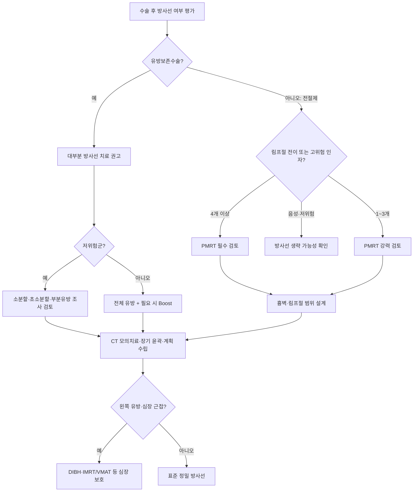

# 유방암 방사선 치료

## 개요
방사선 치료는 고에너지 방사선으로 암세포 DNA를 파괴하는 **국소 치료**다. 유방암에서는 주로 유방보존수술(부분절제) 후 눈에 보이지 않는 미세 암세포를 제거하는 **예방적 목적**으로 사용된다. 전절제술과 동등한 생존율이 입증되어 한국에서는 1990년대부터 표준화되었으며, 최근 10년간 치료 횟수 단축·심장 보호·정밀 기법 발전으로 부작용이 크게 감소하고 있다.

## 핵심 내용

### 방사선 치료 결정 흐름

### 방사선 치료의 역할

**작용 원리**:
- 선형 가속기(Linear Accelerator)로 메가볼티지 고에너지 방사선 생성
- 암세포 DNA 이중나선 파괴 → 세포 사멸
- **분할 조사**: 정상세포는 하루 만에 회복 가능, 암세포는 회복 능력 부족 → 매일 조금씩 나누어 조사

**유방암에서의 역할**:
- 악성 종양은 침투·분산하는 특성 → 육안으로 보이는 병변 외에도 미세 암세포 분포
- 수술 후 남아 있는 미세 암세포를 제거해 재발 예방
- 전절제술 대비 동등한 효과 → 1991-92년 미국에서 부분절제+방사선이 표준 치료로 공표
- 현재 한국 유방암 수술의 약 60%가 유방보존수술 + 방사선

### 치료 횟수 (분할 방식)

| 방식 | 횟수 | 1회 선량 | 기간 | 상태 |
|-----|-----|---------|------|-----|
| **전통 분할** | 25회 | 2.0 Gy | 5주 | 표준 (현재도 일부 사용) |
| **소분할** | 15회 | 2.67 Gy | 3주 | 현재 표준 (영국·캐나다 입증) |
| **초소분할** | 5회 | 5-6 Gy | 1주 | 일부 국가 표준 (코로나 계기 확산) |
| **집중 방사선(Boost)** | +추가 | 더 높음 | 1-2주 추가 | 종양 부위 재발률 추가 감소 |

> ⚠️ 환자마다 횟수가 다른 이유: 서브타입, 재발 위험도, 심장 위치, 집중 방사선 여부 등을 개인화하여 결정. 같은 병원에서도 15회~33회까지 다양하며, 모두 동등한 효과와 부작용이 임상시험으로 입증된 방식들이다.

**동시 집중 방사선 (SIB, Simultaneous Integrated Boost)**:
- 전체 유방과 집중 치료를 순차가 아닌 동시에 시행 → 치료 기간 단축
- 최근 연구들에서 순차 치료와 동등 효과 입증

**부분 유방 방사선 치료 (APBI, Accelerated Partial Breast Irradiation)**:
- 저위험군에서 전체 유방 대신 종양 주변 부위만 조사
- 저위험군(종양 주변 95%이상에서 재발)에서 동등 효과 입증
- 부작용 감소, 횟수 단축 가능

### 부작용 프로파일

#### 피부 화상 / 피부염
- 과거: 1~16%에서 발생
- **IMRT 도입 후**: 강남세브란스 기준 연 1~2케이스 수준으로 감소
- 장기적으로 회복됨 (겨드랑이, 가슴 아래 접히는 부위에서 주로 발생)

#### 심장 독성 (가장 중요한 장기 부작용)
- **2013년 핵심 연구**: 아무리 작은 선량이라도 심장 선량에 비례해 심장 독성 위험 증가
- 왼쪽 유방암에서 더 많이 발생 (심장이 왼쪽으로 치우침)
- **심장 보호가 최근 10년 방사선 치료의 최우선 트렌드**
- 현재 기법으로는 대부분 예방 가능

#### 방사선 폐렴
- 1~2% 보고 (드문 편), 장기 폐 독성으로 이어지는 경우 더 드묾

#### 림프부종
- 수술 + 방사선 복합 원인, 방사선 단독 원인은 아님

### 최신 치료 기법 3가지 발전 방향

#### 1. 분할 방식 혁신 (소분할/초소분할)
- 위 표 참조. 임상시험으로 효과와 부작용 모두 동등함이 수천 명 규모에서 입증됨

#### 2. 치료 범위 축소 (부분 유방 방사선 치료)
- 일부 저위험군에서 전체 유방 치료를 생략하고 종양 부위만 집중

#### 3. 기법 정밀화

**2D → 3D 방사선 치료**:
- CT 기반 3차원 설계, 개인별 장기 위치 고려
- 장기를 하나씩 윤곽 그리기 → 심장, 폐, 식도 등 보호

**IMRT/VMAT (세기조절방사선치료)**:
- 수백 개의 빔을 세기 조절하여 조합 → 한 땀 한 땀 정밀 조사
- 피부 화상 대폭 감소 (대규모 임상시험 3~5개 입증)
- VMAT: IMRT의 한 방식 (부채꼴로 회전하며 조사)

**호흡 조절 기법 (DIBH, Deep Inspiration Breath Hold)**:
- 숨을 깊이 들이마시면 심장이 뒤/아래로 이동 → 방사선 노출 감소
- 또는 지속 양압(Compression) 방식
- 심장이 종양 부위에 가까운 환자에서 선택적 적용 (모든 환자 필요 없음)
- 왼쪽 유방암 환자에서 더 자주 고려

**영상 유도 방사선 치료 (IGRT)**:
- 치료 직전 CT로 자세 및 장기 위치 확인 후 보정
- 피부 마커 선 → 영상 유도로 발전
- 준비 기간: 약 1주일 (CT 촬영, 3D 설계, 장기 윤곽 그리기 포함)

**Adaptive RT (실시간 대응 치료)**:
- 치료 중 가슴 붓기 변화 등에 실시간 설계 수정
- MRI 탑재 방사선 치료기 등 최신 기술 개발 중

### 환자 경험담 — 주차별 피부 증상

환자 커뮤니티에서 반복적으로 공유되는 시간 경과별 패턴:

| 시기 | 자주 공유되는 증상 |
|------|---------------------|
| 1주 | 큰 증상 없음 |
| 2주 | 피로감 시작 |
| 3주 | 피부색 변화, 혈색 변화 |
| 4주 | 부종, 통증 |
| 5주 전후 | 진물, 갈라짐, 극심한 피로 |
| 종료 후 1~2주 | 오히려 더 힘들 수 있음 |

### 분할 방식 한국 적용 현황 (2026-05 기준)

| 방식 | 한국 적용률 추정 | 적응증 | 보험 |
|------|------------------|--------|------|
| **전통 분할 (25회)** | 약 30% | 모든 환자 | 적용 |
| **소분할 (15~16회)** | **약 60%** (표준) | 보존수술 후 대부분 | 적용 |
| **초소분할 (5회 FAST-Forward)** | 약 5~10% (확대 중) | 60세+·T1-T2 N0·ER+·보존수술 | 적용 (선택) |
| **PMRT (전절제 후)** | 약 30~40% | ASCO 2016 기준 | 적용 |
| **APBI (부분 유방)** | 약 5% | 60세+·T1N0·ER+ | 일부 적용 |
| **SIB (동시 부스트)** | 약 30% | 종양 부위 추가 조사 | 적용 |
| **양성자치료** | <1% | 좌측·심장 가까움·젊은 환자 | 일부 적용 |

> 💡 **FAST-Forward 5회 (Lancet 2020) 한국 도입**: KROG 시범 연구 (2024) — 5년 국소 재발률 동등, 피부 합병증 약간 더 빈번 보고. 보존수술 후 림프절 음성 환자에 한해 권고 — **환자 사정·이동 거리·일정 충돌 시 강력한 선택지**.

### 환자 자가 관리 팁 (병원 지침 우선)

- 병원 지침에 맞춰 방사선 크림, 보습제, 알로에젤, 냉찜질 여부 확인
- **표시선은 문지르지 말 것**, 비누칠·탕목욕·사우나·뜨거운 샤워 피하기
- 꽉 끼는 옷과 브래지어는 피부 자극을 줄이기 위해 회피
- 진물이 나면 식염수 거즈, 심한 갈라짐은 처방 연고를 병원에 문의
- **38도 이상 열이 나면** 방사선 치료 지속 여부를 병원에 확인

→ 제품 목록은 [[치료준비물]] 참조.

## 전절제 후 방사선 치료 (PMRT) 기준

> "전절제하면 방사선은 모두 패스"는 잘못된 정보다.

### 2016 ASCO 개정 가이드라인 — PMRT 적응증

| 조건 | PMRT 권고 |
|------|------------|
| 림프절 전이 **4개 이상** | **필수** — 흉벽, 겨드랑이, 쇄골상부, 내유림프절 |
| 림프절 전이 **1~3개** | 필수는 아니나 **강력 권고** |
| 림프절 음성 · 종양 5cm 초과 **또는** 절제 마진 1mm 미만 | 흉벽에 PMRT, 겨드랑이 등은 필요에 따라 |
| 림프절 음성 · 종양 5cm 이하 + 마진 1mm 이상 | PMRT 권고하지 않음 |

### 선항암([[신보조화학요법]]) 후 PMRT 결정 — 기관별 차이

- **한국유방암학회**: 진단 시 추정 병기와 수술 후 조직검사 병기 중 **높은 쪽 기준**으로 PMRT 결정
  - 예: 진단 당시 3기 → 선항암 후 완전관해(pCR)에 도달해도 3기 기준으로 PMRT 실시
- **NCCN**: 선항암 후 수술에서 림프절 전이가 1개라도 나오면 PMRT 실시. 진단 시 애매했던 림프절 전이가 선항암 후 모두 사라진 경우 PMRT를 선택적으로 강력 권고

> ⚠️ 한국유방암학회와 NCCN 가이드라인 적용 기준이 다를 수 있으므로 담당의 판단에 따른다.

## 방사선 치료 준비 과정

1. CT 촬영 (고정 자세로 촬영)
2. 장기 윤곽 그리기 (의사 + 의학물리사 팀)
3. 3D 방사선 치료 계획 설계
4. 치료 직전 영상 유도로 자세 보정
5. 방사선 조사 (15분 내외/회)

→ 준비 기간 약 1주일 후 치료 시작

## 임상적 의의
- 유방보존수술을 가능하게 하는 핵심 치료: 전절제술 대비 동등한 생존율
- 1cm 종양에도 방사선이 필요한 이유: 눈에 보이지 않는 미세 암세포 예방
- 부작용 위험(0.몇% 수준)과 재발 예방 효과를 종합적으로 판단
- 환자마다 횟수·범위·기법이 달라도 모두 임상적으로 검증된 치료

## 관련 개념
- [[유방암수술]] — 부분절제술 후 방사선 치료 연계
- [[신보조화학요법]] — 수술 전 항암 후 방사선 치료 순서
- [[HER2표적치료]] — 표적치료와 방사선 병용 일정
- [[TNBC치료]] — 삼중음성에서 방사선 치료 역할
- [[치료후삶]] — 방사선 치료 후 장기 추적 관찰
- [[치료준비물]] — 방사선 크림·보습제·옷 등 단계별 제품
- [[운동수면위생]] — 방사선 부위 열 자극 회피와 일상 관리
- [[유방암보험청구쟁점]] — 총조사량 5,000cGy 이상 수술비 특약 청구
- [[방사선장기부작용]] — 5~30년 후 심장·폐·이차암 장기 추적
- [[노인유방암]] — PRIME II (65세 이상 방사선 생략 적응증)

## 미해결 질문 / 연구 방향
> 💡 초소분할(5회) 치료 — 아시아 인종에서의 안전성 추가 입증 필요
>    → **답변 (2026-05)**: **FAST-Forward (Lancet 2020)** 5회 26Gy 영국 코호트 — 백인 중심. 한국·일본 아시아 코호트 (KROG 2024 시범 연구) — 5년 국소 재발률 동등, 피부 합병증 약간 더 빈번. **아시아 환자에서 적용 확대 중** — 보존수술 후 림프절 음성에 한해 권고.
> 💡 부분 유방 방사선 치료 — 대상 환자 선별 기준 정립 (저위험군 정의)
>    → **답변 (2026-05)**: **NSABP B-39/RTOG 0413, IMPORT LOW** — PBI 적응증: ≥50세, T1N0, ER+, 단일 병변, 절제연 음성. APBI 적응증 (ASTRO 2017) 표준화. **한국 KBCS 권고**: 60세 이상·T1N0·ER+ 한정 — 적용률 5~10%.
> 💡 Adaptive RT (실시간 대응 치료) — 유방암에서의 임상적 적응증 확립
>    → **답변 (2026-05)**: Adaptive RT (MRI-Linac, Ethos) 유방암 임상 활용 초기 단계 — 종양 위치·크기 변화에 따라 실시간 plan 조정. **호흡 동조·심장 회피에 유리**. 한국 일부 대형 병원 도입 (서울대·연세) — 표준 적응증 미확립, 비용 부담 큼.
> 💡 AI 기반 장기 윤곽 자동 그리기 — 준비 시간 단축 가능성
>    → **답변 (2026-05)**: AI 자동 윤곽 (auto-contouring, MIM·RaySearch) — 폐·심장·식도 등 위험 장기 자동 분할 정확도 90%+. **준비 시간 30~50% 단축** 보고. 한국 대형 병원 도입 확대 — 의사 검토는 여전히 필수.

## 출처
- 장지석. 유방암 방사선 치료의 최신 트렌드 - 방사선 치료 횟수는 어떻게 결정되나요? 의학채널 비온뒤 × 강남세브란스병원. 2022-05-20. https://www.youtube.com/watch?v=ZXrbpiSs1Bo
- Murray Brunt A et al. Hypofractionated breast radiotherapy for 1 week versus 3 weeks (FAST-Forward). Lancet. 2020;395:1613-1626.
- Whelan TJ et al. Long-term results of hypofractionated radiation therapy (START B). NEJM. 2010;362:513-520.
- Recht A et al. Postmastectomy Radiotherapy: ASCO/ASTRO/SSO Focused Guideline Update. JCO. 2016;34:4431-4442.
- Kunkler IH et al. PRIME II — Breast-conserving surgery without radiotherapy in older women. NEJM. 2023;388:585-594.
- 한국방사선종양학회 (KROG) 유방암 가이드라인. 2024.
- NCCN Breast Cancer Guidelines v4.2026.
- 네이버 카페 '유방암이야기' — 치료와 부작용관리 게시판 좋아요 순 2페이지 TOP50 (Notion). 2026-05-31.

## 업데이트 히스토리
- 2026-04-27: 비온뒤 장지석 교수 강의 기반 신규 생성 (분할 방식 변천, 심장 보호 기법, IMRT, IGRT, Adaptive RT)
- 2026-05-18: 카페 가이드(Notion) 기반 주차별 피부 증상 패턴, 자가 관리 팁 추가; [[치료준비물]]·[[운동수면위생]] 링크
- 2026-05-20: Notion 전문지식 TOP — 전절제 후 PMRT 기준(2016 ASCO 가이드라인) + 한국유방암학회 vs NCCN 차이 추가
- 2026-05-31: 분할 방식 한국 적용 현황 표 (전통·소분할·FAST-Forward 5회·PMRT·APBI·SIB·양성자 7방식 적용률·적응증·보험) 추가. 출처 8개로 보강 (FAST-Forward Lancet 2020·START B·ASCO PMRT 2016·KROG·NCCN v4.2026 등)
