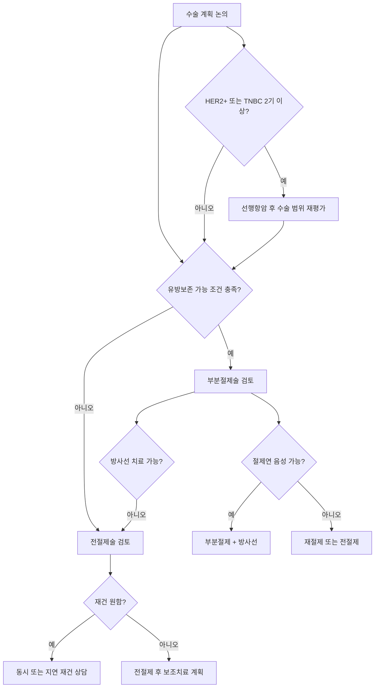

# 유방암 수술

## 개요
유방암 완치를 위해서는 수술이 반드시 필요하며, 크게 유방 보존 수술(부분 절제)과 유방 전절제술 두 가지로 나뉜다. 한국에서는 약 60~70%가 유방 보존 수술로 진행되며, 성공적으로 수행될 경우 전절제와 재발률·생존율 차이가 없다. 수술 방식 결정에는 종양 특성, 환자 선호, 방사선 치료 가능 여부 등 복합적 요인이 작용한다. 2026년에는 수술을 최소화하거나 생략하는 연구가 활발히 진행 중이다.

## 핵심 내용

### 수술 방식 결정 흐름

### 유방 보존 수술 (부분 절제술)

**성공 조건 — 3가지 모두 충족해야 함**:
1. **절제연 음성**: 절제 단면에 암세포 없어야 함. 양성 시 재수술 또는 전절제로 전환
2. **미용적 결과 양호**: 전절제보다 흉한 결과라면 보존의 의미 없음
3. **방사선 치료 이행 가능**: 보존 수술 후 방사선 치료 없이는 재발률이 크게 증가

**재수술 위험**: 절제연 양성 비율 5~10% → 재수술 또는 전절제 전환 가능성

> ⚠️ 주의: 전절제 선택이 재발·생존율을 높이지 않는다. 일부 연구에서는 보존 수술군의 예후가 더 좋다는 결과도 있어, "더 많이 잘라야 안심"이라는 생각은 의학적 근거가 없다.

### 부분절제+방사선 vs 전절제 — 핵심 임상 데이터

| 결과 | 비교 |
|------|------|
| 국소재발률 | 전절제가 약간 낮으나 차이 작음 |
| **장기 생존율** | **두 수술 간 의미 있는 차이 없음** |
| 원격전이 비율 | 10년 장기적으로 차이 없음 |
| 부분절제 후 국소재발 | 전절제로 성공적 치료 가능 |

**대표 논문 3가지**:

1. **2002 NEJM** (Veronesi 등, 6,343회 인용): 종양 2cm 이하 701명 20년 추적
   - 국소재발률: 전절제 2.3% vs 부분절제 8.8%
   - **총사망률: 전절제 41.2% vs 부분절제 41.7% → 통계적으로 차이 없음**

2. **2014 JAMA** (21.4만 명, 후향적 코호트): 초기 침윤성 유방암 5년 생존율
   - 부분절제 97% vs 전절제 94%

3. **2016 Lancet** (3.7만 명, 인구 기반): T1-2기 N0-1 여성 10년 추적
   - **T1N0 서브그룹**에서 부분절제+방사선이 10년 생존율을 의미 있게 향상

> 💡 결론: 국소재발률이 부분절제에서 약간 높지만, **부분절제 후 국소재발은 전절제로 성공적 치료가 가능**하므로 결과에 큰 영향을 주지 않는다. 삶의 질과 재발 우려를 종합할 때 **부분절제+방사선이 전절제보다 열등하지 않다**는 것이 현재 표준 트렌드.

### 유방 전절제술

**전절제 결정 요인** (복합적 고려 필요):

| 요인 | 전절제 고려 상황 |
|------|----------------|
| 종양 크기 | 일반적으로 4cm 초과 |
| 병변 개수 | 다발성 병변 |
| 종양 위치 | 유두 근처, 하내측 위치 |
| 유방 크기 | 작은 유방에 상대적으로 큰 종양 |
| 방사선 치료 | 방사선 치료 시행 불가 |
| 유전자 변이 | [[BRCA유전자]] 돌연변이 보인자 |
| 환자 선호 | 환자가 명확히 전절제를 원하는 경우 |
| 재건 수술 | 재건 수술을 원하고 인프라 갖춘 병원 |

**신보조화학요법 후 보존 가능성 증가**: 항암 후 암 크기가 줄어 원래 전절제 대상이었던 환자의 30~50%에서 보존 수술로 전환 가능

### 유방 재건 수술
전절제 후 동시 재건 수술 가능 (특히 젊은 환자). 세 가지 주요 방법:

**1. 자가조직 재건 (자가 피판술)**
- 복부(TRAM·DIEP) 또는 등(LD) 조직 활용
- 자연스러운 질감, 시간에 따라 함께 노화, 방사선 후에도 유리
- 고난도 수술, 혈관 문합 필요, 통증 많음, 공여부 흉터
- 2025 삼성서울병원 연구: 보형물 대비 정신질환 위험 13% 높음

**2. 보형물 재건 (실리콘 임플란트)**
- 최근 더 많이 시행되는 추세
- 수술 간단, 회복 빠름 — 피막구축·파열 합병증 주의
- 방사선 치료 예정 시 합병증 증가 → 방사선 후 자가조직 권장
- 대형 병원에서 재건 수술 활발할수록 전절제 비율이 높아지는 경향

**3. 인공진피 (ADM) 보조**
- 보형물 재건 시 보조 재료로 사용 — 보형물 안정화·피막구축 예방
- 추적 관찰 영상에서 암 재발로 오인될 수 있음 → 판독 시 주의

→ 상세 비교: [[유방재건수술]]

### 예방적 반대쪽 유방 절제
- [[BRCA유전자]] 돌연변이 보인자: 반대쪽 유방암 발생 위험 20~30% → 예방적 절제 고려
- BRCA 변이 없는 일반 유방암: 반대편 발생 위험 약 7% — 예방적 절제 불필요 (과치료)

### 감시 림프절 생검 (Sentinel Lymph Node Biopsy)

유방암은 겨드랑이 림프절로 먼저 전이되므로, 겨드랑이 림프절 상태를 평가해야 한다.

**과거**: 겨드랑이 림프절 전체 곽청술 → 림프 부종 등 합병증 多

**현재 표준**: 감시 림프절 생검 (파란 염색약 또는 방사선 동위원소 사용)
- 1~3번째 림프절(감시 림프절) 2~3개 검사
- 음성 → 추가 절제 불필요
- 양성 → 추가 림프절 곽청술 시행

### 림프 부종 합병증

| 수술 유형 | 림프 부종 발생률 |
|----------|----------------|
| 감시 림프절 생검 | 5~10% |
| 림프절 곽청술(ALND) | 약 30% |

- 증상: 팔 부종, 무거움, 통증, 관절 가동 범위 제한
- 만성화 시 심각한 장애 초래
- 운동은 림프 부종 예방 효과 없음 — 발병 후 재활 전문의 치료 필요

## 적응증

**수술 전 항암(신보조화학요법)이 선행되는 경우**:
- [[HER2표적치료|HER2+]] 또는 [[TNBC치료|TNBC]]에서 2기 이상
- 수술 후: ER+/HER2- 대부분은 수술을 먼저 시행

**DCIS(상피내암) 수술**:
- 암 전이 없으나 수술 필수 (현재 기준)
- 광범위 DCIS: 전절제 필요 가능
- 부분 절제 후 방사선 치료 ± 호르몬 치료

## 부작용 프로파일
- 림프 부종 (상기 참조)
- 상처 합병증
- 재건 수술 관련: 피막 구축, 보형물 교체 필요 가능
- 어깨·팔 기능 제한 (재활 필요)

## 수술 후 어깨·팔 재활 — 단계별 권고

수술 직후부터 점진적으로 ROM·근력을 회복해야 만성 합병증 (오십견·림프부종) 예방:

| 시기 | 권고 운동 | 강도 |
|------|------------|------|
| **수술 직후~1주** | 통증 없는 범위 손목·손가락·팔꿈치 ROM, 깊은 호흡 | 매우 가벼움 |
| **1~2주** | 어깨 가벼운 ROM (90도까지), 자가 마사지 | 가벼움 |
| **2~6주** | 어깨 ROM 전 범위 회복 (180도 목표), 가벼운 저항 | 점진적 ↑ |
| **6주 이후** | 점진적 저항 운동 (PAL trial 근거), 수영·요가·필라테스 가능 | 정상 |

### 가정에서 따라할 수 있는 핵심 ROM 회복 운동 (서울대병원tv 2019)

- **월 크롤 (Wall Crawl, 전방)** — 어깨 굴곡 180도 목표
- **사이드 월 크롤** — 어깨 외전
- **백 클라이밍** — 어깨 내회전·내전, 등 뒤 손 깍지 회복
- **암 서클 / W 운동** — 견갑 안정성
- **체스트 오프너 / 암 리프트** — 흉근 단축 예방

> 💡 매일 짧게 자주 (하루 2~3회) — 한 번에 무리하기보다 분산. 통증·붓기 시 즉시 중단.

→ 전체 32단계 가정 운동 루틴은 [[운동수면위생|운동수면위생]] / 림프부종 시기별 재활은 [[림프부종]] 참조

## 임상적 의의
- 치료 목적 병원은 너무 멀 필요 없음 — 유방암 수술은 전국적으로 표준화·가이드라인화. 지역 유방외과 전문의로 충분
- 치료 후 10년 이상 장기 추적이 필요하므로 접근성 있는 병원 선택 중요
- 수술 유형은 외과의 성향·병원 재건 수술 인프라에 따라 차이 날 수 있음 → 충분한 설명 후 결정 권고

## 2026 수술 최소화 트렌드

> 💡 "무조건 수술 → 개인 맞춤화·최소화"로 패러다임 전환 중

### DCIS 비수술 관찰
- 일부 DCIS 아형은 호르몬 치료만으로 추적·관리 가능한지 연구 중
- 진행 속도 극히 느린 아형 선별 → 수술 없이 지켜보는 전략 가능성 탐색
- **상태**: 임상 연구 단계, 표준 치료 변경 전

### pCR 후 Watch-and-Wait (수술 생략)
- 신보조항암으로 완전관해(pCR) 달성 시 수술 자체를 생략하는 연구
- **국내**: 서울대병원 이한별 교수 임상 시험 진행 중
- 몇 년 내 결과 발표 예정

### 림프절 수술 최소화
- 초기암 + 초음파 림프절 전이 없음 → 감시 림프절 생검도 없이 재발·생존율 동일하다는 결과 증가
- **국내**: 한원식 교수 주도 다기관 임상 시험 진행 중
- **기대 효과**: 림프 부종 발생 대폭 감소

## 미해결 질문 / 연구 방향
> 💡 pCR 후 watch-and-wait: 어느 서브타입에서 안전한가? 추적 기간·방법은?
> 💡 DCIS 비수술 관찰: 어떤 DCIS가 진행하지 않는지 예측 마커 개발
> 💡 림프절 수술 완전 생략 가능 환자 선별 기준 정립

## 관련 개념
- [[신보조화학요법]] — 수술 전 항암으로 보존 수술 가능성 높임
- [[방사선치료]] — 유방보존수술 후 필수 동반 치료, 횟수·기법 상세
- [[유방재건수술]] — 전절제 후 자가조직·보형물·인공진피 방법 상세 비교
- [[유방암치료트렌드2026]] — 수술 최소화 트렌드 종합
- [[BRCA유전자]] — 예방적 절제 결정의 근거
- [[HER2표적치료]] — HER2+ 수술 전후 치료
- [[TNBC치료]] — TNBC 수술 전후 치료
- [[호르몬치료]] — ER+ 수술 후 보조 치료
- [[치료후삶]] — 수술 후 림프 부종, 재활 관리
- [[휴면암세포_재발메커니즘]] — 수술·치료 후 후기 재발의 분자 기전

## 출처
- 한원식. 유방암 진단을 받았다면 꼭 알아야 할 것들. 서울대병원 외과. 의학채널 비온뒤. 2024-01-30. https://youtu.be/e6xr1NpsXXU
- 한원식. 유방암 치료 트렌드 2026. 의학채널 비온뒤 신년특집. 2026-01-01. https://youtu.be/qjA2HmEGDkM
- 이예지. 유방암 환자의 건강을 지키는 운동법. 서울대학교병원. 서울대병원tv. 2019-10-20. https://www.youtube.com/watch?v=xxovsw7UKcA

## 업데이트 히스토리
- 2026-04-26: 비온뒤 한원식 교수 강의 기반 신규 생성
- 2026-04-27: 수술 최소화 3대 트렌드 추가, 반대편 발생 위험 7% 수치, 림프 부종 운동 미신 교정 (비온뒤 2026 신년특집)
- 2026-05-18: 재건수술 섹션 확장 (인공진피 ADM 추가, [[유방재건수술]] 상세 페이지 연결)
- 2026-05-20: Notion 전문지식 TOP 큐레이션 — 부분절제 vs 전절제 핵심 논문(2002 NEJM/2014 JAMA/2016 Lancet) 데이터 추가; [[휴면암세포_재발메커니즘]] 링크
- 2026-05-27: 서울대병원tv 이예지 강의(2019) — 수술 후 어깨·팔 재활 단계별 권고 (수술 직후~6주 이후 표) + 가정 ROM 회복 핵심 동작 5종 추가
